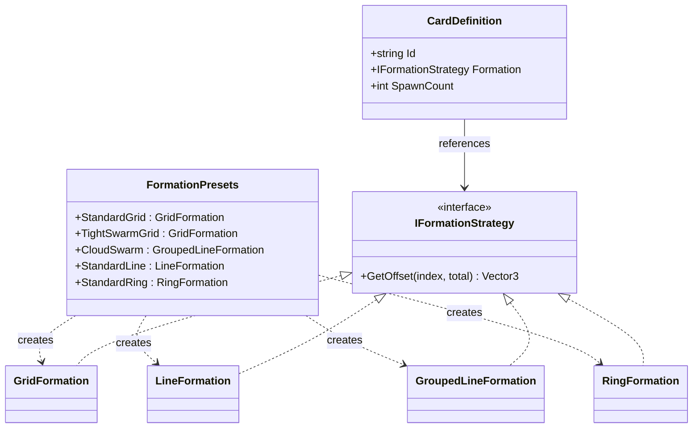

# Formation System Architecture

## How Cards Get Formations


## Formation Composition



## The Flow

1. `CardCatalog` (C#) holds all `CardDefinition` objects
2. Each `CardDefinition` has a `Formation` property referencing a preset from `FormationPresets`
3. `CardFactory.execute_summon()` gets formation directly: `card.Formation`
4. `formation.GetOffset(i, total)` calculates each unit's position

## Key Files

| File | Purpose |
|------|---------|
| `scripts/csharp/Cards/CardCatalog.cs` | All card definitions with formation references |
| `scripts/csharp/Cards/CardDefinition.cs` | Card data class with Formation property |
| `scripts/csharp/Cards/Formations/FormationPresets.cs` | Named formation instances |
| `scripts/csharp/Cards/Formations/IFormationStrategy.cs` | Formation interface |
| `scripts/csharp/Cards/Formations/GridFormation.cs` | Default 2-row staggered grid |
| `scripts/csharp/Cards/Formations/GroupedLineFormation.cs` | Horizontal grouped line |
| `scripts/csharp/Cards/Formations/LineFormation.cs` | Simple horizontal line |
| `scripts/csharp/Cards/Formations/RingFormation.cs` | Circular formation |
| `scripts/csharp/Cards/CardFactory.cs` | Spawns units using card.Formation |

## Adding a New Formation

1. Create strategy class implementing `IFormationStrategy` in `Formations/`
2. Add preset instance to `FormationPresets.cs`
3. Reference the preset in card definitions: `Formation = FormationPresets.YourNewFormation`

## Adding a New Card

Define in `CardCatalog.cs`:
```csharp
["your_card"] = new CardDefinition
{
    Id = "your_card",
    Name = "Your Card",
    // ...
    SpawnCount = 6,
    Formation = FormationPresets.CloudSwarm,  // Direct reference
    // ...
}
```

No strings, no config parsing - just a direct reference to a preset formation.
