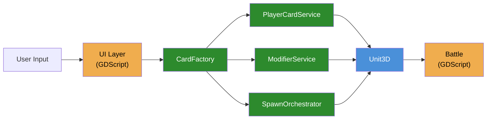
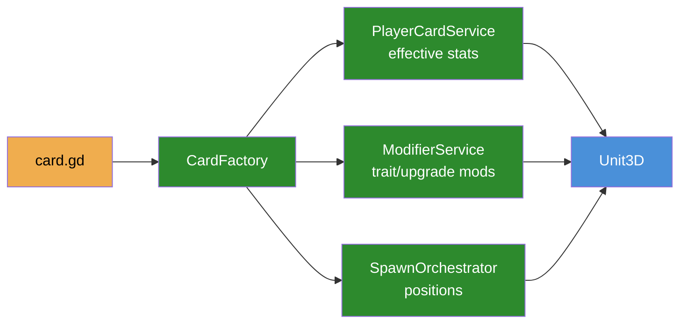
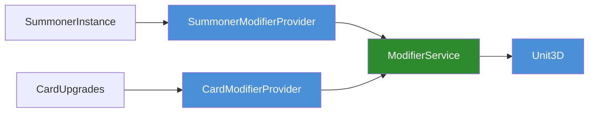

# System Architecture

*Last Updated: 2026-01-06*

## Guiding Principle

**C# = Systems & Mechanics** | **GDScript = Orchestration & UI**

---

## Core Data Flow (DAG)



**Legend:** Orange = GDScript | Green = C# Services | Blue = C# Runtime

---

## Card Play Flow



---

## Modifier Provider Pattern



---

## C# Services (Autoloads)

| Service | Path | Purpose |
|---------|------|---------|
| `CardFactory` | `/root/CardFactory` | Spawns units, executes spells |
| `PlayerCardService` | `/root/PlayerCardService` | Card stats, progression |
| `ModifierService` | `/root/ModifierService` | Stat modifiers from traits/upgrades |
| `SpawnOrchestrator` | `/root/SpawnOrchestrator` | Formation positions |
| `DamageSystem` | `/root/DamageSystem` | Damage/healing application |

All services implement interfaces (`ICardFactory`, etc.) in `scripts/csharp/Services/Interfaces/`.

---

## Unit Components

| Component | Purpose |
|-----------|---------|
| `Unit3D.cs` | Coordinator |
| `UnitHealth.cs` | HP, damage, healing |
| `UnitMovement.cs` | Steering, pathfinding |
| `SpawnRevealComponent.cs` | Spawn animation |

---

## GDScript → C# Interop

```gdscript
# Use factory methods (GDScript can't instantiate C# classes)
var service: Node = get_node_or_null("/root/ModifierService")
service.call("register_summoner_provider", summoner_instance, summoner_id)
```

---

## Key Decisions

1. **C# for mechanics, GDScript for orchestration** - Clear boundary reduces cross-language complexity

2. **Provider pattern for modifiers** - Extensible without modifying core service

3. **Service interfaces** - Enable testing and future dependency injection

4. **Factory methods for interop** - Work around GDScript's inability to instantiate C# classes

5. **Type-safe calls over duck typing** - Use `if unit is Unit3D` instead of `has_method()`
