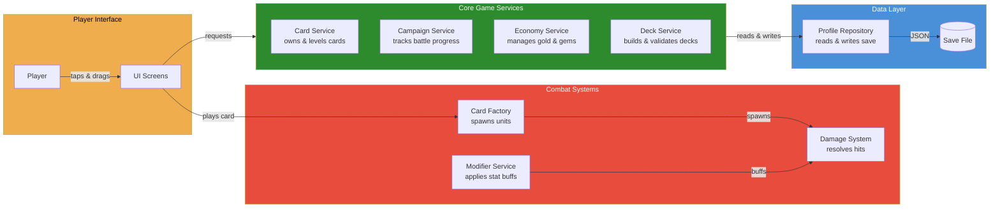

# System Architecture

*Last Updated: 2026-01-25*

## Guiding Principle

**C# = Systems & Mechanics** | **GDScript = Orchestration & UI**

---

## High-Level Architecture

*A new developer should understand this in under 2 minutes.*

This diagram shows runtime communication during gameplay — how player actions flow through the system to persistence.



---

## C# Services (Autoloads)

| Service | Autoload Name | Purpose |
|---------|---------------|---------|
| `ProfileRepository` | `ProfileRepositoryCS` | Bridge to GDScript persistence |
| `CardService` | `CardServiceCS` | Card ownership + progression (merged Collection + PlayerCard) |
| `EconomyService` | `EconomyServiceCS` | Gold, gems, essence management |
| `CampaignService` | `CampaignServiceCS` | Campaign progress, battles, rewards |
| `DeckService` | `DeckServiceCS` | Deck CRUD, validation |
| `ItemService` | `ItemServiceCS` | Item ownership, equipment |
| `ShopService` | `ShopServiceCS` | Shop offerings, purchases |
| `SummonerProgressionService` | `SummonerProgressionCS` | Summoner leveling, traits |
| `SummonerSelectionService` | `SummonerSelection` | Active summoner management |
| `RewardService` | `RewardServiceCS` | Reward processing |

---

## Battle/Combat Services (Autoloads)

| Service | Autoload Name | Purpose |
|---------|---------------|---------|
| `CardFactory` | `CardFactory` | Spawns units, executes spells |
| `ModifierService` | `ModifierService` | Stat modifiers from traits/upgrades |
| `DamageSystem` | `DamageSystem` | Damage/healing application |
| `HitResolver` | `HitResolver` | Hitbox collision resolution |
| `ProjectileService` | `ProjectileService` | Projectile pooling and management |

---

## GDScript → C# Interop

```gdscript
# Access C# service via autoload name
var card_service: Node = CardServiceCS

# Call methods directly (C# methods are exported)
var cards: Array = card_service.GetOwnedCardsDict(summoner_id)
var instance_id: String = card_service.GrantCard("fireball", "common")

# Connect to signals
card_service.CollectionChanged.connect(_on_collection_changed)
```

---

## Initialization Order

Services initialize synchronously in `_Ready()` to ensure they're available when GDScript wrappers call them:

1. **ProfileRepo** (GDScript) - Persistence layer
2. **ProfileRepositoryCS** - Connects to ProfileRepo
3. **EconomyServiceCS** - Uses ProfileRepositoryCS
4. **CardServiceCS** - Uses ProfileRepositoryCS
5. **SummonerProgressionCS** - Uses ProfileRepositoryCS
6. **SummonerSelection** - Uses ProfileRepositoryCS
7. **DeckServiceCS** - Uses ProfileRepositoryCS
8. **ItemServiceCS** - Uses ProfileRepositoryCS
9. **ShopServiceCS** - Uses ProfileRepositoryCS
10. **RewardServiceCS** - Uses ProfileRepositoryCS
11. **CampaignServiceCS** - Uses ProfileRepositoryCS
12. **Campaign** (GDScript) - Injects callbacks into CampaignServiceCS

**Important:** C# services do NOT use `CallDeferred` for initialization. They initialize synchronously to be ready when GDScript wrappers access them.

---

## Key Architecture Decisions

1. **Single path to persistence** - All services go through ProfileRepositoryCS → ProfileRepo

2. **Facade + Handlers pattern** - Large services split into focused handlers (CardService, CampaignService)

3. **Domain-Driven Design** - Clear aggregates in `Domain/Profile/` with defined boundaries

4. **C# for mechanics, GDScript for orchestration** - Clear boundary reduces cross-language complexity

5. **Synchronous initialization** - Services ready immediately for GDScript callers

6. **Type-safe domain models** - No more `PlayerCardInstance` vs `CardInstanceData` duplication

---

## File Structure

```
scripts/csharp/
├── Domain/
│   └── Profile/
│       ├── Collection/CardInstance.cs
│       ├── Summoners/SummonerInstance.cs
│       ├── Inventory/ItemInstance.cs
│       ├── Decks/Deck.cs
│       ├── Account/{Resources,Settings,Meta}.cs
│       ├── Campaign/CampaignProgress.cs
│       └── Enums/{ContentBinding,ResourceType}.cs
│
├── Infrastructure/
│   └── Persistence/
│       ├── ProfileRepository.cs
│       ├── IProfileRepository.cs
│       └── DtoConverters.cs
│
└── Services/
    ├── Cards/
    │   ├── CardService.cs
    │   └── Handlers/{CardOwnershipHandler,CardProgressionHandler}.cs
    ├── Campaign/
    │   ├── CampaignService.cs
    │   └── Handlers/{CatalogHandler,ProgressHandler,RewardHandler,TutorialHandler}.cs
    ├── Deck/DeckService.cs
    ├── Economy/EconomyService.cs
    ├── Items/ItemService.cs
    ├── Shop/ShopService.cs
    ├── Rewards/RewardService.cs
    └── Summoner/{SummonerSelectionService,SummonerProgressionService}.cs
```
