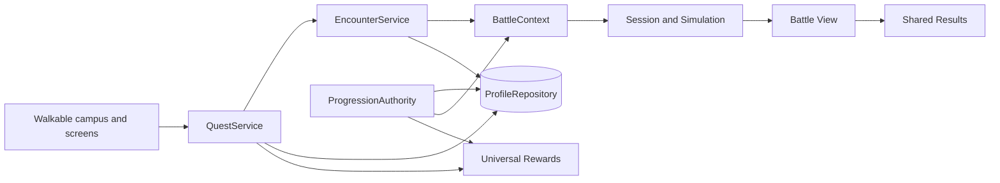

# System Architecture

**Last Updated:** 2026-08-24

## Guiding Boundary

C# owns deterministic mechanics, typed domain state, catalogs, persistence, and
service authority. GDScript owns application orchestration and UI projection.

## Meta Services

| Service | Autoload | Purpose |
|---|---|---|
| `QuestService` | `Quests` | Quest lifecycle, Journal projection, professor offers, capacity, quest rewards |
| `EncounterService` | `Encounters` | Reusable encounter preparation, loadouts, battle configuration, completion |
| `ProgressionAuthorityService` | `ProgressionAuthority` | Direct authored-battle attempts and durable outcomes |
| `ProfileRepository` | `ProfileRepo` | Typed profile persistence and reward transactions |
| `RewardService` | `RewardService` | Universal reward catalog, resolution, claims |
| `EconomyService` | `Economy` | Account resources |
| `ShopService` | `Shop` | Campus Shop catalog and purchases |
| `DeckService` | `Decks` | Deck CRUD and validation |
| `CardService` | `CardService` | Card ownership and progression |
| `ItemService` | `Items` | Summoner-owned inventory and equipment |

Thin GDScript adapters (`QuestApi`, `EncounterApi`, and the other service APIs)
normalize C#/Godot variants at UI boundaries. They do not own progression.

## Progression Data

Per-summoner `SummonerProgress` contains:

- completed authored battle IDs;
- the active battle attempt and terminal attempt receipts;
- quest discovery, active/completed IDs, current steps, tracking, curriculum
  capacity, and encounter loadout selections.

Account resources and universal reward receipts remain separate aggregates.

## Battle Entry Paths

- A quest references an encounter ID. `EncounterService` resolves its authored
  configuration and loadout, then the UI configures `BattleContext` in
  `ENCOUNTER` mode.
- Developer tooling selects an authored debug battle directly. The progression
  authority creates an attempt and `BattleContext` uses `AUTHORED` mode.
- Practice, tutorial, arena, and multiplayer modes retain their dedicated
  application entry points.

No service owns a graph of nodes, route choices, or a second academic activity
pipeline.
