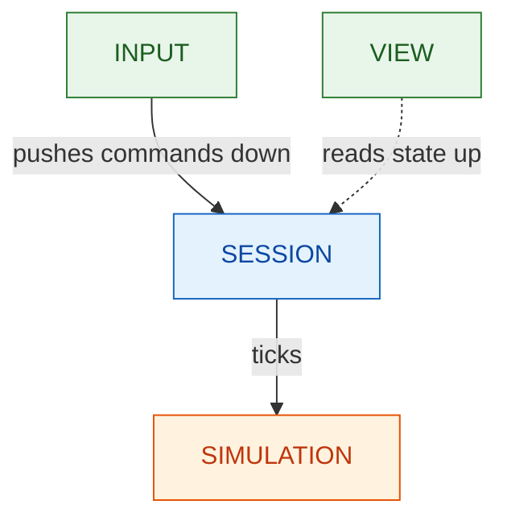
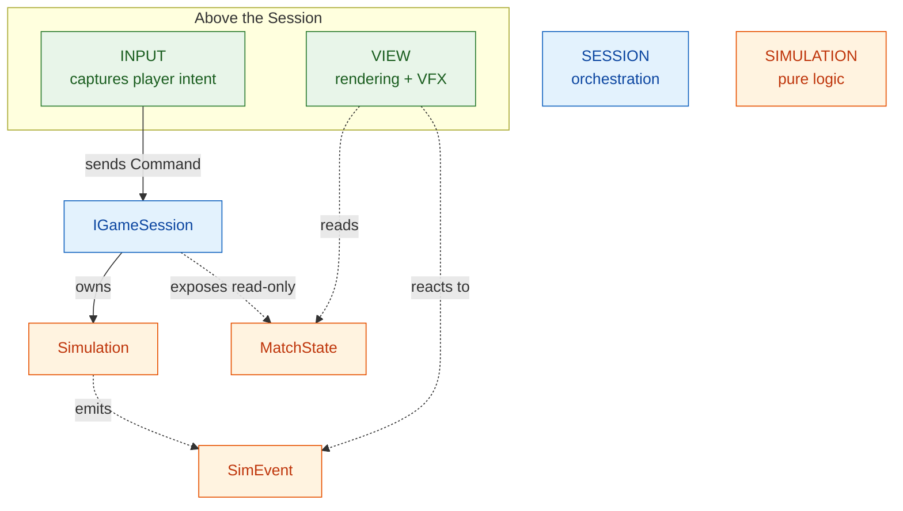
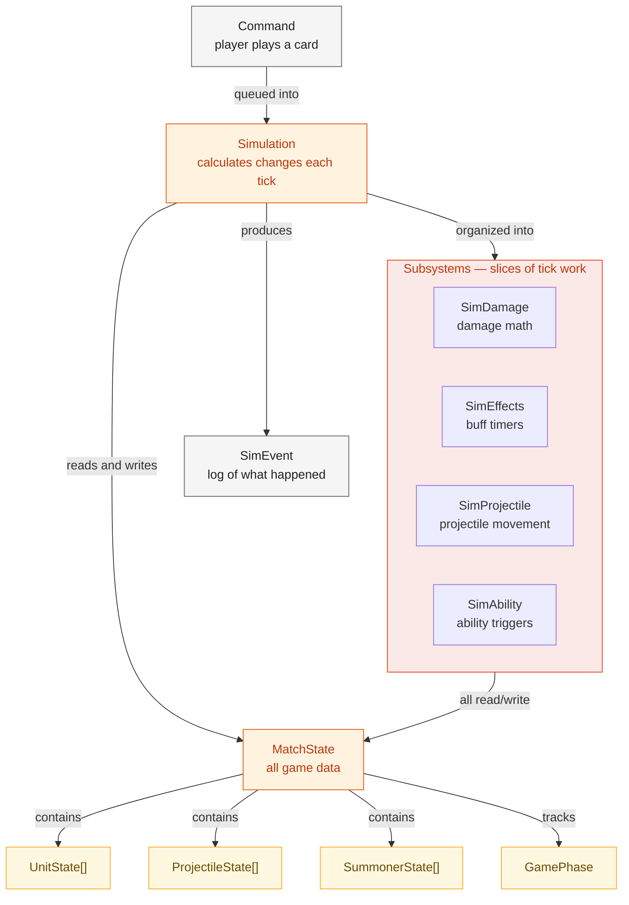
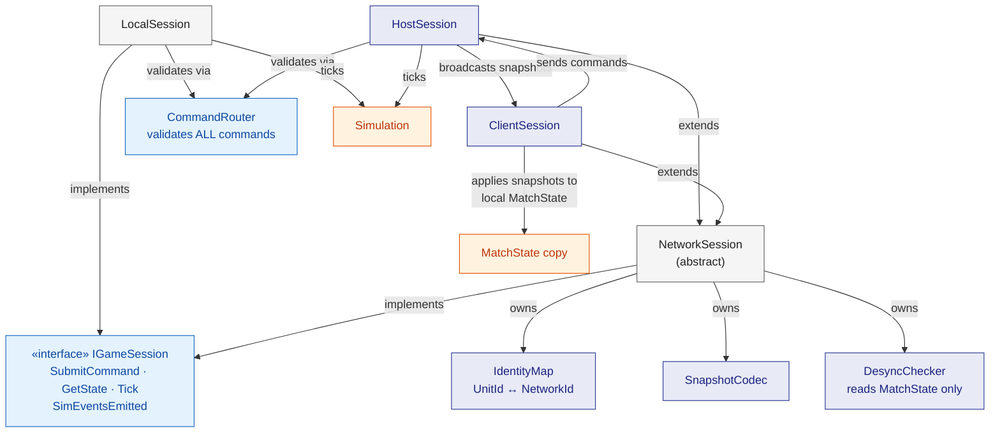
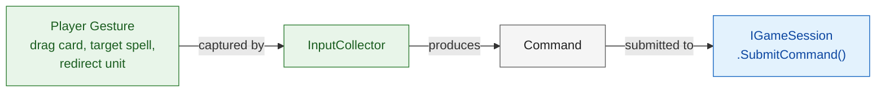
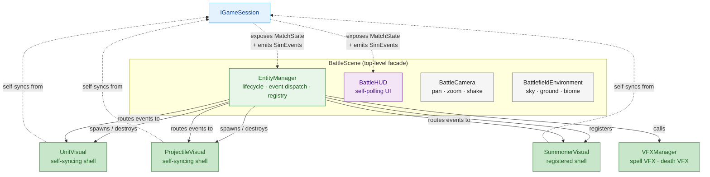
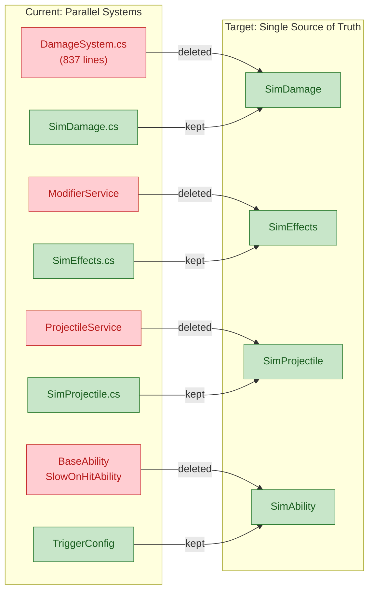

# Target Architecture

High-level architectural redesign to resolve the 25 issues captured in the archived migration issue list (`docs/archive/doc-reorg-2026-03/migration/architectural-issues.md`).

## 1. Layer Boundaries

Three top-level layers in the gameplay subgraph. Dependencies only flow **downward**. Each layer talks to the one below through a single entry point.

Terminology note: this project uses a graph-of-graphs model. Each layer node can expand into its own internal subgraph (for example, `View` expands into `BattleScene`, `EntityManager`, `UnitVisual`, HUD, etc.). The diagram below is the top-level gameplay projection, not a full leaf-level graph. See [graph-of-graphs.md](graph-of-graphs.md) for vocabulary and projection rules.



**Solid arrows** = dependency (calls/sends). **Dashed arrows** = reads (no dependency on consumer).

Input and View are independent peers — both depend on Session, but not on each other. Session is the hub: everything flows through it.

The detailed version below shows what crosses each boundary:



**Input** and **View** are independent peers above the Session. Input pushes Commands down into `IGameSession`; View reads State and Events up from it. Neither depends on the other.

**Solid arrows** = calls/sends. **Dashed arrows** = reads/reacts (no mutation).

## 2. Simulation Layer

Pure C#, zero Godot imports. No networking. Testable without the engine.

**`Simulation`** calculates what happens each frame — movement, targeting, combat, abilities, projectiles. It writes the results into **`MatchState`**, which is just a bag of data: every unit's position/HP/buffs, every projectile's location, each player's hand/deck/mana, the game phase.

**`Commands`** are how players affect the simulation. Player drags a card and drops it — that becomes a Command ("spawn unit X at position Y"). The simulation picks it up next tick and adds the unit to MatchState. From there the tick loop handles it like everything else.

**`SimEvents`** are a log of what changed this tick. As the simulation processes, it writes entries like "unit A dealt 50 damage to unit B" or "unit C died." These aren't game state — they're notifications so the visual layer knows what to animate.

**Subsystems** (`SimDamage`, `SimEffects`, `SimProjectile`, `SimAbility`) are how the simulation is organized internally. Each one handles a slice of the work — damage math, buff timers, projectile movement, ability triggers — all reading and writing the same MatchState.



`Command` and `SimEvent` are the **only** things that cross this layer's boundary. Everything else is internal.

## 3. Session Layer

The Session decides **how** the simulation gets run — locally or over a network. It's a dumb pipe. It doesn't know what a "card play" is or what "damage" means — it just validates and routes Commands, ticks the simulation, and exposes the results.

**`IGameSession`** is the single interface that Input and View talk to. Three methods plus one event:

- **`SubmitCommand(Command)`** — player wants to do something. Session validates it, then either feeds it to the local simulation or sends it over the network.
- **`GetState() → MatchState`** — read current game state. The View polls this each frame for unit positions, HP, animation state — anything that changes continuously.
- **`Tick(float delta)`** — advance the game by one frame. In singleplayer and on the host, this runs the simulation. On the client, this applies the latest snapshot from the host.
- **`SimEventsEmitted`** — event/callback delivering discrete events (damage dealt, unit died, attack fired). The View subscribes to this for one-shot reactions like VFX and sound.

```csharp
// scripts/csharp/Battle/Session/IGameSession.cs
public interface IGameSession
{
    MatchState GetState();
    event Action<IReadOnlyList<SimEvent>> SimEventsEmitted;
    void SubmitCommand(ICommand command);
    void Tick(float delta);
}
```

**`CommandRouter`** validates ALL commands before they reach the simulation, regardless of session type. Today the host bypasses validation while the client validates — this fixes that asymmetry (issue #9).

### Session hierarchy

```
IGameSession                  ← Input + View talk to this only
├── LocalSession              ← Singleplayer
└── NetworkSession (abstract) ← Shared multiplayer infrastructure
    ├── HostSession           ← Ticks sim + broadcasts snapshots
    └── ClientSession         ← Sends commands + applies snapshots
```

**`LocalSession`** — Singleplayer. Validates the command via CommandRouter, feeds it to the Simulation, ticks locally. Simple and self-contained. This is the only session type needed for quest, tutorial, debug, and AI battles.

**`NetworkSession`** (abstract base) — Shared multiplayer concerns that both host and client need:

- **`IdentityMap`** — UnitId ↔ NetworkId O(1) bimap. Simulation uses UnitIds internally; the network uses NetworkIds. This sits at the boundary and translates.
- **`SnapshotCodec`** — serialize/deserialize MatchState for network transmission.
- **`DesyncChecker`** — hash comparison to detect host/client drift. Reads MatchState only, never mutates.
- **`HandleMessage(message)`** — process incoming network data (snapshots, commands, desync reports).

**`HostSession : NetworkSession`** — The authority. Ticks the simulation locally (host is authoritative). After each tick, serializes MatchState via SnapshotCodec and broadcasts the snapshot to the client. Receives remote player commands over the network, validates via CommandRouter, feeds to simulation.

**`ClientSession : NetworkSession`** — Does NOT tick the simulation. Sends local commands to the host over the network. Receives snapshots and applies them to a local copy of MatchState. The View reads that copy — it looks identical to reading from a local simulation.

### Session internals diagram



`LocalSession` uses only `CommandRouter` + `Simulation` — no networking. `HostSession` and `ClientSession` inherit shared multiplayer infrastructure (blue-purple nodes) from `NetworkSession`.

### Session stubs

All stubs are in `scripts/csharp/Battle/Session/`. Each method body throws `NotImplementedException`. Detailed stub listings are in [`gameplay/session/README.md`](gameplay/session/README.md#stubs).

| Stub File | Class | Key Responsibilities |
|-----------|-------|---------------------|
| `LocalSession.cs` | `LocalSession : IGameSession` | Validate → queue → tick sim → emit events |
| `NetworkSession.cs` | `NetworkSession : IGameSession` (abstract) | Owns IdentityMap, SnapshotCodec; routes messages |
| `HostSession.cs` | `HostSession : NetworkSession` | Tick sim + broadcast snapshots + validate remote commands |
| `ClientSession.cs` | `ClientSession : NetworkSession` | Send commands to host + apply snapshots |
| `CommandRouter.cs` | `CommandRouter` | Validate any ICommand against MatchState |
| `IdentityMap.cs` | `IdentityMap` | UnitId ↔ NetworkId O(1) bimap (pure ints) |
| `SnapshotCodec.cs` | `SnapshotCodec` | Encode/decode MatchState for network |

## 4. Above the Session

Input and View are independent peers that sit above `IGameSession`. Input pushes Commands down; View reads State and Events up. They don't depend on each other — a headless game has no View but Input still works, and a replay viewer has no Input but View still works.

Both peers need to cross the Session boundary. The crossing uses two patterns: poll and push.

**Poll for continuous state.** Unit positions, HP bars, animation state, mana — these change every frame. The View reads `IGameSession.GetState()` in `_PhysicsProcess()` and positions visuals accordingly. Each shell (UnitVisual, ProjectileVisual) reads its own state from MatchState 60 times per second and moves the 3D model to match.

**Subscribe for discrete events.** Damage flashes, attack animations, death VFX, sound effects — these fire once and are done. The View subscribes to `IGameSession.SimEventsEmitted` and reacts when events arrive. This is what `SimEventSignalEmitter` already does: it receives "unit A attacked unit B" and triggers the swing animation and hit particle.

**Why both?** Polling is natural for continuous state — you always want the latest position, not a stream of "moved to X" events. But polling for discrete events would mean checking "did anything die this frame?" every frame, which is wasteful and easy to miss. Push-on-event is the right fit there.

**Standardized across session types.** All three session types (`LocalSession`, `HostSession`, `ClientSession`) expose the same `IGameSession` interface. Neither Input nor View knows or cares whether it's singleplayer or multiplayer. This resolves the current inconsistency where the host uses signals for phase/timer updates while the client polls — both paths collapse into `IGameSession` (issues #10, #13).

| Data | Method | Frequency | Why |
|------|--------|-----------|-----|
| Unit position, HP, animation | Poll (`GetState()`) | Every frame | Continuous — always want latest |
| Mana, hand, deck state | Poll (`GetState()`) | Every frame | Continuous |
| Game phase, timer | Poll (`GetState()`) | Every frame | Continuous (standardizes host/client) |
| Damage dealt | Push (`SimEventsEmitted`) | On event | Discrete — trigger VFX once |
| Unit death | Push (`SimEventsEmitted`) | On event | Discrete — trigger death anim once |
| Attack fired | Push (`SimEventsEmitted`) | On event | Discrete — trigger swing anim once |
| Ability activated | Push (`SimEventsEmitted`) | On event | Discrete — trigger ability VFX once |

## 5. Input

Captures player intent and converts it into Commands. Doesn't validate, doesn't execute — just packages what the player wants to do and calls `IGameSession.SubmitCommand()`. The Session decides whether the Command is legal.

**`InputCollector`** watches for player gestures — card drag-and-drop, spell targeting, unit redirect — and produces the matching Command. Card dragged to the battlefield? `PlayCardCommand`. Spell targeting cursor confirmed? `CastSpellCommand`. That's it. One gesture, one Command, hand it off.



**Today this is scattered.** HandUI handles the drag, BattlefieldDropZone handles the drop, `Summoner.play_card_3d()` builds the Command, and `SimulationNode.QueuePlayCard()` submits it. Spell targeting lives in SpellTargetingManager. The target consolidates Command-production into `InputCollector` — one place that owns the translation from gesture to Command.

**Input knows nothing about View.** It doesn't care how units are rendered or whether VFX are playing. It only talks to `IGameSession`.

## 6. View

Reads game state and renders it. No game logic, no mutation — purely visual.

> **Detail docs:** [`docs/architecture/gameplay/view/`](gameplay/view/) has per-component documentation.

### Naming convention

**Role-based suffixes, not Godot node types.** This is a 2.5D game — the `3D` suffix reflects Godot plumbing, not the game's visual paradigm. Names describe what components DO.

| Component | Role | Old Name |
|-----------|------|----------|
| `BattleScene` | Top-level facade: owns all battle visual components | `GameController3D` |
| `EntityManager` | Entity lifecycle + event dispatch + registry | `GameView` / `BattleSceneManager` |
| `UnitVisual` | Visual shell for one unit | `Unit3D` |
| `ProjectileVisual` | Visual shell for one projectile | `ProjectileView` |
| `SummonerVisual` | Visual shell for one summoner | Visual code in `summoner.gd` |
| `BattleHUD` | 2D battle overlay | *(unchanged)* |
| `BattleCamera` | Camera controller | `CameraController3D` |
| `BattlefieldEnvironment` | Biome visuals, sky, ground | `BattlefieldVisuals3D` |
| `VFXManager` | VFX pooling + spawning service | *(unchanged)* |

**Rule:** No `3D` suffix on View components. Use the component's role as the name.

### Data model: hybrid (pull continuous + push discrete)

- **Shells pull** their own continuous state (position, HP, animation) each frame via `_PhysicsProcess` reading `IGameSession.GetState()`
- **EntityManager pushes** discrete events (attack, damage, death) by routing SimEvents to the correct shell via registry lookup
- **EntityManager handles lifecycle** — spawns/destroys shells when entities appear/disappear in MatchState
- **BattleHUD** reads `IGameSession` independently, not mediated by EntityManager

### Component overview



**BattleScene** owns four top-level components. **EntityManager** is the hub of the 3D battlefield — it spawns shells, routes events via O(1) registry lookup, and calls VFXManager for environmental effects. Shells self-sync from IGameSession each frame. **BattleHUD** reads IGameSession independently. **BattleCamera** and **BattlefieldEnvironment** are state-independent.

### BattleScene — top-level facade

C# class extending `Node3D`. The root of the battle visual layer. Owns all four top-level components (`EntityManager`, `Hud`, `Camera`, `Environment`) and wires `EntityManager` and `Hud` to `IGameSession` at init. No game logic — just typed accessors and initialization.

**Before migration:** `GameController3D` (1048 lines) mixed this wiring role with game logic, UI orchestration, and state management (issue #25). `BattleScene.cs` now replaces it as a thin C# facade after game logic moved to Session.

### EntityManager — lifecycle, event dispatch, registry

C# class. Accessed via `BattleScene.EntityManager`. The central coordinator for all 3D battlefield entities. Three jobs: manage shell lifecycles, dispatch discrete events to the correct shell, and maintain a registry for O(1) lookup.

**Lifecycle.** When a unit appears in MatchState, EntityManager spawns a UnitVisual shell. When a projectile appears, it spawns a ProjectileVisual. When entities are removed from MatchState, it destroys the corresponding shells.

**Event dispatch.** Subscribes to `IGameSession.SimEventsEmitted`, looks up the target shell in the registry (O(1)), and calls the appropriate visual method. For environmental effects, calls VFXManager directly.

**Registry.** Maintains `EntityId → shell` mappings for event routing.

**Global control.** Single place to pause, slow-mo, or freeze all visuals.

**What it does NOT do:** Per-frame sync (shells do that themselves). Know about sprites, animations, or HP bars. Display HUD elements.

**Before migration, this was scattered across:** `Summoner._spawn_visual_unit()` handled spawning, `GameController3D._on_remote_unit_spawned()` handled network unit spawning, `SimulationNode._unit3DBySimId` was the registry, and `SimEventSignalEmitter` handled event conversion. All of this is now consolidated in `EntityManager`.

> Detail doc: [`gameplay/view/battlefield/`](gameplay/view/battlefield/)

### UnitVisual — self-syncing visual shell

C# class extending `Node3D`. A passive visual shell that reads its own `UnitState` from `IGameSession.GetState()` each frame in `_PhysicsProcess`. Positions the model, updates the HP bar, and sets the animation state. Exposes reaction methods — `PlayAttackAnimation()`, `FlashDamage()`, `BeginDeath()` — called by EntityManager on events.

**Owns:** IVisualComponent (sprite or skeletal; shadows handled internally via `ShadowHelper`), SpawnRevealComponent.

**Keeps (~1100 lines):** Visual component setup, position sync, HP bar, animation, reaction methods.

**Loses (~1200 lines):** Targeting, behavior state machine, cooldowns, trigger system, `TakeDamage()`, signal subscriptions, `IsSimDriven` flag.

**Before migration:** Unit3D was 2304 lines mixing game logic with rendering (issue #23). Now replaced by `UnitVisual.cs` (visual-only shell) with game logic in sim subsystems.

> Detail doc: [`gameplay/view/battlefield/unit-visual.md`](gameplay/view/battlefield/unit-visual.md)

### SummonerVisual — registered visual shell

C# class extending `Node3D`. Same self-sync model as UnitVisual — reads its own `SummonerData` from `IGameSession.GetState()` each frame — but *registered* at battle init rather than dynamically spawned. Summoners are always present for the entire battle, so dynamic lifecycle management is unnecessary. Exposes `FlashDamage()` and `BeginDeath()` for EntityManager to call on summoner damage/death events.

**Owns:** Sprite3D, FloatingHPBar, HurtboxComponent.

**Today:** Visual code is embedded in `summoner.gd`, which mixes rendering with deck management, mana tracking, casting state, and card play orchestration.

> Detail doc: [`gameplay/view/battlefield/summoner-visual.md`](gameplay/view/battlefield/summoner-visual.md)

### ProjectileVisual — self-syncing visual shell

C# class extending `Node3D`. Reads its own `ProjectileState` each frame, positions/rotates the model. Holds the visual scene instance and trail VFX. `PlayImpactAndDestroy()` called by EntityManager on ProjectileHitSimEvent.

**What it does NOT do:** Collision detection, damage dealing, pierce logic, HitResolver calls. All of that lives in SimProjectile.

**Before migration:** Projectile3D was 1128 lines mixing collision/damage with visual effects (issue #24). Now replaced by `ProjectileVisual.cs` (visual-only shell) with logic in `SimProjectile.cs`.

> Detail doc: [`gameplay/view/battlefield/projectile-visual.md`](gameplay/view/battlefield/projectile-visual.md)

### BattleHUD — independent state readers

GDScript UI components that read `IGameSession` independently. BattleHUD is NOT part of EntityManager — EntityManager owns the 3D battlefield, BattleHUD owns the 2D overlay. Both read the same state source but have no dependency on each other.

**Components:** PhaseTimerDisplay, PlayerManaDisplay, SummonerHPDisplay, HandUI, GameOverOverlay. Each self-polls `IGameSession.GetState()` for continuous data. For discrete events (game over), HUD components subscribe to `IGameSession.SimEventsEmitted` directly.

**Before migration:** `GameController3D._process()` manually pushed state to each UI panel with different codepaths for host vs client. Now `BattleHUD` reads `IGameSession` independently.

> Detail doc: [`gameplay/view/battle-hud.md`](gameplay/view/battle-hud.md)

### Client interpolation — unchanged

`StateInterpolator` writes interpolated positions into MatchState before shells read it. The entire View layer is unaware of interpolation — it just gets smooth values.

### View invariants

1. **Read-only.** View never writes to MatchState.
2. **Session-agnostic.** No `if is_host` branches. Reads `IGameSession`, doesn't know the session type.
3. **No game logic.** No damage calculation, targeting, cooldowns, or behavior decisions.
4. **Shells self-sync.** UnitVisual, ProjectileVisual, and SummonerVisual read their own state each frame. EntityManager doesn't push per-frame data.
5. **EntityManager owns 3D lifecycle.** Only it spawns/destroys battlefield shells (and registers summoner shells at init).
6. **BattleHUD is independent.** Reads `IGameSession` directly, not mediated by EntityManager.
7. **Event dispatch is centralized.** SimEvent-to-visual routing goes through EntityManager. Shells don't subscribe to `SimEventsEmitted` directly. (BattleHUD is the exception for HUD events.)
8. **Naming follows role.** No `3D` suffix. Names describe what the component does.

**View knows nothing about Input.** It doesn't care how Commands were produced. It only reads from `IGameSession`.

### AudioManager: Standalone Service

AudioManager lives outside the layer model as a standalone service, callable by any layer. See [`decisions.md`](decisions.md) Decision #10 for reasoning.

## 7. What Gets Deleted



### Deletion Blockers

All Godot-side duplicates have been deleted. UnitVisual replaced Unit3D as the visual shell, removing the references that previously blocked these deletions.

| File Deleted | Status | Notes |
|---------------|--------|-----------|
| `DamageSystem.cs` + `.tscn` | **Deleted** | Damage logic now in `SimBehavior.cs` + `SimDamage.cs` |
| `ModifierService.cs` | **Deleted** | Modifier logic now in `SimEffects.cs` |
| `ProjectileService.cs` | **Deleted** | Projectile logic now in `SimProjectile.cs` |
| `BaseAbility.cs` | **Deleted** | Was dead code — removed in architecture gap audit |
| `SlowOnHitAbility.cs` | **Deleted** | Was dead code — removed in architecture gap audit |
| `IAbilityConfig.cs` | **Deleted** | Was dead code — removed in architecture gap audit |

## Issue Resolution Map

| Issue | Resolution |
|-------|-----------|
| #1-4 Parallel systems | Sim layer is THE implementation. Godot-side duplicates deleted. |
| #5 NetworkId in sim | `UnitState` has no network fields. `IdentityMap` lives at session boundary. |
| #6 DesyncDetector reads scene tree | `DesyncChecker` reads `MatchState` only. |
| #7 God class | `SimulationNode` splits into `Simulation` + `IGameSession` + `BattleScene`/`EntityManager`. |
| #8-11 Host/client asymmetry | `IGameSession` enforces one contract. `CommandRouter` validates for ALL session types. |
| #12-14 SP/MP divergence | Three `IGameSession` implementations replace hardcoded branching. |
| #15-16 Singletons / DI chaos | Session owns simulation, view reads session. Constructor injection, no statics. |
| #17 Team chaos | Single `Team` value type everywhere. Session remaps at network boundary. |
| #18 Four ID systems | `UnitId` in sim, `IdentityMap` bimap at session layer. O(1) both directions. |
| #19 State constants | `BehaviorState` enum replaces const ints. |
| #20-22 Dead code | Deleted. No `AuthorityProvider`, no prediction stubs, no Godot abilities. |
| #23 Unit3D mixed concerns | **Resolved.** `UnitVisual.cs`: self-syncing visual shell. Game logic lives in sim subsystems (`SimBehavior`, `SimDamage`). EntityManager routes events. |
| #24 Projectile3D mixed concerns | **Resolved.** `ProjectileVisual.cs`: self-syncing visual shell. `SimProjectile` handles logic. No collision detection in view layer. |
| #25 GameController3D mixed concerns | **Resolved.** Game flow moved to Session. `BattleScene.cs` is the thin typed facade that owns EntityManager, Hud, Camera, Environment. |
