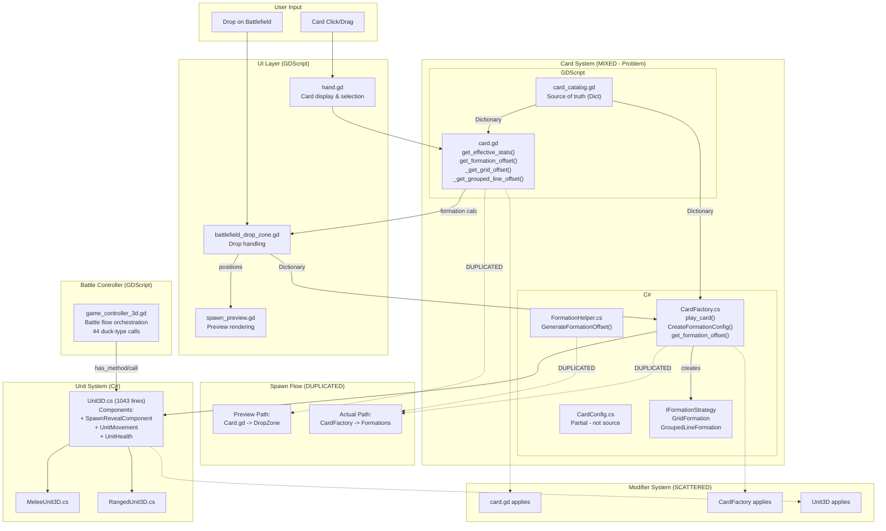
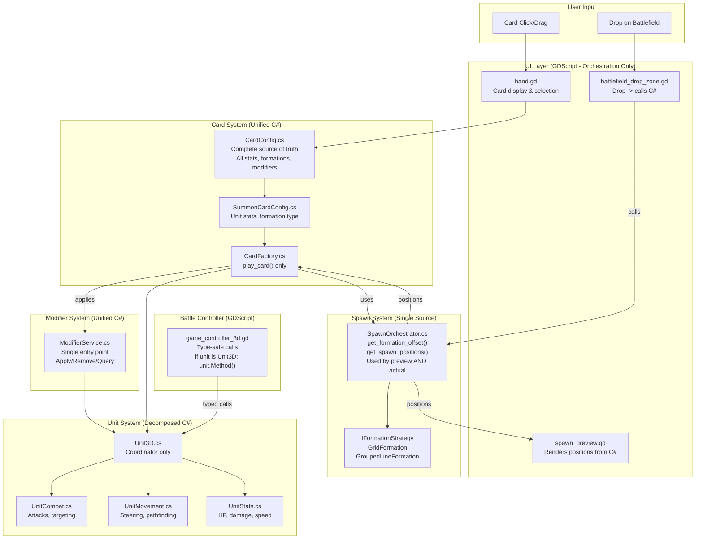
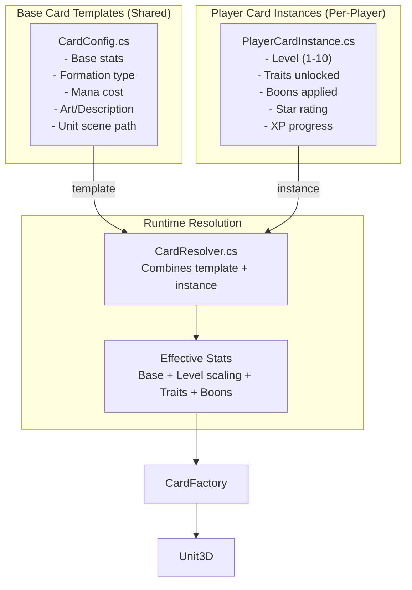

# Architecture Transformation Roadmap

This document tracks the ongoing architecture improvement initiative for Project Summoner.

**Started:** 2026-01-06
**Status:** In Progress

---

## Guiding Principle

**Clear language boundary:**
- **C# = Systems & Mechanics** (cards, units, combat, formations, modifiers)
- **GDScript = Orchestration & UI** (battle flow, hand display, input)

---

## Current State: Full System Architecture

**Problems Identified:**
- Orange = GDScript source of truth (should move to C#)
- Red = Problem areas (duplication, god objects)
- Yellow = Scattered modifiers

---

## Target State: Unified System Architecture

**Benefits:**
- Green = Unified/fixed components
- Blue = Clean C# components
- Light green = GDScript (orchestration only)

---

## Card Data Architecture: Template vs Instance

**Key Pattern:**
- `CardConfig` = immutable template (same for all players)
- `PlayerCardInstance` = mutable player data (levels, traits, boons)
- `CardResolver` = combines both at play time to get effective stats

---

## Implementation Phases

### Phase 1: Spawn & Formation System
**Status:** [x] COMPLETED (2026-01-06)

**Problem:** Formation logic duplicated in Card.gd + CardFactory.cs
**Solution:** CardFactory.get_formation_offset() is single source of truth

**Implementation Notes:**
- CardFactory already had get_formation_offset() using IFormationStrategy pattern
- Updated Card.gd to delegate to CardFactory instead of having duplicate methods
- Deleted FormationHelper.cs (redundant)
- SpawnPreview.cs now uses simple inline default grid for initial placement

**Files:**
- [x] MODIFY: `scripts/cards/card.gd` - Removed `_get_grid_offset`, `_get_grouped_line_offset`, now delegates to CardFactory
- [x] DELETE: `scripts/csharp/SpawnPreview/FormationHelper.cs` - Redundant
- [x] MODIFY: `scripts/csharp/SpawnPreview/SpawnPreview.cs` - Inlined default grid for initial positioning
- [N/A] No separate SpawnOrchestrator needed - CardFactory serves this purpose

---

### Phase 2: Card Stats Flow & PlayerCardService
**Status:** [x] COMPLETED (2026-01-06)

**Problem:** Stats flow through 3 layers with unclear responsibility. No abstraction for future database-backed player data.
**Solution:** Created PlayerCardService (C#) to abstract storage and handle stat calculation pipeline.

**Implementation Notes:**
- Created `PlayerCardInstance.cs` - typed data class for player card instances
- Created `CardUpgradeCatalog.cs` - C# port of upgrade definitions
- Created `PlayerCardService.cs` - full domain service handling:
  - Stats calculation pipeline (base → level → upgrades → boons)
  - XP/level progression logic
  - Storage abstraction (ProfileRepo now, DB later)
- Deleted `card_progression_service.gd` - fully replaced by C# PlayerCardService

**Files:**
- [x] CREATE: `scripts/csharp/Cards/PlayerCardInstance.cs` - Typed card instance data
- [x] CREATE: `scripts/csharp/Data/CardUpgradeCatalog.cs` - Upgrade definitions in C#
- [x] CREATE: `scripts/csharp/Services/PlayerCardService.cs` - Full domain service
- [x] CREATE: `scripts/csharp/Services/PlayerCardService.tscn` - Autoload scene
- [x] MODIFY: `scripts/cards/card.gd` - Delegate to PlayerCardService
- [x] MODIFY: `scripts/ui/modals/card_detail_modal.gd` - Use PlayerCardService
- [x] MODIFY: `scripts/ui/modals/card_level_up_panel.gd` - Use PlayerCardService
- [x] MODIFY: `scripts/ui/screens/collection_screen.gd` - Use PlayerCardService
- [x] MODIFY: `scripts/core/battle_context.gd` - Use PlayerCardService
- [x] MODIFY: `scripts/systems/card_modifier_provider.gd` - Fixed wrong autoload name, use PlayerCardService
- [x] MODIFY: `project.godot` - Added PlayerCardService autoload
- [x] DELETE: `scripts/services/card_progression_service.gd` - Fully replaced by C# PlayerCardService

---

### Phase 3: Remove Duck-Typing
**Status:** [x] COMPLETED (2026-01-06)

**Problem:** Duck-typing patterns (`has_method`/`call`) for C# interop
**Solution:** Use explicit type checking with `is Unit3D`

**Implementation Notes:**
- Most duck-typing in codebase is GDScript-to-GDScript (acceptable for dynamic language)
- Fixed critical C# interop cases where Unit3D methods were called
- Used `is Unit3D` type check instead of `has_method("Activate")`

**Files:**
- [x] MODIFY: `scripts/ui/battle/battlefield_drop_zone.gd` - `_activate_recent_spawns()` now uses `is Unit3D`
- [x] MODIFY: `scripts/vfx/lightning_strike_vfx.gd` - `_apply_damage()` now uses `is Unit3D`
- [N/A] `scripts/core/game_controller_3d.gd` - Duck-typing is GDScript-to-GDScript (acceptable)

---

### Phase 4: Unit3D Decomposition
**Status:** [✓] COMPLETED (2026-01-06)

**Problem:** Unit3D.cs was 1247 lines handling too many concerns
**Solution:** Split into focused components

**Final Results:**
- ✅ Extracted `SpawnRevealComponent` (240 lines) - Ghost materialize animation
- ✅ Extracted `UnitMovement` (199 lines) - Movement calculation, steering integration
- ✅ Extracted `UnitHealth` (126 lines) - HP management, damage, healing, death
- Unit3D reduced from 1247 → 1043 lines (204 lines removed, 16% reduction)

**Component Architecture:**
- `SpawnRevealComponent.cs` - Ghost materialize animation with shader
- `UnitMovement.cs` - Movement calculations, owns UnitSteering
- `UnitHealth.cs` - HP state, damage/heal, death events
- `UnitSteering.cs` - Separation/flanking forces (internal to UnitMovement)
- `IVisualComponent` hierarchy - Visual rendering
- `ShadowComponent.cs` - Shadow rendering

**Remaining in Unit3D (tightly coupled, not extractable):**
- Behavior/AI state machine (UpdateBehavior, UpdateTargeting) - uses abstract methods
- Combat execution (PerformAttackAction) - abstract, subclass-specific
- Targeting helpers - short methods delegating to external systems

**Files:**
- [x] CREATE: `scripts/csharp/Units/Components/SpawnRevealComponent.cs`
- [x] CREATE: `scripts/csharp/Units/Components/UnitMovement.cs`
- [x] CREATE: `scripts/csharp/Units/Components/UnitHealth.cs`
- [x] MODIFY: `scripts/csharp/Units/Unit3D.cs` - Full component integration

---

### Phase 5: C# Config Completeness & CardCatalog Migration
**Status:** [✓] COMPLETED (2026-01-08)

**Problem:** GDScript Dictionary is source of truth, C# CardConfig incomplete
**Solution:** Created `CardCatalog.cs` as single source of truth with `CardDefinition` class

**Implementation Notes:**
- Created `CardCatalog.cs` - static class with all card definitions as `CardDefinition` objects
- Created `CardDefinition.cs` - data class with type-safe properties for all card data
- Created type-safe enums: `Element`, `Rarity`, `UnitType`, `UnlockCondition`
- Created `FormationPresets.cs` - named formation instances referenced directly by cards
- Deleted `FormationConfig.cs`, `GridFormationConfig.cs`, `GroupedLineFormationConfig.cs` - replaced by direct `IFormationStrategy` references
- `CardCatalogBridge.cs` exposes C# catalog to GDScript as autoload
- `card_catalog.gd` is now a thin wrapper delegating to C# bridge

**Files:**
- [x] CREATE: `scripts/csharp/Cards/CardCatalog.cs` - Single source of truth for card definitions
- [x] CREATE: `scripts/csharp/Cards/CardDefinition.cs` - Type-safe card data class
- [x] CREATE: `scripts/csharp/Cards/CardCatalogBridge.cs` - GDScript bridge
- [x] CREATE: `scripts/csharp/Cards/Element.cs` - Elemental affinity enum
- [x] CREATE: `scripts/csharp/Cards/Rarity.cs` - Card rarity enum
- [x] CREATE: `scripts/csharp/Cards/UnitType.cs` - Unit type enum
- [x] CREATE: `scripts/csharp/Cards/UnlockCondition.cs` - Unlock condition enum
- [x] CREATE: `scripts/csharp/Cards/Formations/FormationPresets.cs` - Named formation instances
- [x] DELETE: `scripts/csharp/Cards/Configs/FormationConfig.cs` - Replaced by FormationPresets
- [x] DELETE: `scripts/csharp/Cards/Configs/GridFormationConfig.cs` - Replaced by FormationPresets
- [x] DELETE: `scripts/csharp/Cards/Configs/GroupedLineFormationConfig.cs` - Replaced by FormationPresets
- [x] MODIFY: `scripts/data/card_catalog.gd` - Now delegates to C# CardCatalogBridge
- [x] MODIFY: `scripts/csharp/Cards/Configs/SummonCardConfig.cs` - Uses IFormationStrategy from CardCatalog

---

### Phase 6: Modifier System Consolidation
**Status:** [DEFERRED]

**Problem:** Modifiers applied from 3 different places
**Solution:** Single ModifierService in C#

**Deferral Notes:**
- Current GDScript ModifierSystem + provider pattern is functional
- Scattering is architectural concern, not functional bug
- Different contexts legitimately need different application patterns:
  - Card upgrades = multiplicative progression bonuses
  - Unit stats = applied at spawn time
  - Auras = temporary runtime buffs
- Full consolidation is lower priority than Unit3D decomposition

**Files:**
- [ ] CREATE: `scripts/csharp/Systems/ModifierService.cs`
- [ ] MODIFY: `scripts/csharp/Cards/CardFactory.cs` - Use ModifierService
- [ ] MODIFY: `scripts/csharp/Units/Unit3D.cs` - Use ModifierService

---

### Phase 7: Service Contracts
**Status:** [ ] Not Started

**Problem:** Autoloads assumed, no contracts, hard to test
**Solution:** Define interfaces, dependency injection

**Files:**
- [ ] CREATE: `scripts/csharp/Services/ICardFactory.cs`
- [ ] CREATE: `scripts/csharp/Services/IModifierSystem.cs`
- [ ] MODIFY: Services to implement interfaces

---

## Implementation Order

| Order | Phase | Depends On | Reason |
|-------|-------|------------|--------|
| 1 | SpawnOrchestrator (Phase 1) | Nothing | Smallest, immediate DRY fix |
| 2 | Duck-typing removal (Phase 3) | Nothing | Prevents fragile code |
| 3 | Stats flow (Phase 2) | 1 | Uses patterns from spawn work |
| 4 | CardConfig complete (Phase 5) | 3 | Foundation for further C# work |
| 5 | Modifier consolidation (Phase 6) | 4 | Needs CardConfig |
| 6 | Unit3D decomposition (Phase 4) | 5 | Largest refactor, do last |
| 7 | Service contracts (Phase 7) | 6 | Polish, testing focus |

---

## Progress Log

### 2026-01-06
- Created architecture transformation roadmap document
- Documented current state and target state diagrams
- Defined 7-phase implementation plan
- **Completed Phase 1:** Unified formation logic
  - Card.gd now delegates to CardFactory.get_formation_offset()
  - Deleted redundant FormationHelper.cs
  - Single source of truth for formation calculations
- **Completed Phase 3:** Removed C# duck-typing
  - battlefield_drop_zone.gd: `is Unit3D` instead of `has_method("Activate")`
  - lightning_strike_vfx.gd: `is Unit3D` instead of `has_method("TakeDamage")`
  - GDScript-to-GDScript duck-typing left as-is (acceptable for dynamic language)
- **Completed Phase 2:** Card Stats Flow & PlayerCardService
  - Created PlayerCardInstance.cs (typed card instance data)
  - Created CardUpgradeCatalog.cs (C# port of upgrade definitions)
  - Created PlayerCardService.cs (full domain service)
  - Updated all callers to prefer C# service with GDScript fallback
  - Abstraction ready for future database-backed player data
- **Started Phase 5:** C# Config Completeness
  - CardConfig: Added Rarity, Tags, UnlockCondition, ElementalAffinity, conversion methods
  - SummonCardConfig: Added all unit stats (MaxHp, AttackDamage, etc.), conversion methods
  - SpellCardConfig: Added conversion methods
  - FormationConfig: Added FormationType property
  - Full CardCatalog migration deferred (configs ready for when needed)
- **Analyzed Phase 4:** Unit3D Decomposition
  - Documented 1247-line file structure and sections
  - Identified existing component extractions (UnitSteering, IVisualComponent, ShadowComponent)
  - Identified candidates for extraction (Spawn Reveal 175 lines, Combat Logic, Stats/Modifiers)
  - Risk assessed as high due to tight coupling
  - Recommended incremental extraction approach
- **Deferred Phase 6:** Modifier System Consolidation
  - Current GDScript ModifierSystem is functional
  - Different modifier contexts have legitimate different patterns
  - Lower priority than decomposition

### 2026-01-09
- **Completed Summon Abstraction + Stat Pipeline Unification**
  - Combined two architecture issues into a single cohesive refactor
  - Created type-safe stat infrastructure: `StatKey` enum, `UnitStats` record, `UnitStatCalculator`
  - Created summon tracking: `UnitSummon`, `SummonResult`
  - Extracted from CardFactory: `SpawnPositionCalculator`, `UnitSpawner`
  - CardFactory reduced from 631 to 431 lines
  - `execute_summon()` now returns `SummonResult` with unit references
  - `card.gd` stores summon references, exposes `get_spawned_units()`
  - All 6 stats now applied (including previously ignored `AggroRadius`)
  - Architecture issue docs marked RESOLVED

### 2026-01-08
- **Completed Phase 5:** C# CardCatalog Migration
  - Created CardCatalog.cs as single source of truth for all card definitions
  - Created CardDefinition.cs with type-safe properties
  - Created type-safe enums: Element, Rarity, UnitType, UnlockCondition
  - Created FormationPresets.cs for direct formation references
  - Deleted FormationConfig.cs and subclasses (replaced by FormationPresets)
  - CardCatalogBridge.cs exposes C# catalog to GDScript
  - card_catalog.gd is now a thin wrapper delegating to C# bridge
  - Removed deprecated get_formation_offset() method (use get_formation_offset_by_id)
- **Infrastructure:** Lazy loading for managers & test improvements
  - VFXManager, ProjectileManager, HPBarManager use lazy initialization (resources load on first use)
  - Managers skip initialization when C# runtime unavailable (headless mode)
  - Added GdUnit4Net C# testing framework (19 tests for CardCatalog, FormationPresets)
  - Created TargetingConfigRegistryCS bridge for GDScript test access to static C# class
  - Updated docs/workflows/running-tests.md with Godot .NET instructions
  - All 327 GUT tests pass with Godot .NET version

---

*Last Updated: 2026-01-09*
