# Architecture Diagram — Simulation Rewrite

> **Purpose**: Visual architecture reference with Mermaid diagrams showing the complete system design from scratch. Every class, method, enum, and data flow is documented here. This is the blueprint for implementation.
>
> **Status**: Finalized — 2026-02-26

---

## 1. System Architecture Overview

Four layers with strict data flow boundaries.

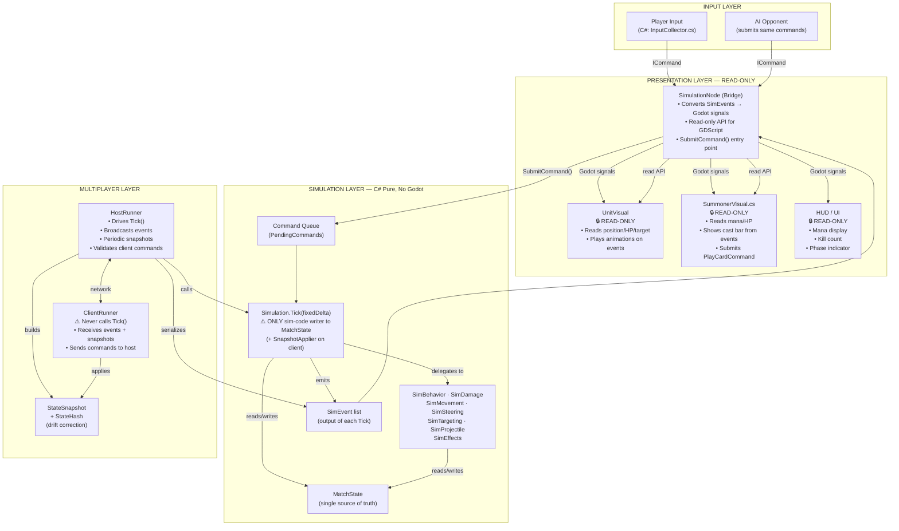

---

## 2. Simulation Tick Pipeline

What `Simulation.Tick(fixedDelta)` does each frame, in order.

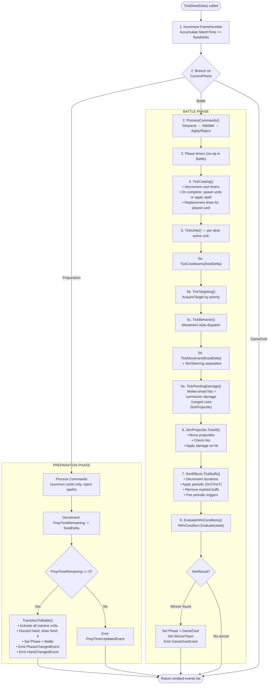

---

## 3. Class Diagrams

### 3.1 Enums

```mermaid
classDiagram
    class DamageType {
        <<enumeration>>
        Physical
        Magic
    }

    class TriggerType {
        <<enumeration>>
        OnAttack
        OnHit
        OnKill
        OnDeath
        OnDamaged
        HpThreshold
        Periodic
        OnSpawn
        LeaderDeath
    }

    class EffectType {
        <<enumeration>>
        DirectDamage
        Heal
        StatModifier
        DamageOverTime
        HealOverTime
        Shield
        Stun
        Slow
        AoE
        ChargeBonusDamage
    }

    class MovementStyle {
        <<enumeration>>
        MoveToward
        Kite
        FollowLeader
    }

    class TargetingPriority {
        <<enumeration>>
        NearestEnemy
        SummonerPriority
        LeaderTarget
    }

    class RetreatCondition {
        <<enumeration>>
        None
        HpThreshold
    }

    class SpellTargetingMode {
        <<enumeration>>
        Position
        Unit
    }

    class GamePhase {
        <<enumeration>>
        Preparation
        Battle
        Overtime
        GameOver
    }

    class UnitLifecycle {
        <<enumeration>>
        Spawning
        Active
        Dying
        Dead
    }

    class ProjectileMovementType {
        <<enumeration>>
        Straight
        Arc
        Homing
        Ballistic
        WeavingHoming
    }

    class CardType {
        <<enumeration>>
        Summon
        Spell
    }

    class Element {
        <<enumeration>>
        Fire
        Wind
        Earth
        Water
        Lightning
        Life
        Death
        Shadow
    }

    class EffectTargetMode {
        <<enumeration>>
        Self
        Target
        AlliesInRadius
        EnemiesInRadius
        AllInRadius
    }

    class FormationType {
        <<enumeration>>
        Grid
        Line
        Ring
        VShape
        Single
    }
```

### 3.2 Data Model

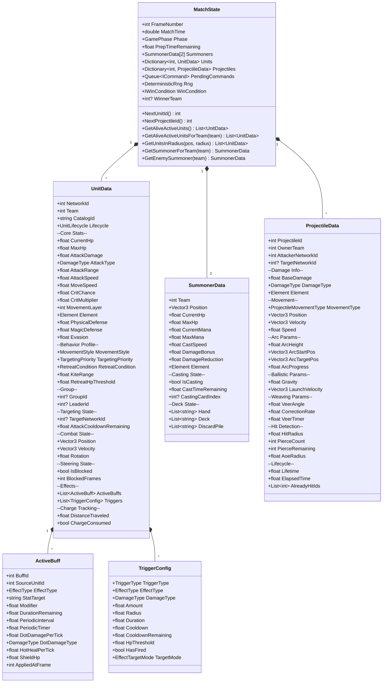

### 3.3 Simulation Systems

```mermaid
classDiagram
    class Simulation {
        -MatchState State
        -ICardDefinitionProvider CardProvider
        +Tick(fixedDelta: float) List~SimEvent~
        -TickPreparation(fixedDelta: float)
        -TickBattle(fixedDelta: float)
        -TickUnits(fixedDelta: float)
        -TickCasting(fixedDelta: float)
        -ProcessCommands()
        -EvaluateWinConditions() WinResult?
        -TransitionToBattle()
        -HandleCastCompletion(summoner: SummonerData)
        -SpawnUnitsFromCard(card: SummonCardDefinition, pos: Vector3, team: int)
        -ApplySpellFromCard(card: SpellCardDefinition, targets: TargetInfo)
        -ReplacementDraw(summoner: SummonerData, slotIndex: int)
        -RecycleDeck(summoner: SummonerData)
        -EmitEvent(event: SimEvent)
    }

    class SimBehavior {
        <<static>>
        +TickCooldowns(unit: UnitData, fixedDelta: float)$
        +TickTargeting(unit: UnitData, state: MatchState)$
        +TickBehavior(unit: UnitData, state: MatchState, fixedDelta: float)$
        +TickPendingDamage(unit: UnitData, state: MatchState, rng: DeterministicRng, events: List) $
        +ApplyMeleeDamageToUnit(attacker: UnitData, target: UnitData, state: MatchState, rng: DeterministicRng, events: List)$
        +ApplyDamageToSummoner(unit: UnitData, summoner: SummonerData, state: MatchState, rng: DeterministicRng, events: List)$
        +FireTriggers(unit: UnitData, triggerType: TriggerType, context: TriggerContext, state: MatchState, events: List)$
    }

    class SimDamage {
        <<static>>
        +Calculate(baseDamage: float, damageType: DamageType, attacker: UnitData, target: UnitData, attackerSummoner: SummonerData, targetSummoner: SummonerData, rng: DeterministicRng) DamageResult$
        +CheckEvasion(evasion: float, rng: DeterministicRng) bool$
        +ApplyCrit(damage: float, critChance: float, critMult: float, rng: DeterministicRng) CritResult$
        +ApplyElementalMatchup(damage: float, attackerElement: Element, defenderElement: Element) float$
        +ApplySummonerBonus(damage: float, summoner: SummonerData) float$
        +ApplyDefense(damage: float, damageType: DamageType, target: UnitData) float$
        +ApplyShieldAbsorption(damage: float, target: UnitData) float$
        +FloorDamage(damage: float, minimum: float) float$
    }

    class SimMovement {
        <<static>>
        +Tick(unit: UnitData, state: MatchState, fixedDelta: float)$
        +CalculateForward(unit: UnitData, fixedDelta: float) Vector3$
        +CalculateTowardPosition(from: Vector3, target: Vector3, speed: float, fixedDelta: float) Vector3$
        +CalculateKite(unit: UnitData, targetPos: Vector3, fixedDelta: float) Vector3$
        +CalculateFollowLeader(unit: UnitData, leaderPos: Vector3, fixedDelta: float) Vector3$
        +CalculateStrafePosition(unit: UnitData, targetPos: Vector3) Vector3$
    }

    class SimSteering {
        <<static>>
        +CalculateSeparation(unit: UnitData, nearby: List~UnitData~) Vector3$
        +UpdateBlockedState(unit: UnitData, desiredPos: Vector3, actualPos: Vector3)$
        +CalculateFlankForce(unit: UnitData, targetPos: Vector3, nearby: List~UnitData~) Vector3$
        +CorrectOverlaps(units: List~UnitData~)$
    }

    class SimTargeting {
        <<static>>
        +AcquireTarget(unit: UnitData, state: MatchState) int?$
        +AcquireTargetForPriority(unit: UnitData, priority: TargetingPriority, state: MatchState) int?$
        +FindNearestEnemy(unit: UnitData, state: MatchState) int?$
        +FindSummonerPriority(unit: UnitData, state: MatchState) int?$
        +FindLeaderTarget(unit: UnitData, state: MatchState) int?$
        +CanAttack(attacker: UnitData, target: UnitData) bool$
        +PassesLayerFilter(attacker: UnitData, target: UnitData) bool$
        +ScoreTarget(unit: UnitData, candidate: UnitData) float$
    }

    class SimProjectile {
        <<static>>
        +Spawn(def: ProjectileDefinition, attacker: UnitData, target: int?, targetPos: Vector3, state: MatchState) ProjectileData$
        +TickAll(state: MatchState, fixedDelta: float, events: List)$
        +TickStraight(proj: ProjectileData, fixedDelta: float)$
        +TickArc(proj: ProjectileData, fixedDelta: float)$
        +TickHoming(proj: ProjectileData, state: MatchState, fixedDelta: float)$
        +TickBallistic(proj: ProjectileData, fixedDelta: float)$
        +TickWeavingHoming(proj: ProjectileData, state: MatchState, fixedDelta: float)$
        +CheckHits(proj: ProjectileData, state: MatchState) List~int~$
        +ApplyHit(proj: ProjectileData, targetId: int, state: MatchState, events: List)$
        +ApplyAoE(proj: ProjectileData, hitPos: Vector3, state: MatchState, events: List)$
    }

    class SimEffects {
        <<static>>
        +ApplyEffect(effectType: EffectType, source: UnitData, targets: List~UnitData~, params: EffectParams, state: MatchState, events: List)$
        +TickBuffs(state: MatchState, fixedDelta: float, events: List)$
        +ResolveSpellTargets(mode: SpellTargetingMode, targetPos: Vector3?, targetUnitId: int?, radius: float, state: MatchState) List~UnitData~$
        +ApplyDirectDamage(source: UnitData, target: UnitData, amount: float, damageType: DamageType, state: MatchState, events: List)$
        +ApplyHeal(target: UnitData, amount: float, events: List)$
        +ApplyStatModifier(target: UnitData, stat: string, modifier: float, duration: float, sourceId: int, frame: int, events: List)$
        +ApplyShield(target: UnitData, amount: float, duration: float, sourceId: int, frame: int, events: List)$
        +ApplyStun(target: UnitData, duration: float, sourceId: int, frame: int, events: List)$
        +ApplySlow(target: UnitData, modifier: float, duration: float, sourceId: int, frame: int, events: List)$
        +ApplyDoT(target: UnitData, dps: float, damageType: DamageType, duration: float, interval: float, sourceId: int, frame: int, events: List)$
        +ApplyHoT(target: UnitData, hps: float, duration: float, interval: float, sourceId: int, frame: int, events: List)$
    }

    class DeterministicRng {
        -uint[] DomainStates
        +Next(domain: int) uint
        +NextFloat(domain: int) float
        +Range(min: int, max: int, domain: int) int
        +RangeFloat(min: float, max: float, domain: int) float
    }

    Simulation --> SimBehavior : delegates
    Simulation --> SimDamage : delegates
    Simulation --> SimMovement : delegates
    Simulation --> SimSteering : delegates
    Simulation --> SimTargeting : delegates
    Simulation --> SimProjectile : delegates
    Simulation --> SimEffects : delegates
    Simulation --> DeterministicRng : uses
```

### 3.4 Commands

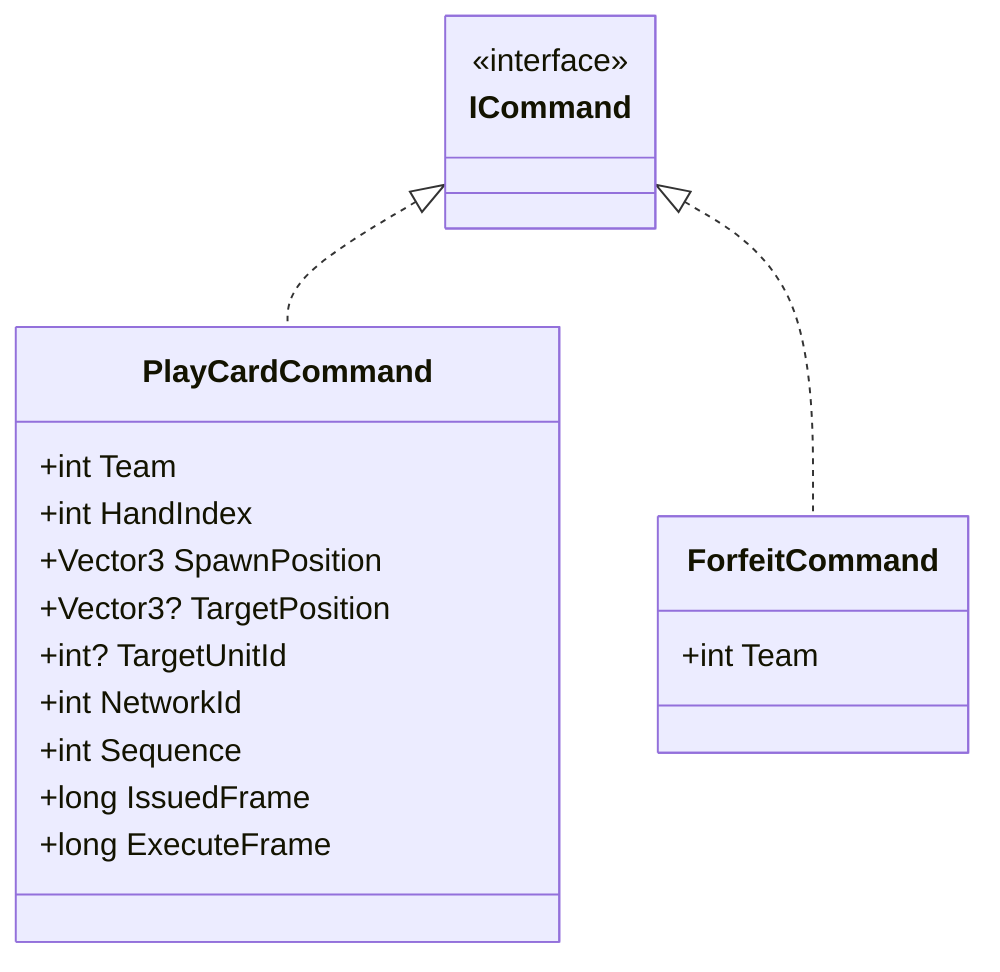

### 3.5 Events (SimEvent Hierarchy)

```mermaid
classDiagram
    class SimEvent {
        <<abstract>>
    }

    class PhaseChangedEvent {
        +GamePhase OldPhase
        +GamePhase NewPhase
    }

    class PrepTimerUpdatedEvent {
        +float TimeRemaining
    }

    class SummonerHpChangedEvent {
        +int Team
        +float NewHp
        +float Damage
    }

    class SummonerManaChangedEvent {
        +int Team
        +float NewMana
    }

    class SummonerDamagedEvent {
        +int Team
        +int AttackerNetworkId
        +float Damage
        +DamageType DamageType
    }

    class CastingStartedEvent {
        +int Team
        +float Duration
        +string CardCatalogId
    }

    class CastingCompletedEvent {
        +int Team
        +string CardCatalogId
        +List~int~ SpawnedUnitIds
    }

    class CardDrawnEvent {
        +int Team
        +int SlotIndex
        +string CardCatalogId
    }

    class HandChangedEvent {
        +int Team
        +List~string~ NewHand
    }

    class DeckRecycledEvent {
        +int Team
    }

    class CommandRejectedEvent {
        +int Team
        +string Reason
    }

    class UnitActivationChangedEvent {
        +int NetworkId
        +UnitLifecycle NewLifecycle
    }

    class AbilityTriggeredEvent {
        +int SourceUnitId
        +string AbilityType
        +Vector3 Position
        +float Radius
    }

    class UnitRegisteredEvent {
        +int NetworkId
        +int Team
        +string CatalogId
        +Vector3 Position
        +float MaxHp
    }

    class UnitRemovedEvent {
        +int NetworkId
    }

    class UnitAttackedEvent {
        +int AttackerNetworkId
        +int TargetNetworkId
    }

    class UnitDamagedEvent {
        +int TargetNetworkId
        +int AttackerNetworkId
        +float Damage
        +DamageType DamageType
        +bool IsCrit
    }

    class UnitDiedSimEvent {
        +int NetworkId
        +int KillerNetworkId
    }

    class AttackEvadedEvent {
        +int AttackerNetworkId
        +int TargetNetworkId
    }

    class BuffAppliedEvent {
        +int UnitNetworkId
        +int BuffId
        +EffectType EffectType
        +string StatTarget
        +float Modifier
        +float Duration
    }

    class BuffExpiredEvent {
        +int UnitNetworkId
        +int BuffId
    }

    class ShieldAbsorbedEvent {
        +int UnitNetworkId
        +int BuffId
        +float AbsorbedAmount
        +float RemainingShieldHp
    }

    class TriggerFiredEvent {
        +int UnitNetworkId
        +TriggerType TriggerType
        +EffectType EffectType
    }

    class ProjectileSpawnedEvent {
        +int ProjectileId
        +int AttackerNetworkId
        +int? TargetNetworkId
        +Vector3 SpawnPosition
        +ProjectileMovementType MovementType
    }

    class ProjectileHitSimEvent {
        +int ProjectileId
        +int? TargetNetworkId
        +Vector3 HitPosition
    }

    class GameOverEvent {
        +int WinnerTeam
        +string Reason
    }

    SimEvent <|-- PhaseChangedEvent
    SimEvent <|-- PrepTimerUpdatedEvent
    SimEvent <|-- SummonerHpChangedEvent
    SimEvent <|-- SummonerManaChangedEvent
    SimEvent <|-- SummonerDamagedEvent
    SimEvent <|-- CastingStartedEvent
    SimEvent <|-- CastingCompletedEvent
    SimEvent <|-- CardDrawnEvent
    SimEvent <|-- HandChangedEvent
    SimEvent <|-- DeckRecycledEvent
    SimEvent <|-- CommandRejectedEvent
    SimEvent <|-- UnitActivationChangedEvent
    SimEvent <|-- AbilityTriggeredEvent
    SimEvent <|-- UnitRegisteredEvent
    SimEvent <|-- UnitRemovedEvent
    SimEvent <|-- UnitAttackedEvent
    SimEvent <|-- UnitDamagedEvent
    SimEvent <|-- UnitDiedSimEvent
    SimEvent <|-- AttackEvadedEvent
    SimEvent <|-- BuffAppliedEvent
    SimEvent <|-- BuffExpiredEvent
    SimEvent <|-- ShieldAbsorbedEvent
    SimEvent <|-- TriggerFiredEvent
    SimEvent <|-- ProjectileSpawnedEvent
    SimEvent <|-- ProjectileHitSimEvent
    SimEvent <|-- GameOverEvent
```

### 3.6 Card & Projectile Definitions (Read-Only Data)

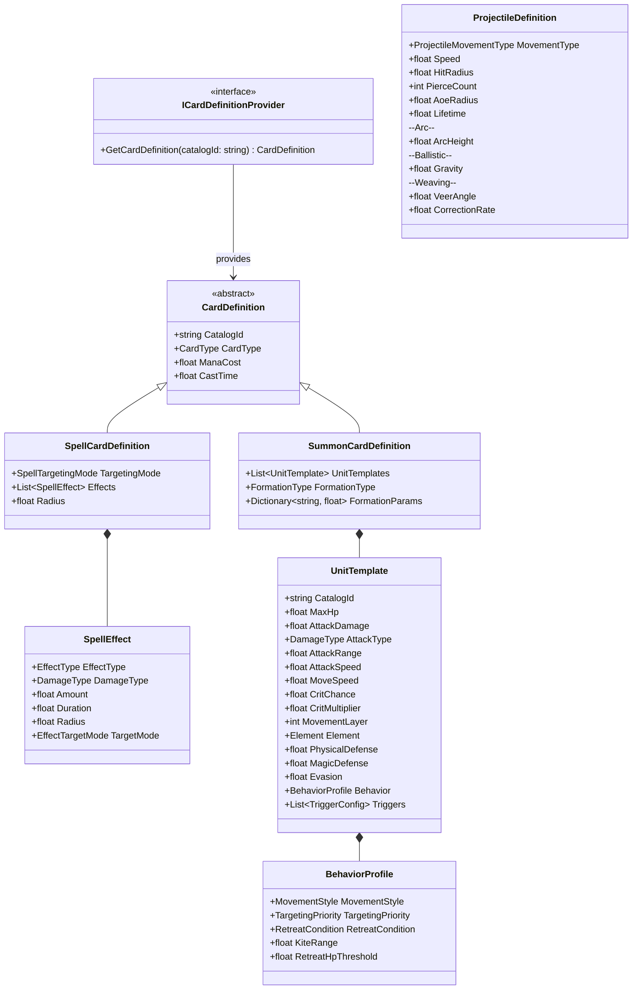

### 3.7 Bridge Layer

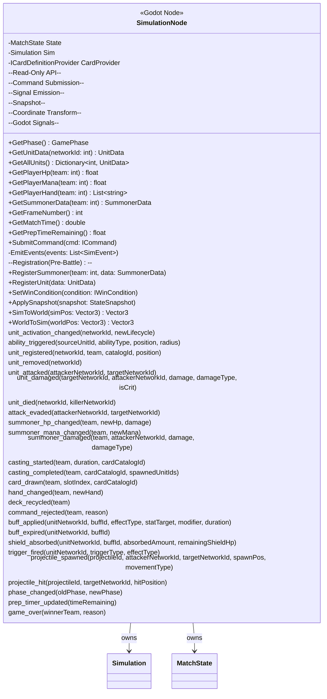

### 3.8 Win Conditions

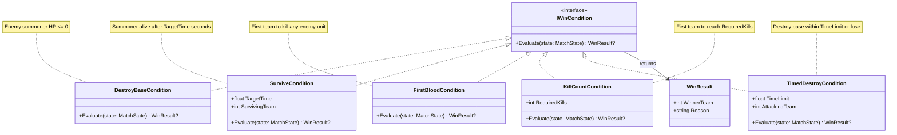

### 3.9 Multiplayer

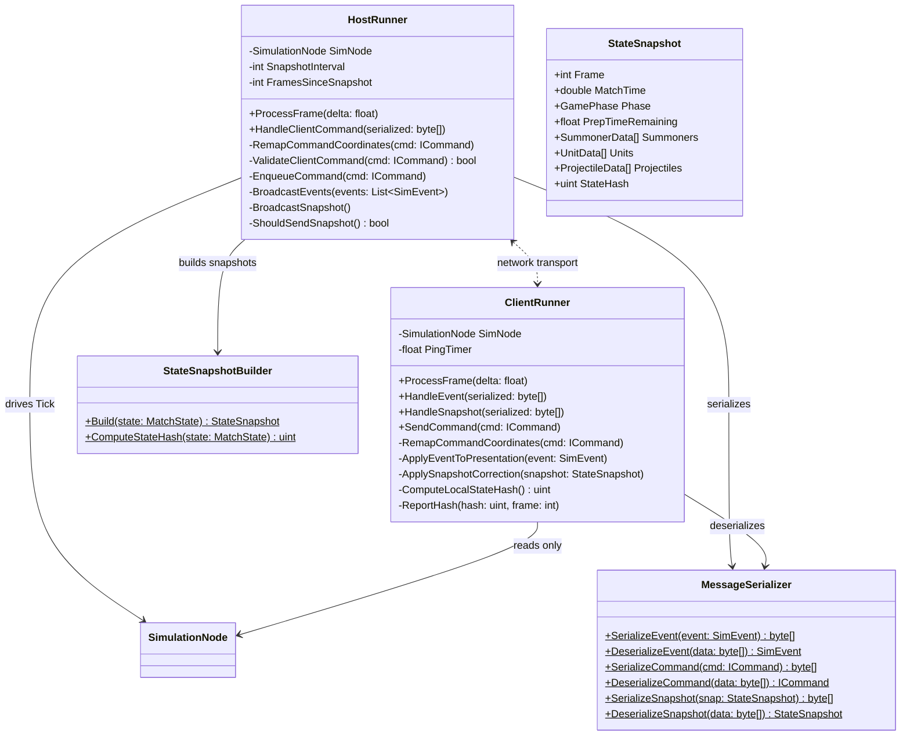

---

## 4. Damage Pipeline

Full calculation flow from attack initiation to HP deduction.

```mermaid
flowchart TD
    Start(["Attack Initiated\n(melee hit / projectile hit / spell damage)"])
    BaseDmg["Base Damage\n(from unit ATK or spell amount)"]
    DmgType["Determine DamageType\n(Physical or Magic)"]
    Evasion{"Evasion Check\n(seeded RNG vs target.Evasion)"}
    Evaded(["EVADED\nEmit AttackEvadedEvent\nDamage = 0"])
    Crit{"Critical Hit Check\n(seeded RNG vs attacker.CritChance)"}
    CritYes["Apply CritMultiplier\ndamage *= attacker.CritMultiplier"]
    CritNo["No crit"]
    Elemental["Elemental Matchup\n• Advantage: damage *= 1.25\n• Disadvantage: damage *= 0.8\n• Neutral: unchanged"]
    SummonerBonus["Summoner Damage Bonus\ndamage *= (1 + summoner.DamageBonus)"]
    Defense["Defense Reduction\n(pluggable formula)\n• Physical → target.PhysicalDefense\n• Magic → target.MagicDefense"]
    Shield{"Target has Shields?"}
    ShieldAbsorb["Shield Absorption\n(oldest shield first)\nLoop shields:\n  absorbed = min(shield.ShieldHp, remaining)\n  shield.ShieldHp -= absorbed\n  remaining -= absorbed\n  if shield depleted → remove buff\n  Emit ShieldAbsorbedEvent"]
    Floor["Floor Damage\ndamage = max(damage, 1)"]
    DeductHP["Deduct HP\ntarget.CurrentHp -= damage"]
    EmitDmg["Emit UnitDamagedEvent\n(damage, type, isCrit)"]
    DeathCheck{"target.CurrentHp <= 0?"}
    Death["Set Lifecycle = Dying\nEmit UnitDiedSimEvent"]
    DeathTriggers["Fire OnDeath triggers on target\nFire OnKill triggers on attacker\nFire LeaderDeath if target was leader"]
    Alive(["Target survives"])

    Start --> BaseDmg --> DmgType --> Evasion
    Evasion -->|"Evaded"| Evaded
    Evasion -->|"Not evaded"| Crit
    Crit -->|"Crit!"| CritYes --> Elemental
    Crit -->|"No crit"| CritNo --> Elemental
    Elemental --> SummonerBonus --> Defense --> Shield
    Shield -->|"Yes"| ShieldAbsorb --> Floor
    Shield -->|"No"| Floor
    Floor --> DeductHP --> EmitDmg --> DeathCheck
    DeathCheck -->|"Yes"| Death --> DeathTriggers
    DeathCheck -->|"No"| Alive
```

---

## 5. Multiplayer Data Flow

Host-client interactions for commands, events, and snapshots.

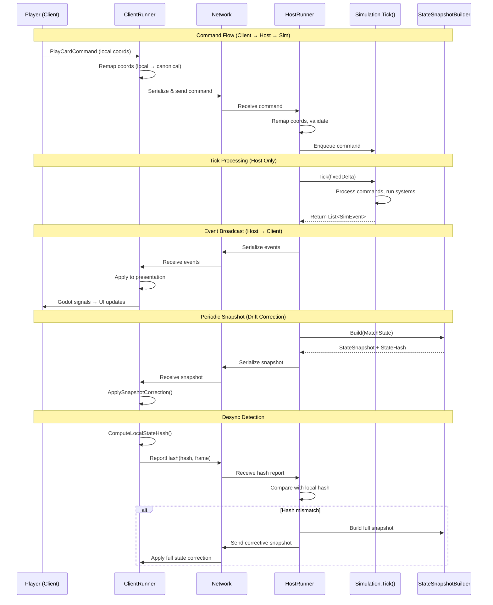

---

## 6. Card Play Flow

Full path from player input to visual result.

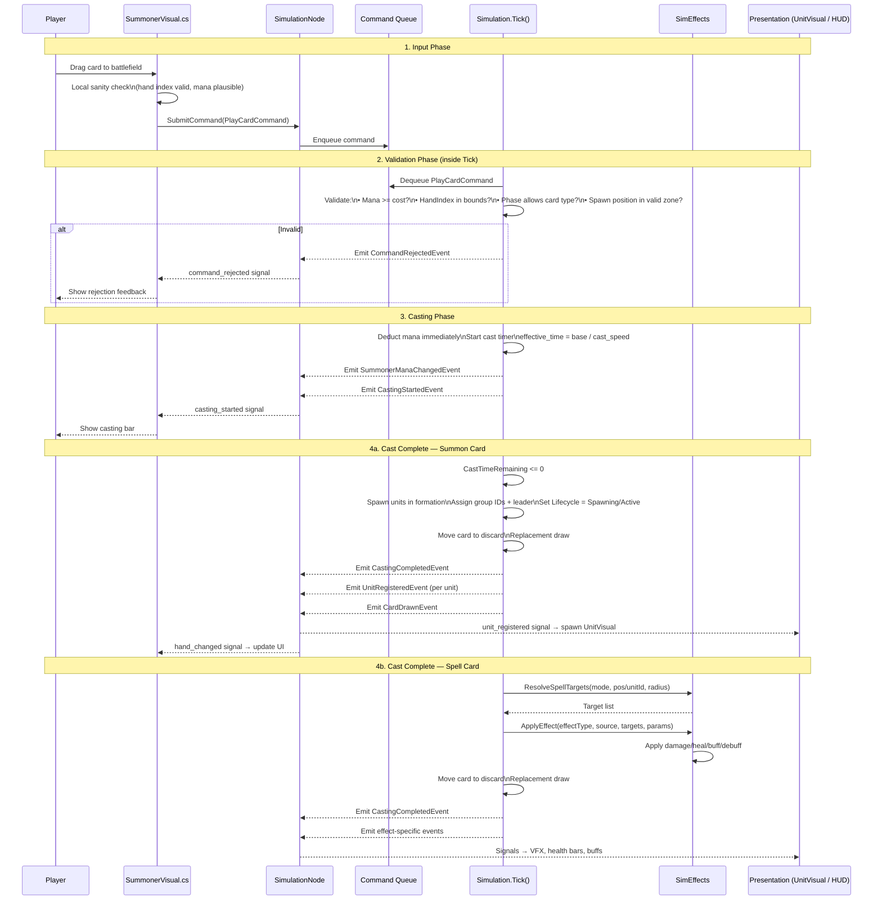

---

## 7. Unit Behavior State Machine

### 7.1 Lifecycle States

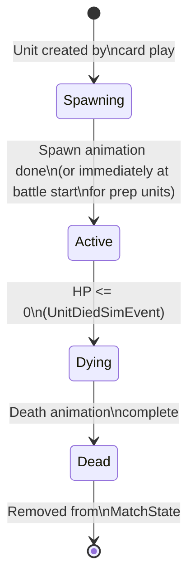

### 7.2 Behavior Loop (within Active state)

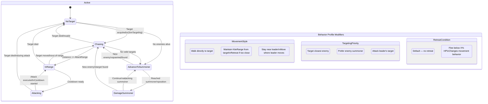

---

## 8. Effect System Flow

Three trigger entry points converging on a shared effect pipeline.

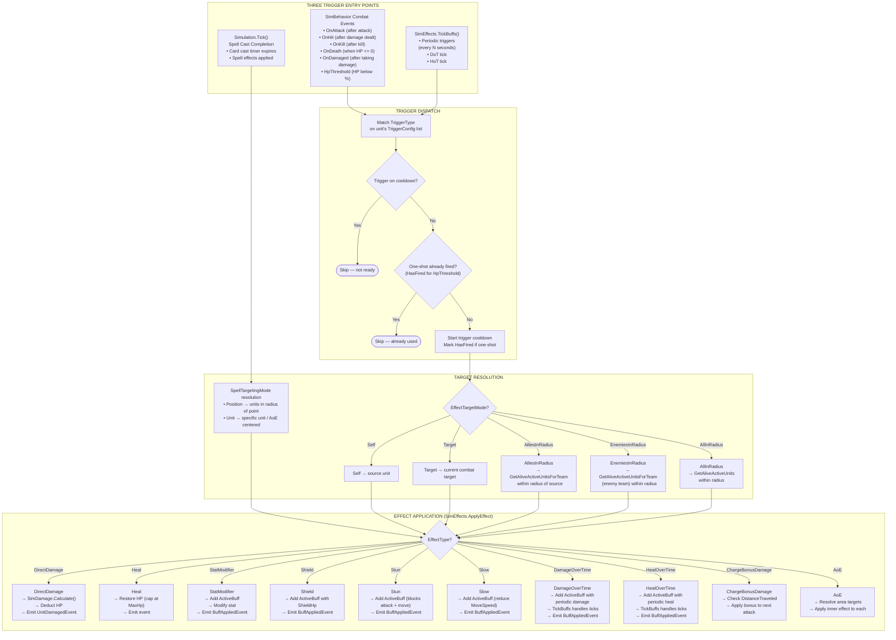

---

## 9. Requirements Verification Matrix

Every requirement mapped to responsible classes, with determinism and multiplayer safety verification.

### 9.1 Match Flow

| Requirement | Responsible Classes | Deterministic? | Multiplayer-Safe? |
|---|---|---|---|
| Deck locked at match start | Simulation (init), SummonerData | Yes — set once at initialization | Yes — part of MatchState, in snapshots |
| Preparation phase ~30s timer | Simulation.TickPreparation | Yes — fixedDelta-based countdown inside Tick | Yes — host-only Tick, timer in MatchState |
| Prep: summon cards only | Simulation.ProcessCommands | Yes — phase check is pure logic | Yes — validated by host Tick |
| Prep: units spawn inactive | Simulation.SpawnUnitsFromCard | Yes — Lifecycle set to Spawning | Yes — lifecycle in UnitData, in snapshots |
| Prep: fixed mana, no regen | SummonerData, Simulation | Yes — mana only decremented inside Tick | Yes — mana in MatchState |
| Battle start: activate all units | Simulation.TransitionToBattle | Yes — iterates all units, sets Active | Yes — host-only Tick emits PhaseChangedEvent |
| Battle start: hand refresh (draw 4) | Simulation.TransitionToBattle | Yes — seeded RNG for deck order | Yes — hand state in MatchState, HandChangedEvent broadcast |
| Battle start: mana carries over | Simulation.TransitionToBattle | Yes — no mana mutation on transition | Yes — mana unchanged in MatchState |
| Battle: all card types available | Simulation.ProcessCommands | Yes — phase check allows all types | Yes — validated by host Tick |
| Battle: no mana regen | SummonerData, Simulation | Yes — no regen logic exists | Yes — mana only modified by commands in Tick |
| Game over on win condition | Simulation.EvaluateWinConditions | Yes — predicate evaluation inside Tick | Yes — GameOverEvent broadcast |

### 9.2 Card System

| Requirement | Responsible Classes | Deterministic? | Multiplayer-Safe? |
|---|---|---|---|
| Hand size = 4 cards | SummonerData, Simulation | Yes — fixed constant | Yes — hand in MatchState |
| Replacement draw on play | Simulation.ReplacementDraw | Yes — seeded RNG for deck | Yes — CardDrawnEvent broadcast |
| Hand refresh at battle start | Simulation.TransitionToBattle | Yes — seeded RNG | Yes — HandChangedEvent broadcast |
| Mana fixed pool (~100) | SummonerData | Yes — set at init | Yes — in MatchState |
| Cast time per card | Simulation.TickCasting | Yes — timer in SummonerData, decremented in Tick | Yes — CastingStartedEvent broadcast |
| Cast speed modifier | Simulation (effective_time = base / cast_speed) | Yes — pure math | Yes — CastSpeed in SummonerData |
| Mana deducted immediately | Simulation.ProcessCommands | Yes — deducted when command validated | Yes — SummonerManaChangedEvent broadcast |
| Cast lock (no card during cast) | Simulation.ProcessCommands | Yes — IsCasting check | Yes — casting state in MatchState |
| Deck recycle (shuffle discard) | Simulation.RecycleDeck | Yes — seeded RNG (DeckShuffle domain) | Yes — DeckRecycledEvent broadcast |
| Spawn formations | Simulation.SpawnUnitsFromCard | Yes — deterministic geometry from FormationType | Yes — unit positions in UnitData |
| Spell targeting: position-based | SimEffects.ResolveSpellTargets | Yes — radius check, pure math | Yes — resolved inside Tick |
| Spell targeting: unit-based | SimEffects.ResolveSpellTargets | Yes — unit lookup from MatchState | Yes — resolved inside Tick |

### 9.3 Summoner

| Requirement | Responsible Classes | Deterministic? | Multiplayer-Safe? |
|---|---|---|---|
| Static base (fixed position) | SummonerData | Yes — position set at init, never changes | Yes — position in MatchState |
| HP / Max HP | SummonerData, SimBehavior | Yes — only modified inside Tick | Yes — SummonerHpChangedEvent broadcast |
| Mana / Max Mana | SummonerData, Simulation | Yes — only modified inside Tick | Yes — SummonerManaChangedEvent broadcast |
| Cast Speed stat | SummonerData | Yes — read at cast time inside Tick | Yes — in MatchState |
| Damage Bonus % | SummonerData, SimDamage | Yes — applied in damage formula | Yes — in MatchState |
| Damage Reduction | SummonerData, SimDamage | Yes — applied in damage formula | Yes — in MatchState |
| Element affinity | SummonerData, SimDamage | Yes — used in elemental matchup | Yes — in MatchState |
| Summoner HP 0 = defeat | IWinCondition (DestroyBaseCondition) | Yes — evaluated inside Tick | Yes — GameOverEvent broadcast |
| Progression baked at init | SimulationNode.RegisterSummoner | Yes — one-time setup before Tick runs | Yes — set before first Tick |

### 9.4 Combat System

| Requirement | Responsible Classes | Deterministic? | Multiplayer-Safe? |
|---|---|---|---|
| Physical/Magic damage types | DamageType enum, SimDamage | Yes — enum comparison, pure logic | Yes — DamageType in UnitData + events |
| Physical Defense stat | UnitData, SimDamage.ApplyDefense | Yes — pluggable formula, pure math | Yes — in UnitData, in snapshots |
| Magic Defense stat | UnitData, SimDamage.ApplyDefense | Yes — pluggable formula, pure math | Yes — in UnitData, in snapshots |
| Evasion (% dodge) | UnitData, SimDamage.CheckEvasion | Yes — seeded RNG (CombatCrits domain) | Yes — AttackEvadedEvent broadcast |
| Shield (stackable, oldest first) | ActiveBuff, SimDamage.ApplyShieldAbsorption | Yes — ordered iteration, pure math | Yes — ActiveBuffs in UnitData, in snapshots |
| Armor (temporary reduction) | ActiveBuff, SimEffects | Yes — buff applied inside Tick | Yes — ActiveBuffs in snapshots |
| Damage pipeline order | SimDamage.Calculate | Yes — fixed order, pure functions | Yes — all inside Tick |
| Pluggable defense formula | SimDamage.ApplyDefense | Yes — pure function | Yes — deterministic, same on host |
| Elemental matchups | SimDamage.ApplyElementalMatchup | Yes — table lookup, pure function | Yes — deterministic |
| Critical hits (seeded RNG) | SimDamage.ApplyCrit, DeterministicRng | Yes — seeded RNG (CombatCrits domain) | Yes — deterministic, same seed |
| Summoner damage from units | SimBehavior.ApplyDamageToSummoner | Yes — distance check + damage inside Tick | Yes — SummonerDamagedEvent broadcast |
| Floor at minimum 1 | SimDamage.FloorDamage | Yes — pure math | Yes — inside Tick |

### 9.5 Unit System

| Requirement | Responsible Classes | Deterministic? | Multiplayer-Safe? |
|---|---|---|---|
| Melee / Ranged / Flying types | UnitData (MovementLayer, AttackRange) | Yes — stat-driven | Yes — in UnitData, in snapshots |
| All 13 unit stats | UnitData | Yes — stored in MatchState | Yes — in snapshots |
| Lifecycle: Spawning → Active → Dying → Dead | UnitData.Lifecycle, Simulation | Yes — transitions inside Tick | Yes — lifecycle in UnitData, events broadcast |
| Autonomous behavior (no player control) | SimBehavior | Yes — FSM inside Tick, pure logic | Yes — host-only Tick |
| Acquire target → move → attack → repeat | SimTargeting, SimMovement, SimBehavior | Yes — all inside Tick | Yes — host-only Tick |
| Advance toward summoner if no enemies | SimBehavior.TickBehavior | Yes — fallback to summoner position | Yes — inside Tick |
| MovementStyle: MoveToward | SimMovement.CalculateForward | Yes — pure math | Yes — position in UnitData |
| MovementStyle: Kite | SimMovement.CalculateKite | Yes — pure math with KiteRange | Yes — position in UnitData |
| MovementStyle: FollowLeader | SimMovement.CalculateFollowLeader | Yes — reads leader position from MatchState | Yes — position in UnitData |
| TargetingPriority: NearestEnemy | SimTargeting.FindNearestEnemy | Yes — distance comparison | Yes — inside Tick |
| TargetingPriority: SummonerPriority | SimTargeting.FindSummonerPriority | Yes — prefers summoner position | Yes — inside Tick |
| TargetingPriority: LeaderTarget | SimTargeting.FindLeaderTarget | Yes — reads leader's target from MatchState | Yes — inside Tick |
| RetreatCondition: HpThreshold | SimBehavior.TickBehavior | Yes — HP comparison | Yes — inside Tick |
| Group ID tracking | UnitData.GroupId | Yes — assigned at spawn | Yes — in UnitData, in snapshots |
| Leader-follower relationships | UnitData.LeaderId, SimTargeting | Yes — set at spawn, queried in Tick | Yes — in UnitData, in snapshots |
| Death triggers on relationships | SimBehavior.FireTriggers (LeaderDeath) | Yes — fires inside Tick | Yes — TriggerFiredEvent broadcast |

### 9.6 Effect System

| Requirement | Responsible Classes | Deterministic? | Multiplayer-Safe? |
|---|---|---|---|
| Data-driven (config, not code) | TriggerConfig, SpellEffect | Yes — configs are pure data | Yes — configs in UnitData/CardDefinition |
| Runs inside Tick | SimEffects, SimBehavior | Yes — all inside Tick | Yes — host-only Tick |
| Trigger: OnAttack | SimBehavior.FireTriggers | Yes — fires after attack in Tick | Yes — inside Tick |
| Trigger: OnHit | SimBehavior.FireTriggers | Yes — fires after damage dealt in Tick | Yes — inside Tick |
| Trigger: OnKill | SimBehavior.FireTriggers | Yes — fires after kill in Tick | Yes — inside Tick |
| Trigger: OnDeath | SimBehavior.FireTriggers | Yes — fires when HP <= 0 in Tick | Yes — inside Tick |
| Trigger: OnDamaged | SimBehavior.FireTriggers | Yes — fires after taking damage in Tick | Yes — inside Tick |
| Trigger: HpThreshold | SimBehavior.FireTriggers | Yes — HP comparison in Tick | Yes — inside Tick |
| Trigger: Periodic | SimEffects.TickBuffs | Yes — timer-based inside Tick | Yes — timer in TriggerConfig |
| Trigger: OnSpawn | SimBehavior.FireTriggers | Yes — fires at activation in Tick | Yes — inside Tick |
| Trigger: LeaderDeath | SimBehavior.FireTriggers | Yes — fires on leader death in Tick | Yes — inside Tick |
| Effect: DirectDamage | SimEffects.ApplyDirectDamage → SimDamage | Yes — damage pipeline | Yes — UnitDamagedEvent |
| Effect: Heal | SimEffects.ApplyHeal | Yes — HP clamped at max | Yes — event broadcast |
| Effect: StatModifier | SimEffects.ApplyStatModifier | Yes — buff added to ActiveBuffs | Yes — BuffAppliedEvent |
| Effect: DamageOverTime | SimEffects.ApplyDoT, TickBuffs | Yes — periodic inside Tick | Yes — buff in ActiveBuffs |
| Effect: HealOverTime | SimEffects.ApplyHoT, TickBuffs | Yes — periodic inside Tick | Yes — buff in ActiveBuffs |
| Effect: Shield | SimEffects.ApplyShield | Yes — ShieldHp tracked in buff | Yes — BuffAppliedEvent |
| Effect: Stun | SimEffects.ApplyStun | Yes — blocks attack + move via buff | Yes — buff in ActiveBuffs |
| Effect: Slow | SimEffects.ApplySlow | Yes — speed modifier via buff | Yes — buff in ActiveBuffs |
| Effect: ChargeBonusDamage | UnitData.DistanceTraveled, SimBehavior | Yes — distance tracked in Tick | Yes — in UnitData |
| Effect: AoE | SimEffects + radius check | Yes — geometry, pure math | Yes — inside Tick |
| Shared system (abilities + spells) | SimEffects.ApplyEffect (both paths) | Yes — same code path | Yes — same events |
| ChargeAbility migration | TriggerConfig (OnAttack), DistanceTraveled | Yes — distance + trigger inside Tick | Yes — in UnitData |
| AuraAbility migration | TriggerConfig (Periodic), radius check | Yes — periodic inside Tick | Yes — TriggerFiredEvent |
| DeathExplosionAbility migration | TriggerConfig (OnDeath), AoE damage | Yes — fires on death inside Tick | Yes — inside Tick |
| SlowOnHitAbility migration | TriggerConfig (OnHit), Slow effect | Yes — fires on hit inside Tick | Yes — BuffAppliedEvent |

### 9.7 Projectile System

| Requirement | Responsible Classes | Deterministic? | Multiplayer-Safe? |
|---|---|---|---|
| Movement: Straight | SimProjectile.TickStraight | Yes — linear math | Yes — position in ProjectileData |
| Movement: Arc | SimProjectile.TickArc | Yes — Bezier/parabolic, pure math | Yes — position in ProjectileData |
| Movement: Homing | SimProjectile.TickHoming | Yes — tracks target from MatchState | Yes — position in ProjectileData |
| Movement: Ballistic | SimProjectile.TickBallistic | Yes — gravity math | Yes — position in ProjectileData |
| Movement: WeavingHoming | SimProjectile.TickWeavingHoming | Yes — seeded RNG for veer direction | Yes — position in ProjectileData |
| Per-definition config | ProjectileDefinition (read-only data) | Yes — data-driven | Yes — same data on host |
| Speed | ProjectileData.Speed | Yes — constant per projectile | Yes — in ProjectileData |
| Hit radius | SimProjectile.CheckHits | Yes — distance check | Yes — inside Tick |
| Pierce count | ProjectileData.PierceRemaining | Yes — decremented inside Tick | Yes — in ProjectileData |
| AoE radius | SimProjectile.ApplyAoE | Yes — radius check | Yes — inside Tick |
| Lifetime | ProjectileData.Lifetime, ElapsedTime | Yes — timer inside Tick | Yes — in ProjectileData |
| Deterministic hit detection | SimProjectile.CheckHits | Yes — line-segment distance, inside Tick | Yes — host decides hits |

### 9.8 Win Conditions

| Requirement | Responsible Classes | Deterministic? | Multiplayer-Safe? |
|---|---|---|---|
| Configurable predicate system | IWinCondition interface | Yes — evaluated inside Tick | Yes — set at init, in MatchState |
| Destroy base (HP <= 0) | DestroyBaseCondition | Yes — HP comparison | Yes — GameOverEvent broadcast |
| Survive (alive after X seconds) | SurviveCondition | Yes — time comparison | Yes — GameOverEvent broadcast |
| First blood | FirstBloodCondition | Yes — kill count check | Yes — GameOverEvent broadcast |
| Kill count (N kills) | KillCountCondition | Yes — counter comparison | Yes — GameOverEvent broadcast |
| Timed destroy | TimedDestroyCondition | Yes — time + HP check | Yes — GameOverEvent broadcast |
| Overtime (placeholder) | Simulation | Deferred — placeholder acceptable | Deferred |

### 9.9 Multiplayer

| Requirement | Responsible Classes | Deterministic? | Multiplayer-Safe? |
|---|---|---|---|
| Host-authoritative | HostRunner, Simulation | Yes — single Tick on host | Yes — by design |
| Client never runs Tick | ClientRunner (no Tick call) | N/A — client has no sim | Yes — enforced by IsHost check |
| Command-based input | ICommand, PlayCardCommand, ForfeitCommand | Yes — commands processed in Tick order | Yes — validated by host |
| Event broadcast | HostRunner.BroadcastEvents | N/A — network layer | Yes — events serialized and sent |
| Periodic snapshots | HostRunner.BroadcastSnapshot, StateSnapshotBuilder | N/A — correction mechanism | Yes — full state sync |
| Desync detection (state hash) | StateSnapshotBuilder.ComputeStateHash | Yes — deterministic hash | Yes — hash comparison triggers correction |
| Coordinate remapping | HostRunner, ClientRunner (remap methods) | Yes — fixed transform | Yes — canonical coords in MatchState |
| Single-player = local host | HostRunner (default) | Yes — same code path | Yes — no network, same Tick |
| AI uses command queue | AI Opponent → SubmitCommand | Yes — same pipeline as player | Yes — same validation |

### 9.10 Randomness

| Requirement | Responsible Classes | Deterministic? | Multiplayer-Safe? |
|---|---|---|---|
| Seeded RNG | DeterministicRng (Xorshift32) | Yes — same seed = same sequence | Yes — host seed is authoritative |
| Domain: DeckShuffle | DeterministicRng, Simulation.RecycleDeck | Yes — per-domain state | Yes — deck state in snapshots |
| Domain: AiDecisions | DeterministicRng, AI | Yes — per-domain state | Yes — AI on host only |
| Domain: CombatCrits | DeterministicRng, SimDamage.ApplyCrit | Yes — per-domain state | Yes — crit result in events |
| Domain: SpawnPositions | DeterministicRng | Yes — per-domain state | Yes — positions in UnitData |
| Domain: ProjectileBehavior | DeterministicRng, SimProjectile | Yes — per-domain state | Yes — positions in ProjectileData |
| Non-deterministic presentation RNG | System.Random / GDScript randf() | N/A — visual only | Yes — no gameplay impact |

### 9.11 Battlefield

| Requirement | Responsible Classes | Deterministic? | Multiplayer-Safe? |
|---|---|---|---|
| Flat open rectangle | MatchState (boundaries) | Yes — fixed at init | Yes — same boundaries |
| Canonical coordinate system | SimulationNode (SimToWorld, WorldToSim) | Yes — fixed transform | Yes — all sim uses canonical coords |
| Perspective flip for client | ClientRunner, SimulationNode | Yes — deterministic transform | Yes — applied at presentation only |
| Spawn zone validation | Simulation.ProcessCommands | Yes — boundary check inside Tick | Yes — validated by host |

---

## Key Design Decisions

### 1. Fat Struct for ActiveBuff/TriggerConfig
One struct covers all effect types. Unused fields are zeroed. This is preferred over an interface hierarchy because:
- Serialization is trivial (no polymorphic dispatch)
- Snapshot hashing is straightforward (hash all fields)
- No allocations for different buff subtypes
- Simpler iteration in TickBuffs

### 2. PlayCardCommand Handles Both Summons and Spells
`TargetPosition` and `TargetUnitId` are nullable. Which is set depends on `SpellTargetingMode` (from the card definition). This is cleaner than separate command types because:
- Single command validation pipeline
- Single casting flow in Tick
- Type resolution happens at cast completion, not at command creation

### 3. IWinCondition Stored on MatchState
The win condition is part of the serializable state. It is:
- Included in snapshots
- Set at match initialization
- Immutable during gameplay
- Evaluated every Tick by calling `IWinCondition.Evaluate(state)`

### 4. ICardDefinitionProvider Interface
The simulation queries this interface to resolve `CatalogId → CardDefinition`. The bridge layer provides the implementation using the existing card catalog system. This keeps:
- Simulation free of Godot dependencies
- Card data loaded from existing catalog infrastructure
- Clean separation between data and logic

### 5. UnitLifecycle Enum Replaces ActivationState
A proper C# enum inside simulation with clear states (Spawning, Active, Dying, Dead) instead of integer flags. No GDScript dependency. Lifecycle transitions happen only inside Tick.

---

*Last updated: 2026-02-26*
*Status: Finalized*
*Source: Derived from requirements.md, architecture-decisions.md, implementation-plan.md, ai-implementation-guide.md, problem-analysis.md*
