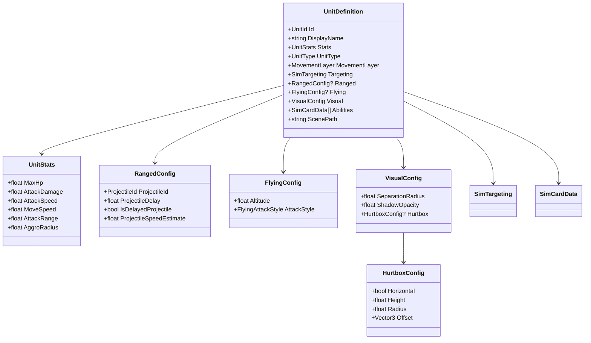
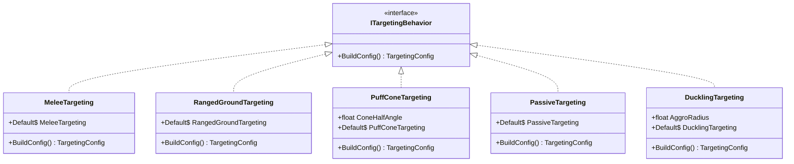
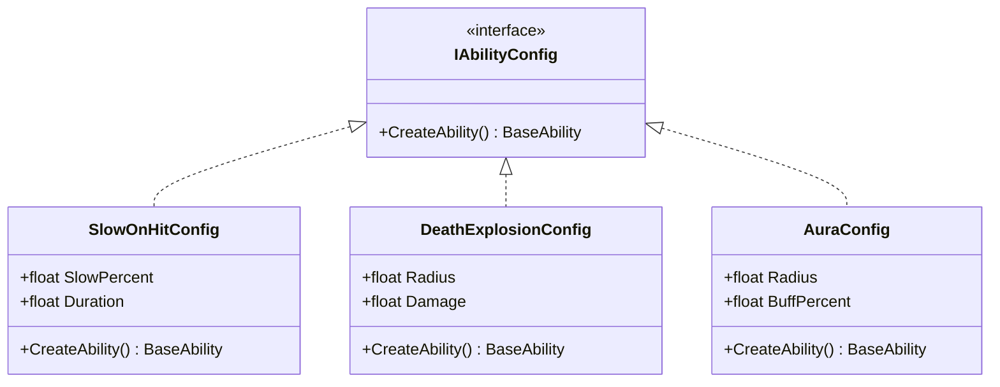
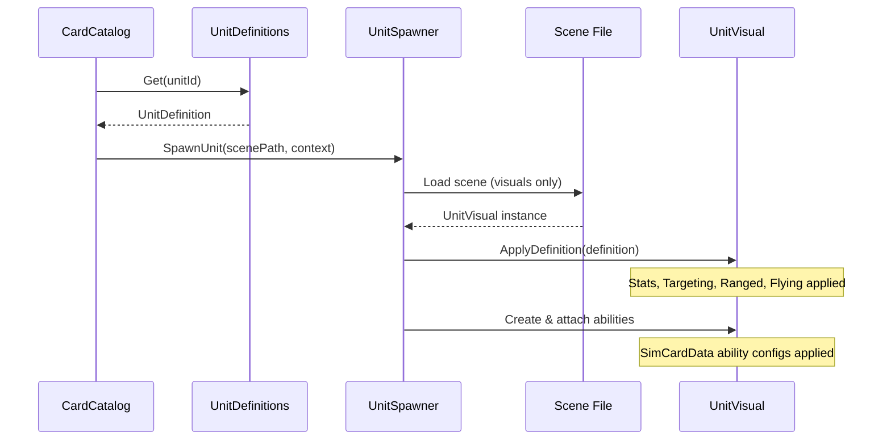

# Unit Definition Architecture Refactor

## Overview

Consolidate all unit configuration into a single C# source of truth. Currently unit data is scattered across scene files, UnitCatalog, TargetingConfigRegistry, and CardCatalog.

**Core Principle: Scene files define VISUALS. C# defines BEHAVIOR.**

---

## Architecture Diagram



---

## Targeting Behaviors (Interface Pattern)

Targeting logic now lives in `scripts/csharp/Battle/Simulation/Combat/SimTargeting.cs`. The interface pattern remains, but implementations have moved to the simulation layer.



**Why interfaces instead of enums?**
- Each behavior can have its own parameters (PuffCone's angle, Duckling's aggro radius)
- No enum/catalog lookup indirection
- Easy to add new behaviors without modifying existing code
- Self-contained and testable

---

## Ability Configs (Interface Pattern)

Ability configuration now lives in `scripts/csharp/Battle/Simulation/Data/SimCardData.cs`.



**Why interfaces instead of one record with nullable params?**
- Each ability has only its relevant parameters (no `float? SlowPercent, float? DamageRadius, ...` soup)
- Compile-time validation that required params are provided
- Adding new abilities doesn't touch existing code

---

## Data Flow



---

## Class Overview

### UnitDefinition

The single source of truth for what a unit IS.

```csharp
public record UnitDefinition
{
    // Identity
    public required UnitId Id { get; init; }
    public required string DisplayName { get; init; }

    // Core
    public required UnitStats Stats { get; init; }
    public required UnitType UnitType { get; init; }
    public MovementLayer MovementLayer { get; init; } = MovementLayer.Ground;

    // Targeting (interface - each behavior is its own class, implementations in SimTargeting.cs)
    public ITargetingBehavior Targeting { get; init; } = MeleeTargeting.Default;

    // Grouped Configs (null = not applicable)
    public RangedConfig? Ranged { get; init; }   // null for melee
    public FlyingConfig? Flying { get; init; }   // null for ground
    public VisualConfig Visual { get; init; } = VisualConfig.Default;

    // Abilities (interface - each type has its own config)
    public IReadOnlyList<IAbilityConfig> Abilities { get; init; } = [];

    // Scene Reference
    public required string ScenePath { get; init; }
}
```

### Grouped Config Records

```csharp
public record RangedConfig(
    ProjectileId ProjectileId,
    float ProjectileDelay = 0f,
    bool IsDelayedProjectile = false,
    float ProjectileSpeedEstimate = 15f
);

public record FlyingConfig(
    float Altitude = 2.5f,
    FlyingAttackStyle AttackStyle = FlyingAttackStyle.Hover
);

public record VisualConfig
{
    public float SeparationRadius { get; init; } = 0.5f;
    public float ShadowOpacity { get; init; } = 0.6f;
    public HurtboxConfig? Hurtbox { get; init; }
    public static VisualConfig Default => new();
}

public record HurtboxConfig(
    bool Horizontal = false,
    float Height = 0f,
    float Radius = 0f,
    Vector3 Offset = default
);
```

---

## Example Definitions

### Ranged Ground Unit (Fire Spider)

```csharp
public static readonly UnitDefinition FireSpider = new()
{
    Id = UnitIds.FireSpider,
    DisplayName = "Fire Spider",
    Stats = new(MaxHp: 50, AttackDamage: 10, AttackSpeed: 0.6f, MoveSpeed: 3.5f, AttackRange: 18f),
    UnitType = UnitType.Ranged,
    Targeting = RangedGroundTargeting.Default,
    Ranged = new(ProjectileIds.FireWeb),
    Visual = new() { SeparationRadius = 0.4f, ShadowOpacity = 0.5f },
    Abilities = [new SlowOnHitConfig(SlowPercent: 0.3f, Duration: 2f)],
    ScenePath = "res://scenes/battle/units/fire_spider_3d.tscn"
};
```

### Ranged Flying Unit with Custom Targeting (Puff)

```csharp
public static readonly UnitDefinition Puff = new()
{
    Id = UnitIds.Puff,
    DisplayName = "Puff",
    Stats = new(MaxHp: 80, AttackDamage: 12, AttackSpeed: 0.4f, MoveSpeed: 2.5f, AttackRange: 24f, AggroRadius: 24f),
    UnitType = UnitType.Ranged,
    MovementLayer = MovementLayer.Air,
    Targeting = new PuffConeTargeting { ConeHalfAngle = 30f },  // Custom angle!
    Ranged = new(ProjectileIds.WindPuff, ProjectileDelay: 0.585f, IsDelayedProjectile: true),
    Flying = new(Altitude: 2.5f),
    Visual = new()
    {
        SeparationRadius = 0.5f,
        ShadowOpacity = 0.5f,
        Hurtbox = new(Horizontal: true, Height: 3f, Radius: 0.75f, Offset: new(1.4f, 0, 0))
    },
    ScenePath = "res://scenes/battle/units/puff_3d.tscn"
};
```

### Melee Ground Unit (Stone Ape)

```csharp
public static readonly UnitDefinition StoneApe = new()
{
    Id = UnitIds.StoneApe,
    DisplayName = "Stone Ape",
    Stats = new(MaxHp: 200, AttackDamage: 25, AttackSpeed: 0.6f, MoveSpeed: 1.8f, AttackRange: 4f),
    UnitType = UnitType.Melee,
    // Targeting defaults to MeleeTargeting.Default
    // Ranged = null (melee unit)
    // Flying = null (ground unit)
    ScenePath = "res://scenes/battle/units/stone_ape_3d.tscn"
};
```

### Passive Unit (Rock - Target Dummy)

```csharp
public static readonly UnitDefinition Rock = new()
{
    Id = UnitIds.Rock,
    DisplayName = "Rock",
    Stats = new(MaxHp: 500, AttackDamage: 0, AttackSpeed: 0, MoveSpeed: 0, AttackRange: 3f, AggroRadius: 0f),
    UnitType = UnitType.Melee,
    Targeting = PassiveTargeting.Default,
    ScenePath = "res://scenes/battle/units/rock_3d.tscn"
};
```

---

## Files to Create

| File | Purpose |
|------|---------|
| `scripts/csharp/Units/UnitDefinition.cs` | UnitDefinition record + grouped config records |
| `scripts/csharp/Units/UnitDefinitions.cs` | All 19 unit definitions |
| `scripts/csharp/Battle/Simulation/Combat/SimTargeting.cs` | Targeting interface + all implementations (formerly `ITargetingBehavior.cs`) |
| `scripts/csharp/Projectiles/ProjectileId.cs` | Type-safe projectile ID struct |
| `scripts/csharp/Battle/Simulation/Data/SimCardData.cs` | Ability config interface + all implementations (formerly `IAbilityConfig.cs`) |

## Files to Modify

| File | Changes |
|------|---------|
| `scripts/csharp/Battle/View/UnitVisual.cs` | Add ApplyDefinition() method (ranged config merged here; `RangedUnit3D.cs` deleted) |
| `scripts/csharp/Summons/UnitSpawner.cs` | Look up and apply UnitDefinition on spawn |
| `scripts/csharp/Cards/CardCatalog.cs` | Use UnitDefinitions.Get() for stats |
| All 19 unit .tscn files | Remove stats, targeting, ability children |

## Files to Delete

| File | Reason |
|------|--------|
| `scripts/csharp/Targeting/TargetingConfigRegistry.cs` | Replaced by SimTargeting |
| `scripts/csharp/Targeting/DefaultTargetingConfig.cs` | Absorbed into MeleeTargeting |
| `scripts/csharp/Units/UnitCatalog.cs` | Replaced by UnitDefinitions |

---

## Migration Steps

1. Create ProjectileId struct (extend existing pattern from UnitId)
2. Create ITargetingBehavior interface + implementations
3. Create IAbilityConfig interface + implementations
4. Create grouped config records (RangedConfig, FlyingConfig, VisualConfig)
5. Create UnitDefinition record
6. Create UnitDefinitions.cs with all 19 units
7. Update UnitSpawner to apply UnitDefinition on spawn
8. Update UnitVisual with ApplyDefinition() method (RangedUnit3D merged into UnitVisual)
9. Update CardCatalog to use UnitDefinitions.Get() for stats
10. Clean scene files (remove stats, targeting, ability children)
11. Delete old files (TargetingConfigRegistry, DefaultTargetingConfig, UnitCatalog)
12. Test in-game

---

## Verification

### Build
- `dotnet build` passes with no errors

### Manual Testing
1. **Stone Ape**: Melee, ground, MoveToward fallback
2. **Rock Thrower**: Ranged, ground, MoveToward (no strafe), throws rocks
3. **Fire Spider**: Ranged, ground, SlowOnHit ability works
4. **Puff**: Ranged, air, PuffCone constraint, delayed projectile
5. **Rock**: Passive, no movement, no attack
6. **Duckling**: Follows mama, short aggro radius

### Stat Accuracy
- Compare UnitDefinitions values against old UnitCatalog/scene values
- All 19 units should have identical stats after migration
