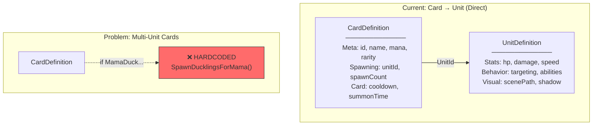
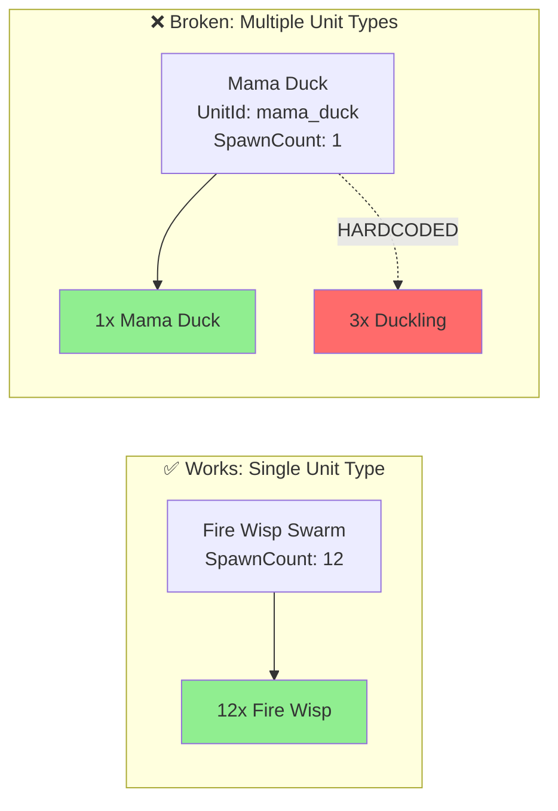
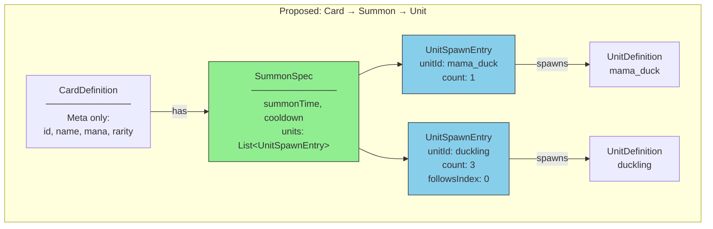
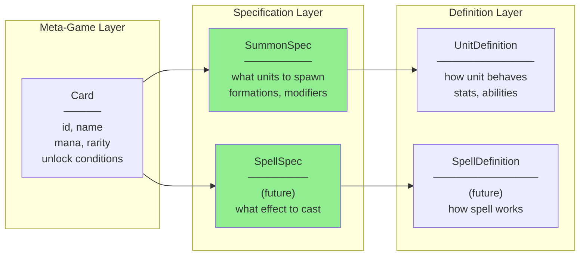
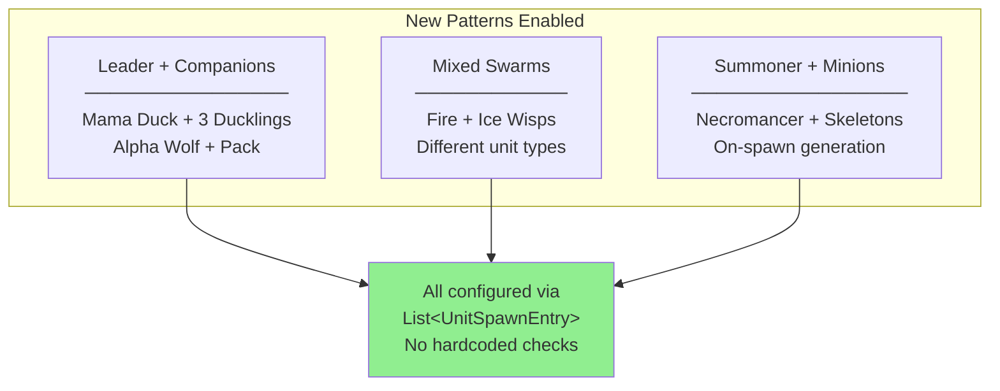

# Card/Summon/Unit Architecture Proposal

*Last Updated: 2026-02-01*

> **Archived historical proposal (2026-08-24):** The `SummonSpec` data model was
> implemented in the typed C# card catalog. This file preserves the proposal and
> its pre-implementation `CardFactory` examples; it is not current wiring
> guidance.

**Status:** Implemented and archived.

---

## Executive Summary

This proposal addresses a gap in our spawning architecture where multi-unit cards (like Mama Duck) require hardcoded special cases. We propose introducing a `SummonSpec` layer between `CardDefinition` and `UnitDefinition` to make all spawning behavior data-driven.

---

## Current Architecture



### The Hardcoded Hack

**Location:** `CardFactory.cs:275-278`
```csharp
// ONLY special-case card ID check in entire spawning pipeline
if (catalogId == CardIds.MamaDuck)
{
    SpawnDucklingsForMama(summon, gameplayLayer, spatialGrid, team, position, spawnDuration, inBattlePhase);
}
```

### What Works vs What Doesn't



---

## Proposed Architecture



### Three Clean Layers



---

## Data Structures

```csharp
public class CardDefinition
{
    // Meta-game only
    public CardId Id { get; set; }
    public string Name { get; set; }
    public int ManaCost { get; set; }
    public Rarity Rarity { get; set; }
    public CardType Type { get; set; }

    // Spawning delegated to SummonSpec
    public SummonSpec? Summon { get; set; }
}

public class SummonSpec
{
    public List<UnitSpawnEntry> Units { get; set; } = [];
    public float SummonTime { get; set; }
    public float Cooldown { get; set; }
}

public class UnitSpawnEntry
{
    public UnitId UnitId { get; set; }
    public int Count { get; set; } = 1;
    public IFormationStrategy? Formation { get; set; }
    public StatModifier? Modifier { get; set; }  // For weaker swarm units
    public int? FollowsIndex { get; set; }       // For companion targeting
    public SpawnPlacement Placement { get; set; } = SpawnPlacement.Formation;
}

public enum SpawnPlacement
{
    Formation,      // Use formation strategy
    BehindLeader,   // Spawn behind entry[0]
    AroundLeader,   // Spawn around entry[0]
}
```

---

## Before vs After: Mama Duck

### Before (Hardcoded)

```csharp
// CardDefinitions.cs
public static readonly CardDefinition MamaDuck = new()
{
    Id = CardIds.MamaDuck,
    UnitId = UnitIds.MamaDuck,
    SpawnCount = 1,  // Only mama - ducklings are hardcoded elsewhere!
    ManaCost = 5,
    Rarity = Rarity.Epic,
    // ...
};

// CardFactory.cs - special case buried in spawning code
if (catalogId == CardIds.MamaDuck)
    SpawnDucklingsForMama(...);  // 100+ lines of special logic
```

### After (Data-Driven)

```csharp
// CardDefinitions.cs - everything declarative
public static readonly CardDefinition MamaDuck = new()
{
    Id = CardIds.MamaDuck,
    ManaCost = 5,
    Rarity = Rarity.Epic,
    Type = CardType.Summon,

    Summon = new SummonSpec
    {
        SummonTime = 1.5f,
        Cooldown = 3.0f,
        Units = [
            new() { UnitId = UnitIds.MamaDuck, Count = 1 },
            new() {
                UnitId = UnitIds.Duckling,
                Count = 3,
                Placement = SpawnPlacement.BehindLeader,
                FollowsIndex = 0  // Ducklings follow mama's targeting
            }
        ]
    }
};

// CardFactory.cs - no special cases, just iterate over Units
```

---

## Comparison

| Aspect | Before | After |
|--------|--------|-------|
| **Multi-unit cards** | Hardcoded special cases | Declarative configuration |
| **Adding new patterns** | Requires code changes | Just add data |
| **Code complexity** | Scattered conditionals | Single spawning loop |
| **Testability** | Hard to test special cases | All patterns testable uniformly |
| **Data ownership** | Spawning mixed into Card | Clear separation of concerns |

---

## Future Card Patterns Enabled



| Pattern | Example | Current | After |
|---------|---------|---------|-------|
| **Leader + Companions** | Mama Duck + Ducklings | Hardcoded | Two entries, FollowsIndex |
| **Pack/Squad** | Alpha Wolf + Pack | Would need hack | Leader entry + followers |
| **Mixed Swarms** | Fire + Ice Wisps | Not supported | Multiple entries |
| **Homogeneous Swarm** | Fire Wisp (12x) | Works | Single entry, Count=12 |

---

## Implementation Phases

### Phase 1: Trait Storage (Lower Risk)
1. Create `CardTraitIds.cs` constants class
2. Update `CardInstance.Upgrades` → `CardInstance.Traits` with typed list
3. Add JSON converter for backwards compatibility
4. Update all callsites

### Phase 2: SummonSpec Architecture (Higher Risk)
1. Create `SummonSpec`, `UnitSpawnEntry`, `SpawnPlacement`
2. Add `Summon` property to `CardDefinition`
3. Update `CardFactory.execute_summon()` to iterate over entries
4. Migrate existing cards to new format
5. Remove hardcoded Mama Duck check
6. Generalize `DucklingUnit3D` to `CompanionUnit3D` base class

---

## Files to Modify

| File | Phase | Changes |
|------|-------|---------|
| `CardTraitIds.cs` (new) | 1 | Constants class with all trait IDs |
| `CardInstance.cs` | 1 | `Upgrades` → `Traits` with typed list |
| `DtoConverters.cs` | 1 | Add `CardTraitIdListConverter` |
| `SummonSpec.cs` (new) | 2 | New spawning specification class |
| `UnitSpawnEntry.cs` (new) | 2 | Individual spawn entry |
| `CardDefinition.cs` | 2 | Add `Summon` property |
| `CardFactory.cs` | 2 | Replace hardcoded check with loop |
| `CardDefinitions.cs` | 2 | Update all card definitions |

---

## Verification Plan

### Trait Storage Tests
- Serialize/deserialize `CardInstance` with traits
- Level up a card, verify trait stored correctly
- Load existing profile with string-based upgrades (backwards compatibility)

### SummonSpec Tests
- Spawn Mama Duck, verify 1 mama + 3 ducklings
- Kill mama, verify ducklings continue fighting
- Spawn Fire Wisp Swarm, verify 12 weaker wisps
- Verify `AllUnitsDied` fires only when all units dead
- Test new card patterns (pack, mixed swarm)

---

## Open Questions

1. Should `SummonSpec` and `SpellSpec` share a common interface (e.g., `ICardEffect`)?
2. For companion units, should the targeting relationship be in the spec or unit definition?
3. Deprecate single-UnitId pattern entirely, or keep for backwards compatibility?
