# Art Commission Brief

**Game:** Fateforged
**Genre:** Card-based strategy with real-time battles

_Note: I'm open to any suggestions to make the style more cohesive or improve the art direction._

---

## Art Style Direction

### Vision

**Stylized characters** — more detailed than cartoon, less detailed than full anime.

- Clear, readable silhouettes
- Expressive character designs
- Enough detail to convey personality and texture
- Not so much detail that it becomes visually busy

We're looking for a stylized art style with characters in dynamic poses and designs that express their personality clearly. Characters shouldn't be overly busy or cluttered — we want clean, readable designs that aren't hyper-detailed anime but also aren't too flat or simplistic.

### Reference Images

**Primary reference:**

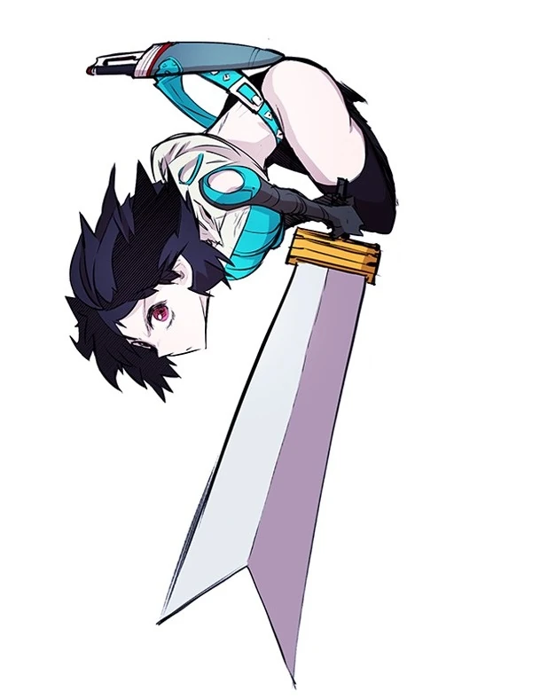

**Additional references:**

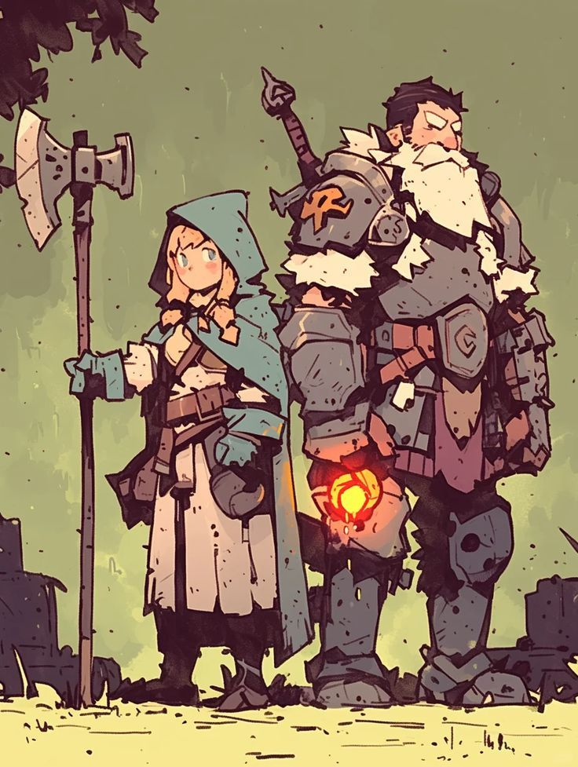 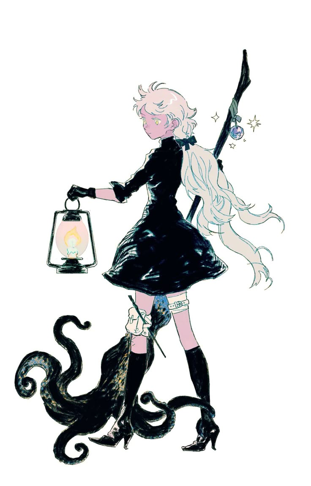 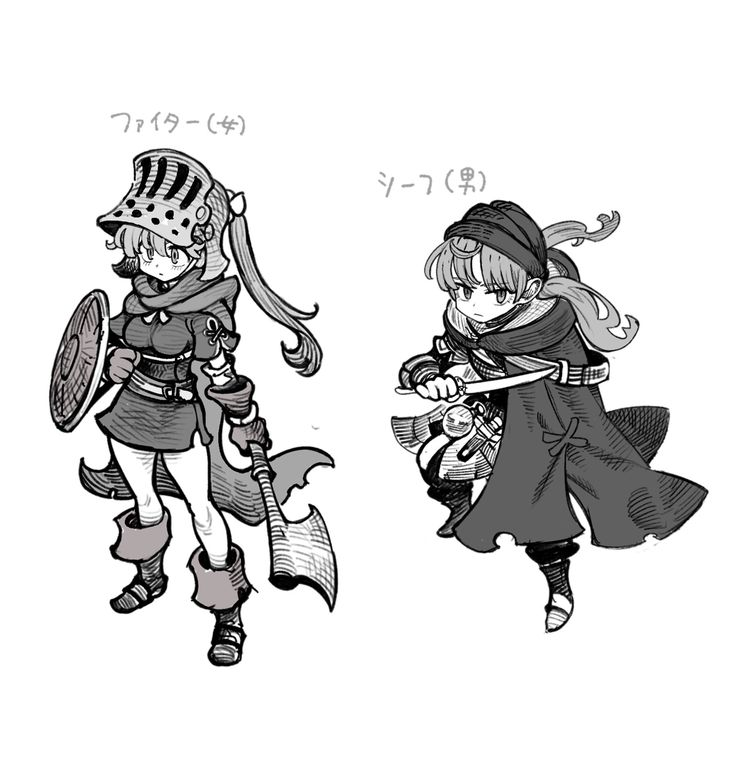

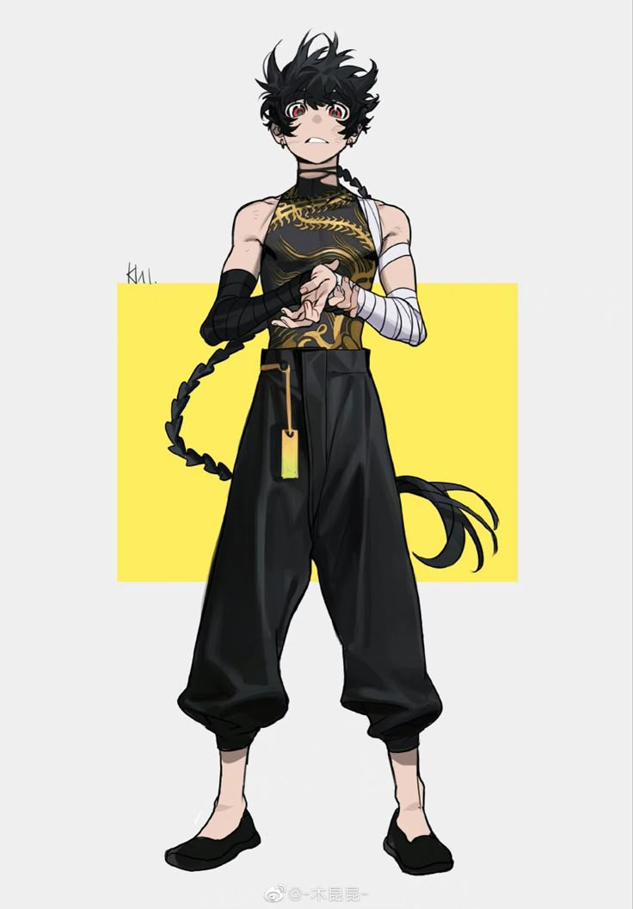 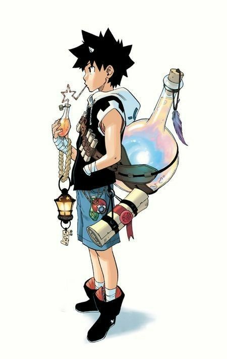 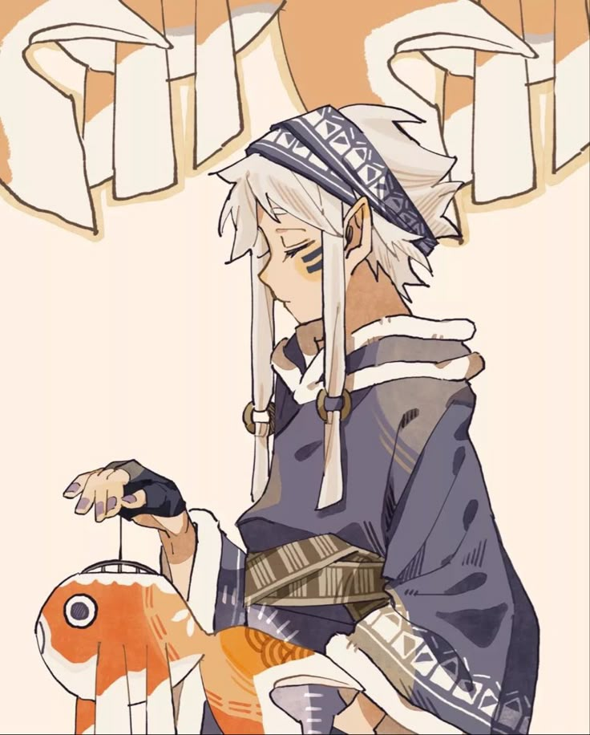

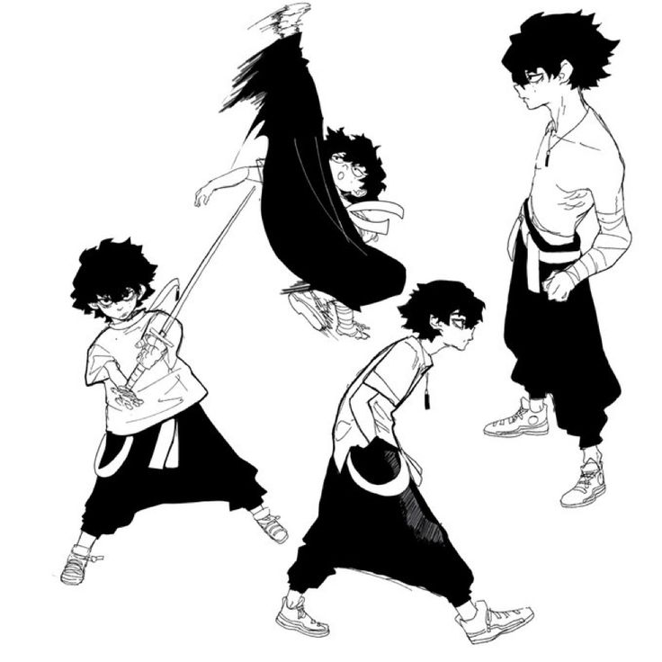 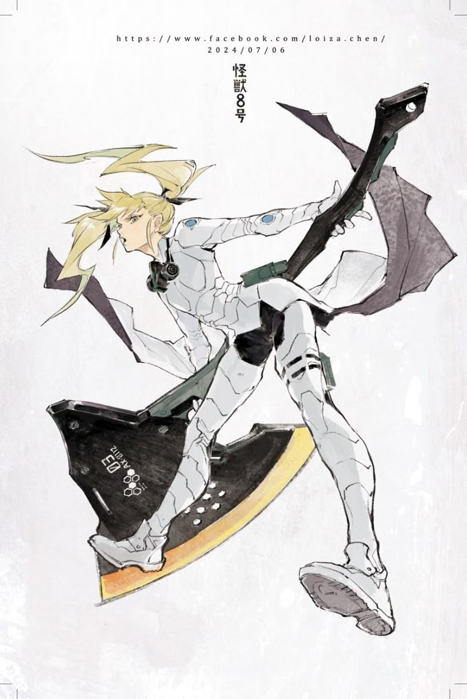

---

## 1. UI Components

We need artist input on UI style direction. Below are the generic elements and screens requiring UI work.

### Generic Elements

| Element                      | Description                                                                                           |
| ---------------------------- | ----------------------------------------------------------------------------------------------------- |
| **Hero Portrait Widget**     | Circular portrait with HP bar attached + mana bar below (unified widget for battle HUD)               |
| **Panel Backgrounds**        | Content containers for various screens                                                                |
| **Modal Overlays**           | Popup/dialog backgrounds                                                                              |
| **Buttons**                  | Primary, secondary, and icon buttons with states (normal, hover, pressed)                             |
| **Dialogue Box**             | NPC conversation UI (for Merlin, Merriweathers, events)                                               |
| **Summon/Hero Info Display** | Way to show unit information — form TBD (card-like or box-like, open to suggestions)                  |
| **Icons (~10 to start)**     | Unsure of full icon needs yet — budgeting ~10 icons initially (e.g., gold coin), can expand as needed |

### Screens Needing UI

| Screen                 | Purpose                   | Key Elements                                     |
| ---------------------- | ------------------------- | ------------------------------------------------ |
| **Title Screen**       | Main menu                 | Play button, settings, branding                  |
| **Summoner Selection** | Pick your summoner        | Summoner portraits, selection UI                 |
| **Campaign Map**       | Navigate campaign nodes   | Map nodes, path connections, current position    |
| **Battle HUD**         | In-battle interface       | Hero portrait widget, hand area, phase indicator |
| **Shop/Caravan**       | Buy stuff during campaign | Item display, gold counter, purchase UI          |
| **Collection**         | View/manage collection    | Grid, filters, details                           |
| **Event Screen**       | Campaign events/dialogue  | Dialogue box, choice buttons, NPC portrait area  |
| **Reward Screen**      | Post-battle rewards       | Reward display, continue button                  |
| **Settings**           | Options/preferences       | Sliders, toggles, navigation                     |

### Campaign Map

The campaign is a node-based map with branching paths.

| Asset                | Description                                 |
| -------------------- | ------------------------------------------- |
| **Node types**       | Battle node, special battle node, shop node |
| **Connecting lines** | Lines/roads connecting nodes                |
| **Node states**      | Completed, uncompleted                      |
| **Current position** | Marker showing where the player is          |

---

## 2. Character Art

_Note: May commission additional characters in the future._

### Summoners

4 summoner characters for initial commission. All summoners are meant to appear in their early twenties. For each summoner we need:

- **Portrait art** — for menus and selection screens
- **In-game unit** — the summoner appears on the battlefield and can be attacked

| Summoner | Element | Gender/Ethnicity | Personality                     | Portrait Art Direction                                     |
| -------- | ------- | ---------------- | ------------------------------- | ---------------------------------------------------------- |
| Cole     | Fire    | White man        | Arrogant, competitive, abrasive | Looking down at viewer with cocky smile                    |
| Mei      | Wind    | Asian woman      | Elusive, self-interested, loner | Looking away, elsewhere - viewer not interesting enough    |
| Selene   | Water   | Black woman      | Gentle, caring, relaxed         | Braids with silver cuffs/beads; peaceful, calm, unbothered |
| Teo      | Earth   | Hispanic man     | Direct, reliable, gym rat       | Bulky but not overly so                                    |

**Element Colors:**

- Fire (Cole): red
- Wind (Mei): white
- Water (Selene): blue
- Earth (Teo): brown/green

#### In-Game Unit Format

Each summoner's in-game unit is a **single static image** (full body, standing pose). No sprite sheets or skeletal rigs needed — the engine handles all visual feedback (hit flash, death fade) via shader effects on the image.

**Total:** 4 characters × (1 portrait + 1 in-game unit) = 8 images

---

### NPCs

Characters that appear in campaign events, dialogue, and shops. For NPCs we just need portrait art.

#### Merlin — Headmaster

Academy Headmaster, mentor figure. Generic old archmage look — blue robes, mage hat, wooden staff, etc.

#### Mr. & Mrs. Merriweather — Caravan Merchants

A husband-and-wife merchant duo who run the traveling caravan shop.

**Mr. Merriweather** — Face of the caravan. Relentlessly cheerful, theatrical warmth. Traveling merchant look, approachable, well-maintained.

**Mrs. Merriweather** — Handles business operations. Calm, grounded warmth. Practical traveling clothes, organized, observant.

**Portrait Art Direction:** Over-the-top friendly looking. Almost suspiciously so.

**Total:** 3 NPCs × portrait

---

## 3. Battlefield & Environment

The battlefield is a 3D plane viewed from a **35° top-down camera angle**. The environment uses a **two-layer approach** — a ground layer where gameplay happens and a separate background layer for atmospheric scenery.

Starting with one biome (Grass/Plains). Additional biomes can be commissioned later.

### Grass/Plains Biome

Two separate deliverables:

#### Ground Texture

The main gameplay surface — a hand-painted top-down view of the terrain. The engine's 35° camera adds perspective naturally; the art should be painted as a **flat top-down view**.

| Spec       | Value                                                                                     |
| ---------- | ----------------------------------------------------------------------------------------- |
| Dimensions | 4096×4096px minimum. 8192×8192px preferred if your workflow supports it, but not required. |
| Aspect     | Square (5:4 gameplay area, but square texture with natural edges works best)               |
| Style      | Hand-painted grass/earth terrain — forest clearing feel                                    |
| Tiling     | **NOT tileable** — single unique painting with natural variation                           |
| Colors     | Muted greens and earth tones                                                               |
| Notes      | Subtle texture variation to avoid flatness. Slight blur at max zoom is acceptable.         |

#### Background Strip

A separate painted backdrop visible behind/above the ground — purely atmospheric, not interactive. For the grass/plains biome, this would be a **tree line and sky**.

| Spec       | Value                                                                             |
| ---------- | --------------------------------------------------------------------------------- |
| Height     | ~2160px tall                                                                      |
| Width      | **Horizontally seamless** (the engine will scroll it via parallax)                |
| Style      | Atmospheric scenery — tree line fading into sky for the forest clearing biome     |
| Notes      | This layer is disconnected from the ground. Think of it as the distant background |

#### Edge Treatment

The ground meets the background naturally — for the forest clearing biome, grass terrain transitions into the tree line. Exact edge treatment depends on the biome; we'll provide guidance but are open to artist interpretation.

### Reference Images

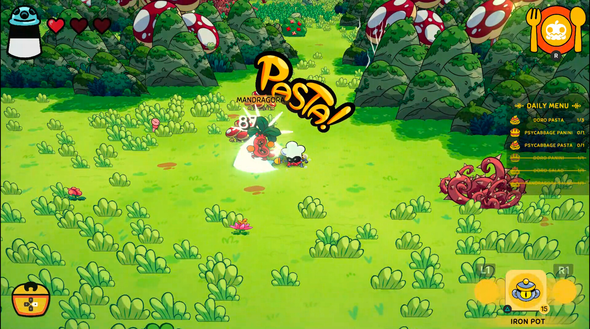 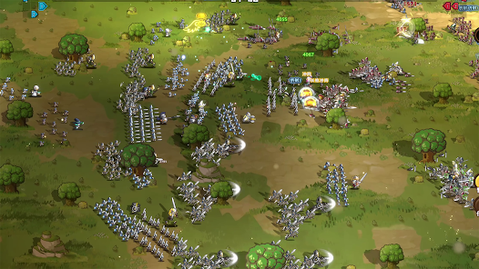

_Reference for the two-layer concept: Mewgenics-style setup — distinct ground where gameplay happens, with a separate background layer behind it._

_Note: May need additional biomes in the future._

---

## 4. VFX & Effects

Visual effects for use in Godot. Scope is variable based on price. Examples below are not a fixed list.

**Spell effects:**

- Fireball
- Icebolt
- Mana missile
- Healing AOE

**Screen effects:**

- Victory splash
- Defeat splash

**UI effects:**

- Button hover/press
- Screen transitions

---

_Document Version: 1.0_
