# Character Art Direction

---

## Portrait Style

This covers character art for everything outside of active gameplay — card art, UI, splash screens, menus, etc. Expressive faces, detailed clothing, personality reads.

### General

- All characters read as approximately 22 years old
- All characters should be conventionally attractive / pretty
- All characters should be fit
- Clothing style: flowy, robe-like silhouettes

> **Note:** I will be taking the time to develop a more detailed and consistent clothing style. Any clothing references or notes in this doc for now are cursory thoughts in the meantime.

### References

| Reference | Notes |
|-----------|-------|
| [Ichi the Witch](https://www.viz.com/ichi-the-witch) | Characters feel cool and stylish with expressive, readable faces |
| Pinterest board | https://www.pinterest.com/amarichar/character-art-inspo/ |

### General Style References

**Desscaras — [Ichi the Witch](https://www.viz.com/ichi-the-witch)**

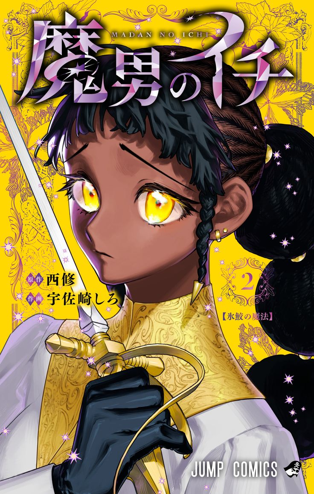

- Personality and expression are conveyed through facial expression, pose, hair, clothing — not through inherent physical features. When it's done the other way, characters end up feeling like caricatures: gimmicky, unserious, and hard to find cool. The goal is for personality to read as a natural extension of who the character is, not something written into how they look.
- Strong example of depicting a POC without caricaturizing them.

---

**Valkyrie warrior / EV Ganin — warrior girl / EV Ganin — Philippa Cliber Hart**

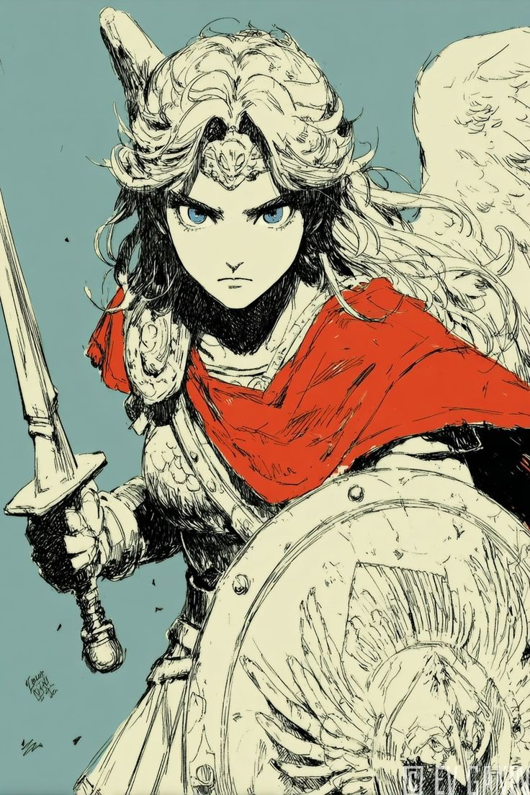 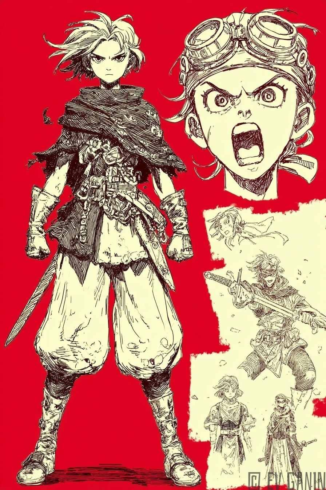 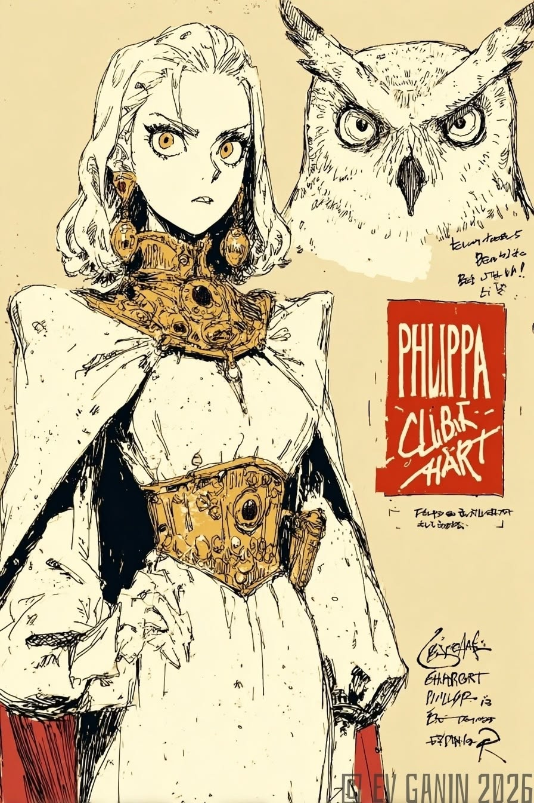

All three characters convey emotion and conviction clearly and strongly through their facial expressions. You can read exactly who they are and what they're feeling without anything else doing that work for them. They can be taken seriously.

### Negative References

| Reference | Notes |
|-----------|-------|
| [Clash Royale](https://supercell.com/en/games/clashroyale/) character roster | Personality conveyed entirely through physicality |

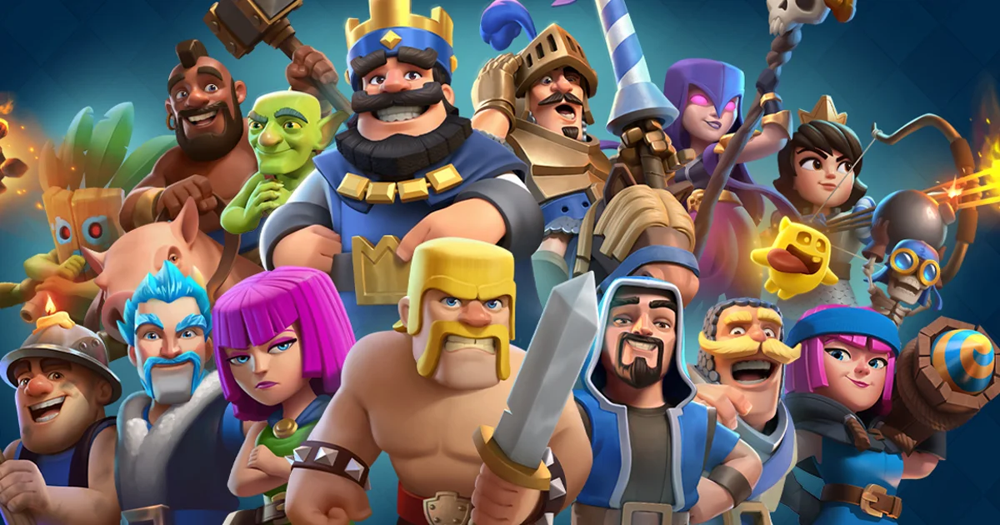

**Why this is the wrong direction:**
Personality should come through facial expression, pose, hair, and clothing — not body proportions. In Clash Royale there is a direct correlation between how exaggerated a character's proportions are and how unserious they read. The Barbarian is massive with tiny legs and a gap tooth — his build makes him a dumb brute before he's done anything. PEKKA is a hulking mass, its size *is* its personality. The Princess is normally proportioned and reads as composed and intelligent by comparison. Exaggerated proportions carry an inherent silliness that undercuts cool. Our characters should feel serious and grounded — personality conveyed through how they carry themselves, not how big they are.

---

| Reference | Notes |
|-----------|-------|
| [Skullgirls](https://skullgirls.com/) roster | Art style too soft and rounded to read as cool or serious |

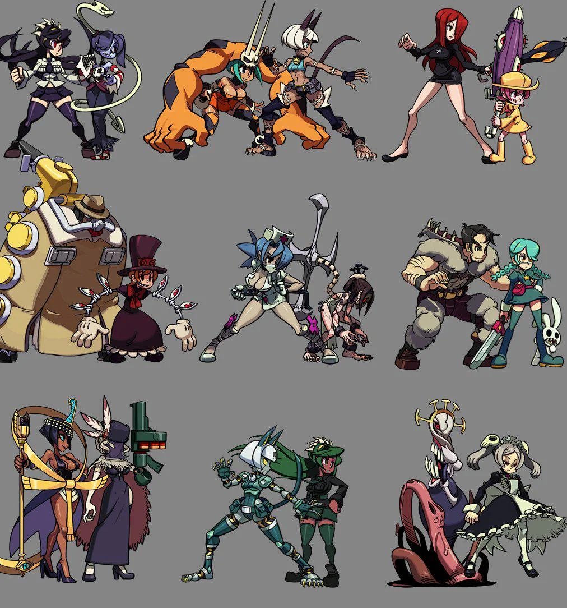 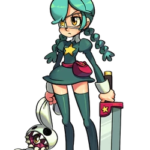

**Why this is the wrong direction:**
Everything is rounded, smooth, and cute in a way that defuses any edge or coolness. Even characters that are supposed to feel dangerous or intense get undercut by the softness of the art style — there's no visual tension. The characters end up feeling like they belong in a Saturday morning cartoon regardless of what they're actually doing. Our characters need sharp, deliberate lines that make them feel like someone you'd take seriously. Compare Annie here to Desscaras — the difference in how seriously you take each of them is almost entirely down to that.

---

## In-Game Combat Style

This covers the characters as they appear during active battles — the units that attack and get hit.

### General

The current best candidate is a style similar to the characters from *Sword x Staff* — a chibi-adjacent proportion style that reads clearly at gameplay scale while still feeling characterful.

> **Note:** Open to feedback on this. If there's a better method that preserves portrait expressiveness while working proportionally in-engine, worth exploring.

### References

| Reference | Notes |
|-----------|-------|
| Sword x Staff (short) | https://www.youtube.com/shorts/sRPh87GbfHE |
| Sword x Staff (gameplay) | https://www.youtube.com/watch?v=C7s_-a-B-8c |
| Sword x Staff (characters) | https://www.tiktok.com/@sxsmoririn/video/7627502796035640607 — focused on character designs specifically |

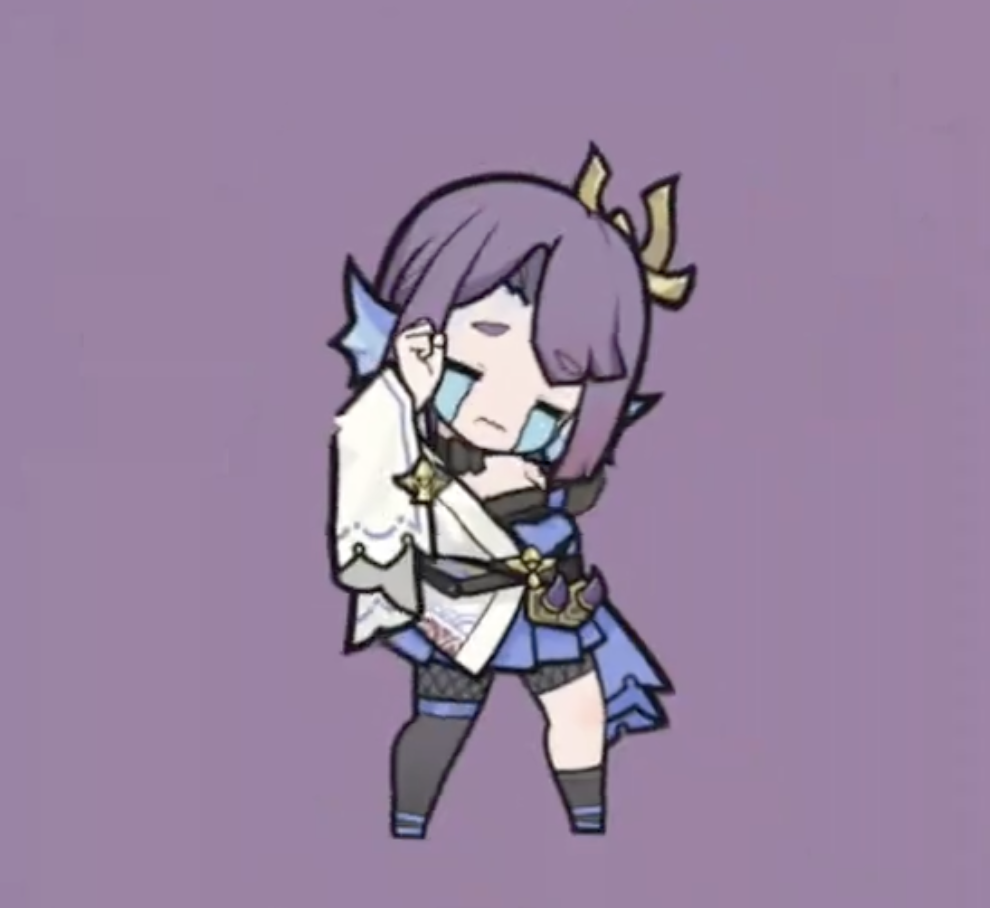

---

## Character-Specific Direction

---

### Cole

#### Personality & Vibe

Cocky, arrogant, full of himself — but in a cool way. Regal.

#### Primary Inspiration

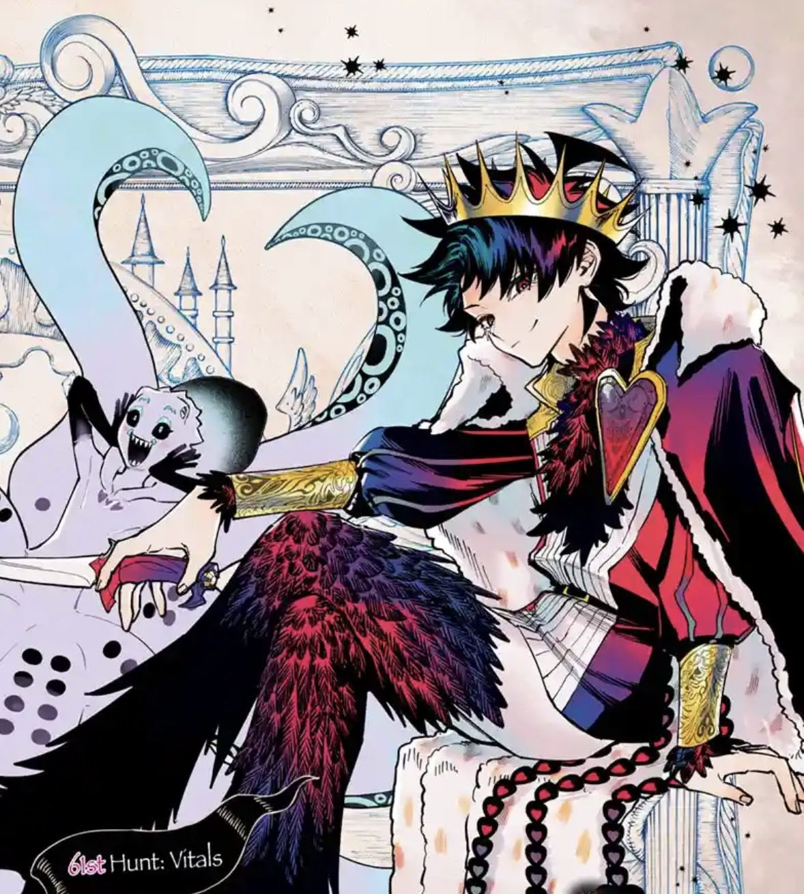

> **Note:** The primary inspiration captures the personality and aesthetic well, but the character reads younger than intended (~15-16) due to his height/proportions. Cole should read as ~22. The hair ref image below is a better reference for the older age read.

#### Face

 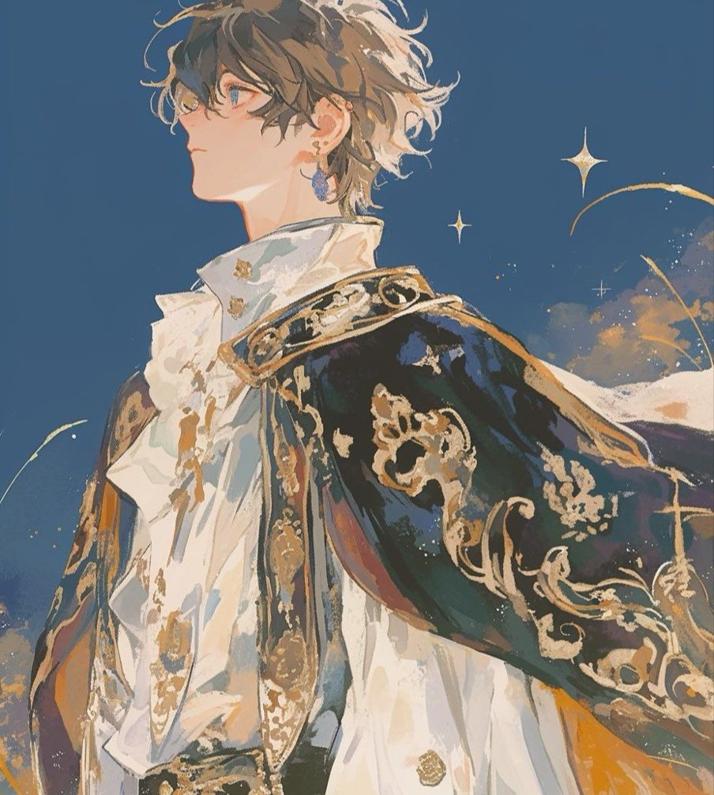

Face shape and features: see refs above. Default expression: holier than thou, cocky.

#### Hair

Messy, tousled short hair — effortlessly disheveled. Feels natural and a little wild rather than perfectly styled.

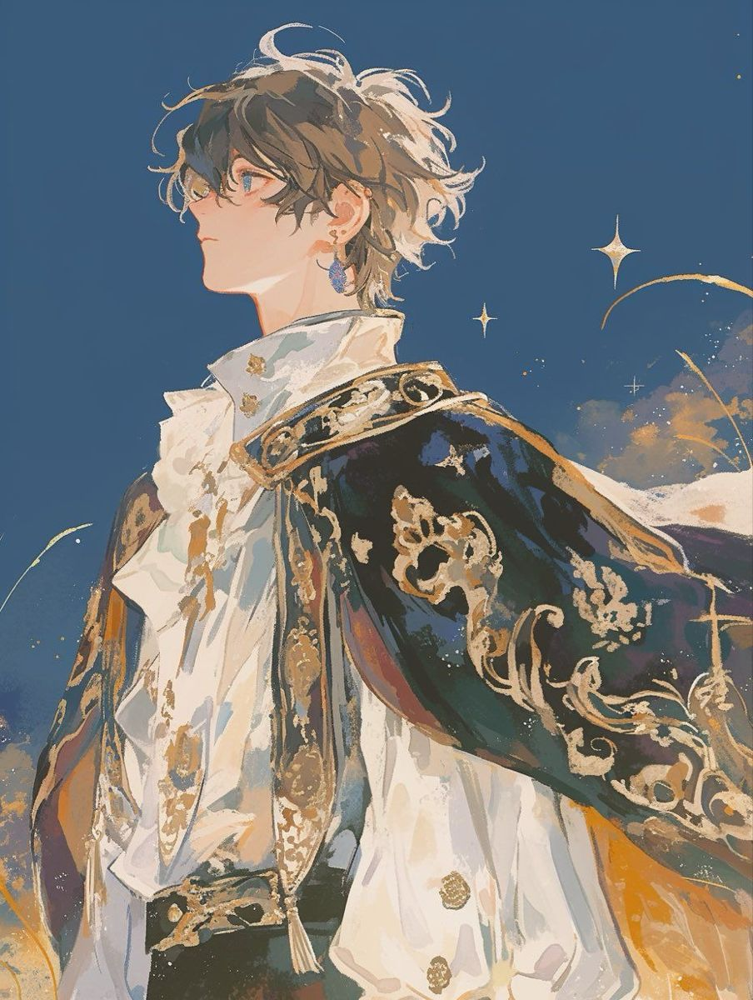

#### Body

*(Describe proportions, silhouette, build, pose energy, etc.)*

#### Color

- Skin: Warm ivory — slightly tan, not pale (#e9c7a8)
- Hair: Red
- Age read: ~22

#### Clothing

- Regal, fancy, elegant — not gaudy or tacky
- Gold highlights and/or gold accessories to reinforce his regal quality

---

<!-- Template for adding new characters:

### [Character Name]

#### Face

#### Body

#### Color

#### Clothing

-->
