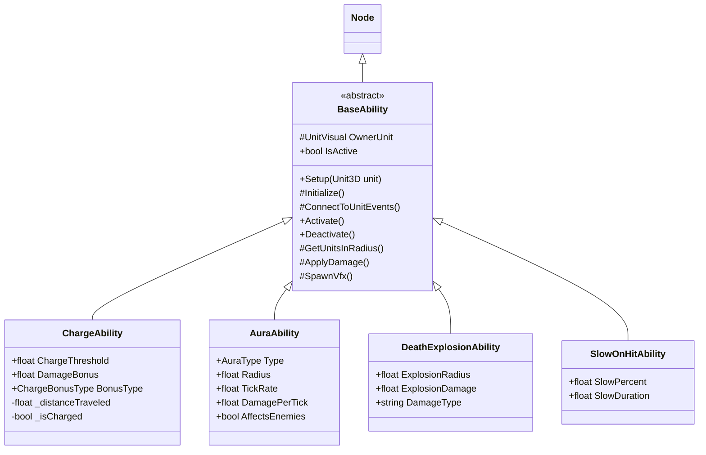
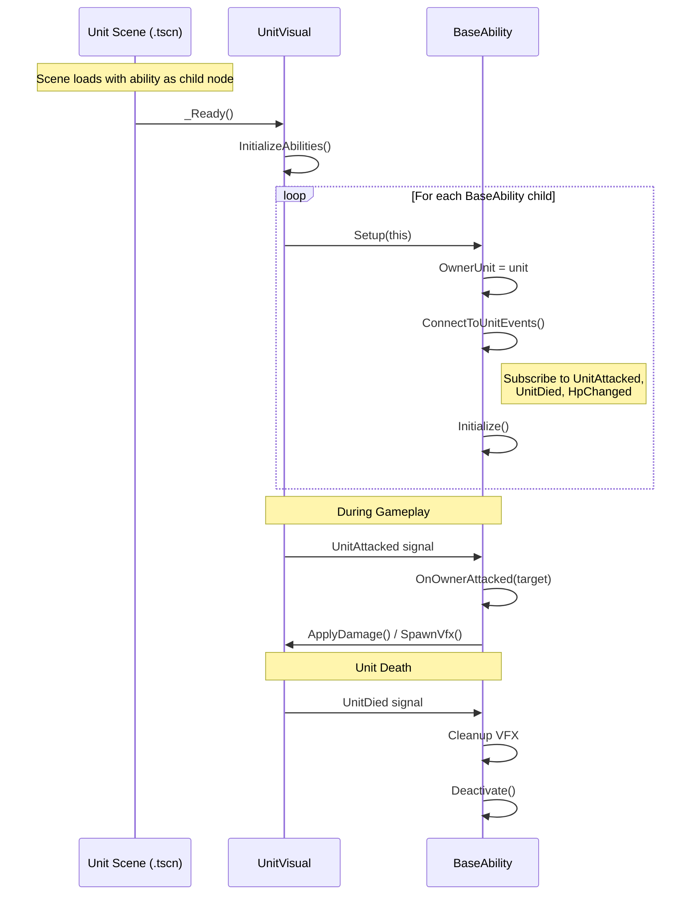
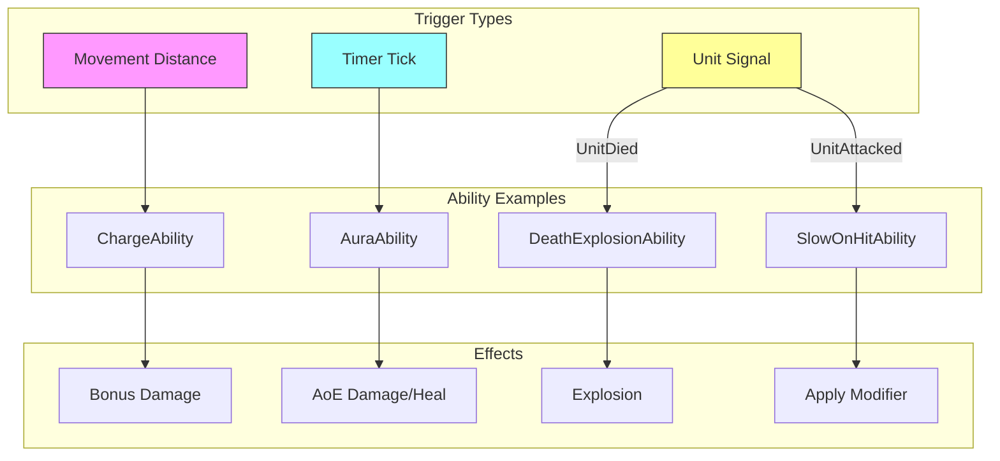

# Ability System Architecture

## Design Rationale

### Why Component-Based?

We evaluated several approaches for the ability system:

| Approach | Description | Verdict |
|----------|-------------|---------|
| **ECS (Data-Oriented)** | Entities are IDs, components are pure data, systems process in bulk | Overkill for <100 entities, complex setup |
| **Component-Based** | Nodes as components attached to units, configured via exports | ✓ **Chosen** - Godot-native, intuitive |
| **Inheritance-Based** | AbilityUnit extends UnitVisual, override methods | Rigid hierarchies, can't mix abilities |
| **Data-Driven (GAS-style)** | Abilities as resources, central ability system | Significant boilerplate for our scale |

### Architecture Trade-offs

**Strengths:**
- Godot-native (nodes as components, signals for events)
- Inspector-friendly (tune abilities without code changes)
- Composition over inheritance (mix abilities freely)
- Auto-discovery (just add node to scene)

**Known Limitations:**
- No central ability registry (can't query "all ChargeAbility units")
- No built-in stacking/priority system
- Abilities baked into scenes, not granted at runtime

**When to reconsider:**
- If we have 20+ unique abilities with complex interactions
- If we need runtime ability granting (skill trees, items)
- If ability order/priority becomes important

### References

- [ECS Architecture (Wikipedia)](https://en.wikipedia.org/wiki/Entity_component_system)
- [Unreal GAS Documentation](https://github.com/tranek/GASDocumentation)
- [Godot Entity-Component Pattern (GDQuest)](https://www.gdquest.com/tutorial/godot/design-patterns/entity-component-pattern/)
- [Why Godot Isn't ECS-Based (Godot Blog)](https://godotengine.org/article/why-isnt-godot-ecs-based-game-engine/)

---

## Overview

The ability system is a **component-based architecture** where abilities are Node children attached to units. This follows Godot's composition pattern and enables:

- Reusable abilities across different unit types
- Data-driven configuration via exported properties
- Runtime enable/disable without code changes
- Clear separation between unit logic and special behaviors

## Class Hierarchy



**Location:** `scripts/csharp/Abilities/`

## BaseAbility Contract

The base class provides the framework for all abilities:

```csharp
public abstract partial class BaseAbility : Node
{
    // === STATE ===
    protected UnitVisual? OwnerUnit { get; private set; }
    public bool IsActive { get; protected set; } = true;

    // === LIFECYCLE ===
    public void Setup(UnitVisual unit)              // Entry point - sets owner, calls hooks
    protected virtual void Initialize()          // Override for custom init
    protected virtual void ConnectToUnitEvents() // Override to wire signals

    // === CONTROL ===
    public void Activate()
    public void Deactivate()
    public void Toggle()

    // === HELPERS ===
    protected List<UnitVisual> GetUnitsInRadius(Vector3 center, float radius,
        bool targetEnemies, bool targetAllies, bool includeSelf)
    protected void ApplyDamage(UnitVisual target, float damage, string damageType)
    protected Node? SpawnVfx(string vfxId, Vector3 position, Node? parent = null)
}
```

## Ability Lifecycle



### Scene Structure

```
fire_spider_3d.tscn
├─ Visual (MeshInstance3D)
├─ CollisionShape3D
└─ SlowOnHitAbility (Node)     ← Ability with [Export] properties
     ├─ SlowPercent: 0.3
     └─ SlowDuration: 2.0
```

## Unit Signals

Units emit these signals that abilities can connect to:

```csharp
// In UnitVisual.cs
[Signal] public delegate void HpChangedEventHandler(float newHp, float maxHp);
[Signal] public delegate void UnitDiedEventHandler(UnitVisual unit);
[Signal] public delegate void UnitAttackedEventHandler(Node3D target);
```

Abilities connect in `ConnectToUnitEvents()`:

```csharp
protected override void ConnectToUnitEvents()
{
    if (OwnerUnit != null)
    {
        OwnerUnit.UnitAttacked += OnOwnerAttacked;
        OwnerUnit.UnitDied += OnOwnerDied;
    }
}
```

## Existing Abilities

### ChargeAbility

**Trigger:** Movement distance threshold reached
**Effect:** Bonus damage on next attack
**Pattern:** `_PhysicsProcess` tracks distance, flag set when threshold met, consumed on attack

```csharp
[Export] public float ChargeThreshold { get; set; } = 5.0f;
[Export] public float DamageBonus { get; set; } = 30.0f;
[Export] public ChargeBonusType BonusType { get; set; } = ChargeBonusType.Flat;
[Export] public bool ResetOnAnyAttack { get; set; } = true;
[Export] public string ChargeReadyVfx { get; set; } = "";
[Export] public string ChargeImpactVfx { get; set; } = "";
```

**Used by:** Fire Boar

### AuraAbility

**Trigger:** Timer tick (every N seconds)
**Effect:** Damage/heal/buff units in radius
**Pattern:** `_PhysicsProcess` manages timer, `GetUnitsInRadius()` finds targets

```csharp
public enum AuraType { Damage, Heal, BuffSpeed, DebuffSlow, Custom }

[Export] public AuraType Type { get; set; } = AuraType.Damage;
[Export] public float Radius { get; set; } = 4.0f;
[Export] public float TickRate { get; set; } = 1.0f;
[Export] public float DamagePerTick { get; set; } = 5.0f;
[Export] public float HealPerTick { get; set; } = 0.0f;
[Export] public float SpeedModifier { get; set; } = 0.0f;
[Export] public bool AffectsEnemies { get; set; } = true;
[Export] public bool AffectsAllies { get; set; } = false;
[Export] public bool AffectsSelf { get; set; } = false;
```

### DeathExplosionAbility

**Trigger:** UnitDied signal
**Effect:** AoE damage at death location
**Pattern:** Signal handler, single-use

```csharp
[Export] public float ExplosionRadius { get; set; } = 3.0f;
[Export] public float ExplosionDamage { get; set; } = 50.0f;
[Export] public string DamageType { get; set; } = "fire";
[Export] public bool AffectsEnemies { get; set; } = true;
[Export] public bool AffectsAllies { get; set; } = false;
[Export] public string ExplosionVfx { get; set; } = "explosion_default";
[Export] public float ExplosionDelay { get; set; } = 0.0f;
```

### SlowOnHitAbility

**Trigger:** UnitAttacked signal
**Effect:** Apply speed debuff to attacked target
**Pattern:** Signal handler, applies modifier on each attack

```csharp
[Export] public float SlowPercent { get; set; } = 0.3f;   // 30% reduction
[Export] public float SlowDuration { get; set; } = 2.0f;  // seconds
```

**Used by:** Fire Spider

## Configuration via Exports

All abilities use `[Export]` for data-driven configuration:

```csharp
[Export] public float ChargeThreshold { get; set; } = 5.0f;
[Export] public float DamageBonus { get; set; } = 30.0f;
[Export] public string ChargeImpactVfx { get; set; } = "";
```

This enables:
- Tuning values in Godot inspector without code changes
- Different configurations per unit (Fire Boar vs other chargers)
- Easy iteration during balancing

## Adding Abilities to Units

### Via Scene (Recommended)

Add ability as child node in `.tscn` file:

```
FireBoar3D (CharacterBody3D)
├─ Visual (MeshInstance3D)
├─ CollisionShape3D
└─ ChargeAbility (Node)        ← Ability with [Export] properties
    ├─ ChargeThreshold: 4.0
    ├─ DamageBonus: 25.0
    └─ BonusType: Flat
```

In the scene file:
```
[node name="ChargeAbility" type="Node" parent="."]
script = ExtResource("2_charge")
ChargeThreshold = 4.0
DamageBonus = 25.0
```

### Via Code (Dynamic)

```csharp
var chargeAbility = new ChargeAbility
{
    ChargeThreshold = 5.0f,
    DamageBonus = 30.0f,
    BonusType = ChargeAbility.ChargeBonusType.Flat
};
unit.AddChild(chargeAbility);
// Note: Setup() is called automatically by UnitVisual.InitializeAbilities()
```

## Creating New Abilities

### Template

```csharp
using Godot;
using Fateforged.View;

namespace Fateforged.View;

[GlobalClass]
public partial class MyAbility : BaseAbility
{
    // === CONFIGURATION ===
    [Export] public float MyParameter { get; set; } = 1.0f;

    // === INITIALIZATION ===
    protected override void Initialize()
    {
        // Custom setup after OwnerUnit is set
    }

    protected override void ConnectToUnitEvents()
    {
        if (OwnerUnit != null)
        {
            OwnerUnit.UnitAttacked += OnOwnerAttacked;
            // OwnerUnit.UnitDied += OnOwnerDied;
            // OwnerUnit.HpChanged += OnHpChanged;
        }
    }

    // === EVENT HANDLERS ===
    private void OnOwnerAttacked(Node3D target)
    {
        if (!IsActive || target is not UnitVisual targetUnit)
            return;

        // Do something when owner attacks
    }

    // === UPDATE (if needed) ===
    public override void _PhysicsProcess(double delta)
    {
        if (!IsActive || OwnerUnit == null || !OwnerUnit.IsAlive)
            return;

        // Per-frame logic
    }
}
```

### Guidelines

1. **Always check `IsActive`** - Abilities can be disabled at runtime
2. **Guard against null OwnerUnit** - Especially in `_PhysicsProcess`
3. **Use helpers** - `GetUnitsInRadius()`, `ApplyDamage()`, `SpawnVfx()`
4. **Emit AbilityTriggered signal** - For debugging and potential UI hooks
5. **Clean up on death** - Remove VFX, disconnect signals in UnitDied handler

## Ability Patterns



### Movement-Based (ChargeAbility pattern)

```csharp
private float _distanceTraveled;
private Vector3 _lastPosition;

public override void _PhysicsProcess(double delta)
{
    Vector3 currentPos = OwnerUnit.GlobalPosition;
    _distanceTraveled += currentPos.DistanceTo(_lastPosition);
    _lastPosition = currentPos;

    if (_distanceTraveled >= Threshold)
        _isReady = true;
}
```

### Timer-Based (AuraAbility pattern)

```csharp
private float _timer;

public override void _PhysicsProcess(double delta)
{
    _timer -= (float)delta;
    if (_timer <= 0)
    {
        TriggerEffect();
        _timer = TickRate;
    }
}
```

### Signal-Based (DeathExplosionAbility pattern)

```csharp
protected override void ConnectToUnitEvents()
{
    OwnerUnit.UnitDied += OnOwnerDied;
}

private void OnOwnerDied(UnitVisual unit)
{
    // Trigger effect once
    TriggerExplosion();
    Deactivate();
}
```

## Modifier System Integration

Abilities can apply temporary stat modifiers using the modifier system:

```csharp
private void ApplySlowModifier(UnitVisual target)
{
    target.Call("ApplyModifier", new Godot.Collections.Dictionary
    {
        ["source"] = $"slow_{OwnerUnit.Name}",
        ["duration"] = SlowDuration,
        ["stats"] = new Godot.Collections.Dictionary
        {
            ["move_speed"] = -SlowPercent
        },
        ["amplification"] = "MULTIPLICATIVE"
    });
}
```

## File Locations

| File | Purpose |
|------|---------|
| `scripts/csharp/Abilities/BaseAbility.cs` | Abstract base class |
| `scripts/csharp/Abilities/ChargeAbility.cs` | Movement-based damage bonus |
| `scripts/csharp/Abilities/AuraAbility.cs` | Periodic area effects |
| `scripts/csharp/Abilities/DeathExplosionAbility.cs` | AoE on death |
| `scripts/csharp/Abilities/SlowOnHitAbility.cs` | Slow on attack |
| `scripts/csharp/Battle/View/UnitVisual.cs` | Contains InitializeAbilities() |

## See Also

- [Unit Stat Pipeline](unit-stat-pipeline.md) - How stats are calculated
- [Projectile System](projectile-system.md) - Ranged attack projectiles
- [Targeting System](targeting-system.md) - How units acquire targets
