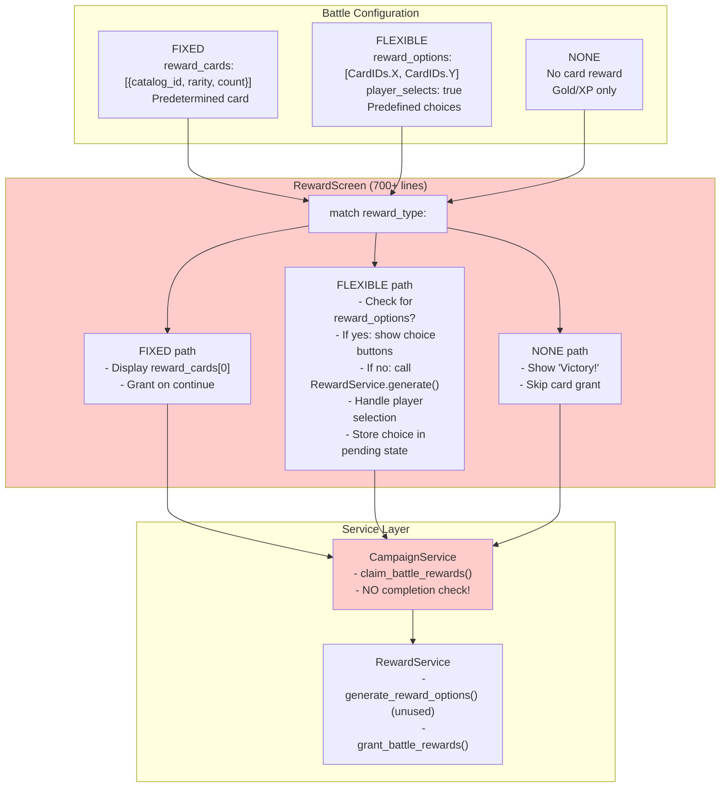
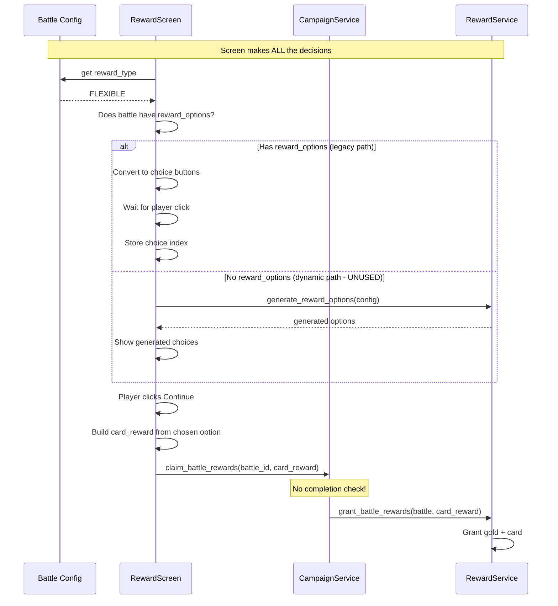
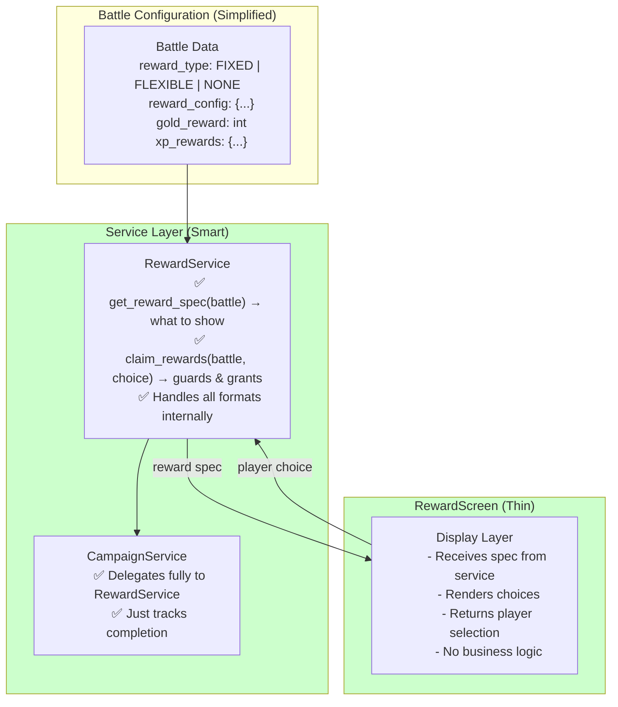
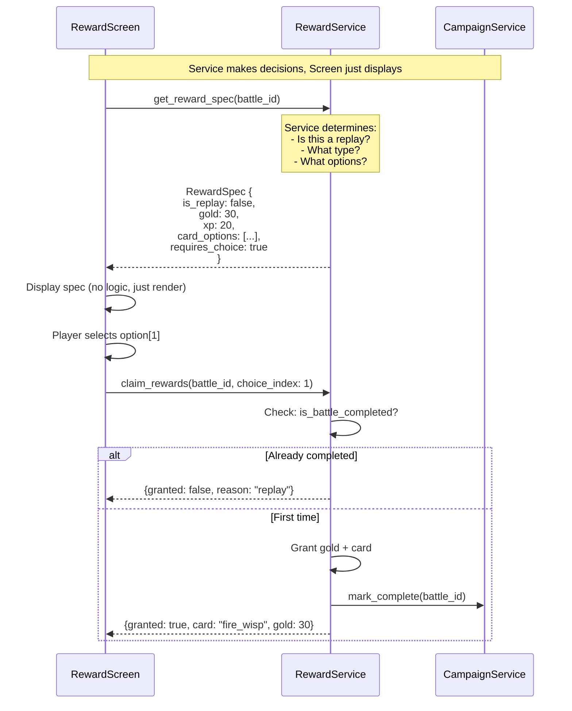
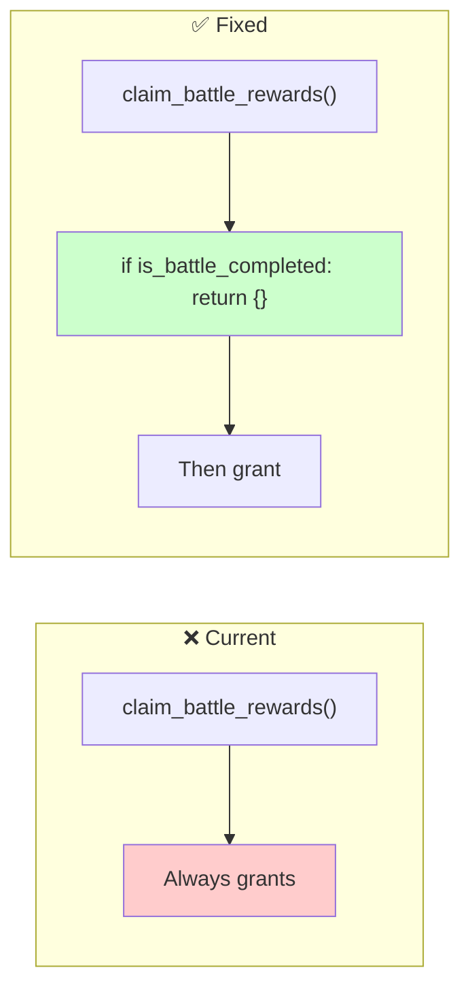
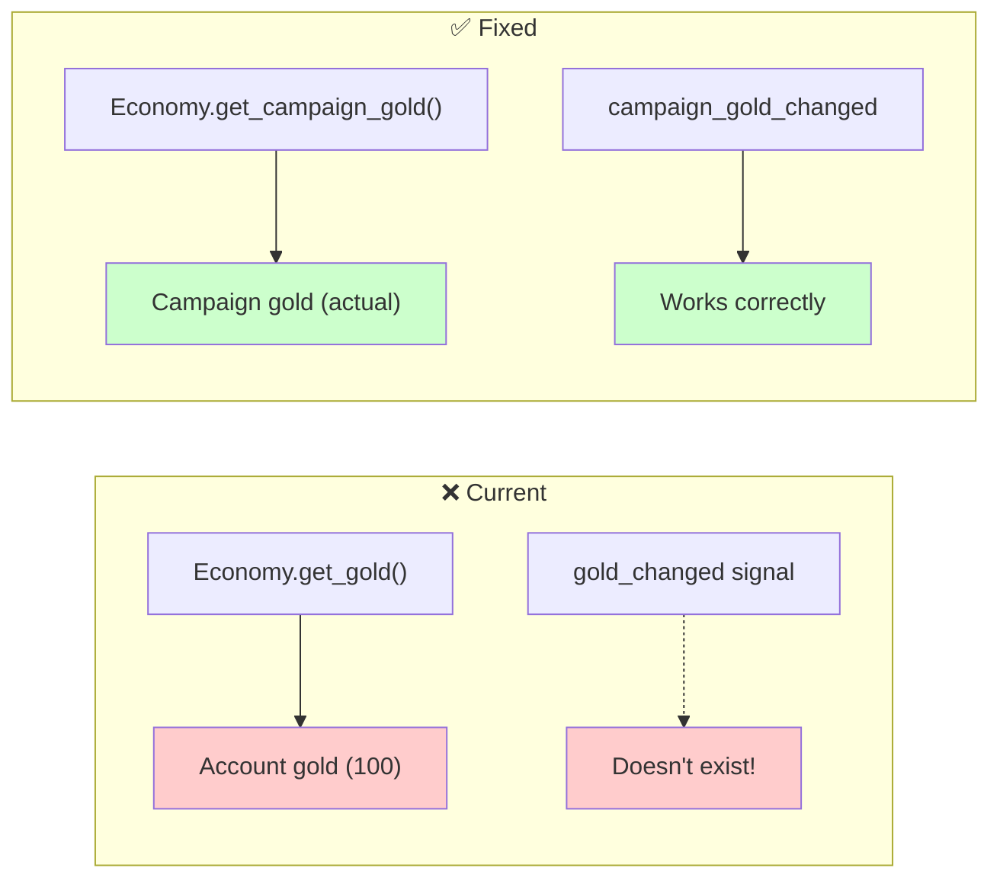

# Battle Reward System Architecture

## The Real Problem: Too Many Paths, Wrong Responsibilities

---

## How Battles Configure Rewards Today

```gdscript
# Example from summoners_path_data.gd
{
    "id": BattleIDs.FIRST_TRIAL,
    "data": {
        "reward_type": RewardTypeIDs.FLEXIBLE,      # FIXED | FLEXIBLE | NONE
        "reward_options": [CardIDs.CHARGE, CardIDs.FIRE_WISP, CardIDs.PUFF],
        "player_selects": true,
        "gold_reward": 30,
        "card_xp_reward": 15,
        "summoner_xp_reward": 20,
    }
}
```

---

## Current Architecture: Three Reward Paths



### The Problems

| Issue | Description |
|-------|-------------|
| **Screen does too much** | RewardScreen determines reward type, renders UI, manages state, AND initiates granting |
| **Three data formats** | FIXED uses `{catalog_id, rarity}`, FLEXIBLE uses raw IDs `["charge"]`, dynamic uses `{id, type, amount}` |
| **Unused code paths** | Dynamic generation (`guaranteed_count`, `pool_count`) is built but never used |
| **No service guard** | `claim_battle_rewards()` grants even if battle already completed |
| **Scattered validation** | `reward_cards` validated, but `reward_options` never checked |

---

## Current Sequence: Why It's Confusing



---

## Proposed Architecture: Service Owns Logic



### Proposed Sequence: Service-Driven



---

## The Two Bugs (Simple Fixes)

### Bug 1: Replay Grants Gold



**Fix**: Add 3 lines to `campaign_service.gd`:
```gdscript
func claim_battle_rewards(battle_id, card_reward):
    if is_battle_completed(battle_id):  # ADD THIS
        return {}                         # ADD THIS
    # ... existing code
```

### Bug 2: Summoner Screen Shows Wrong Gold



**Fix**: Change `summoner_screen.gd`:
```gdscript
# Change get_gold() to get_campaign_gold()
# Connect to campaign_gold_changed instead of gold_changed
```

---

## What We Should Do

### Phase 1: Fix the Bugs (Now)
1. Add completion guard in `claim_battle_rewards()` - 3 lines
2. Fix summoner screen gold display - 5 lines

### Phase 2: Clean Up RewardScreen (Later)
1. Move reward type determination into RewardService
2. Create `get_reward_spec(battle_id)` that returns a unified structure
3. RewardScreen becomes a thin display layer

### Phase 3: Unify Data Formats (Later)
1. Standardize on single reward option format
2. Remove unused dynamic generation code OR actually use it
3. Add validation for `reward_options`

---

## Summary

| What | Current State | Ideal State |
|------|--------------|-------------|
| **Who decides reward type?** | RewardScreen | RewardService |
| **Who checks if replay?** | Nobody (bug!) | RewardService |
| **Data format** | 3 different formats | 1 unified format |
| **RewardScreen responsibility** | Everything | Just display |
| **Dynamic generation** | Built, unused | Either use or remove |

**Files to modify for bug fixes:**
1. `scripts/services/campaign_service.gd` - Add completion guard (3 lines)
2. `scripts/ui/screens/summoner_screen.gd` - Fix gold display (5 lines)

**The "dynamic rewards" and "specific_options" aren't the bug** - they're complexity that makes the code harder to understand, but the actual bugs are just missing guards.
