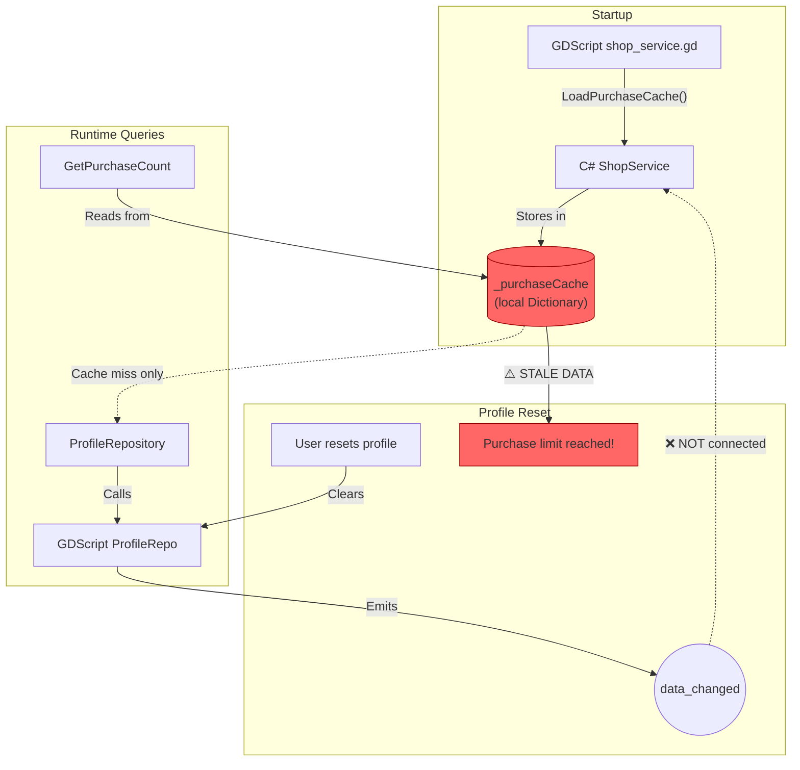
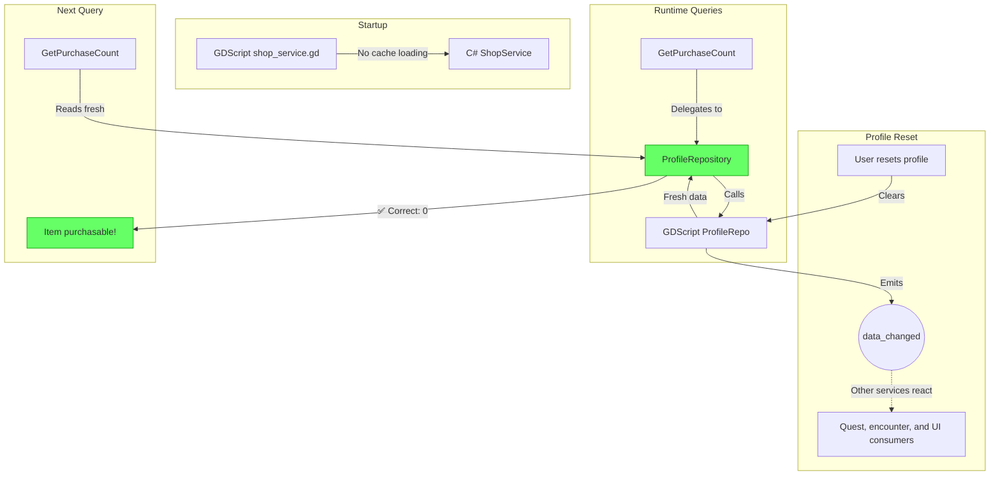
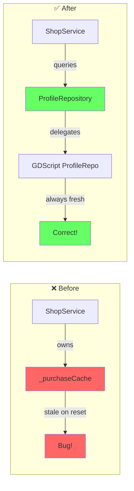

# Shop Service Cache Architecture

## Problem: Stale Cache After Profile Reset

After resetting profile via debug UI:
1. **Purchase limits persist** - "Purchase limit reached" for items never purchased
2. **Gold may accumulate incorrectly** - stale cached state

### Root Cause
`ShopService` cached purchase counts in memory at startup, but didn't clear them on profile reset.

---

## Before: ShopService with Local Cache



---

## After: Repository-Managed (Stateless Service)



---

## Data Flow Comparison



---

## Key Principle

| Pattern | Risk | Recommendation |
|---------|------|----------------|
| Service caches profile data | Must remember to clear on reset → bug when forgotten | ❌ Avoid |
| Service queries repository | Reset automatically works | ✅ Preferred |

**Rule**: Services should be **stateless** for profile data. The repository owns all profile state (including caches), so lifecycle is managed automatically.

---

## Files Changed

| File | Change |
|------|--------|
| `scripts/csharp/Meta/Services/Shop/ShopService.cs` | Removed `_purchaseCache`, delegates to `IProfileRepository` |
| `scripts/services/shop_service.gd` | Removed `LoadPurchaseCache()` call |

## Future Pattern

For any new cached state:

```
❌ BAD:  Service caches data in _localCache, forgets to clear on reset
✅ GOOD: Repository owns cache, clears automatically on reset
```
