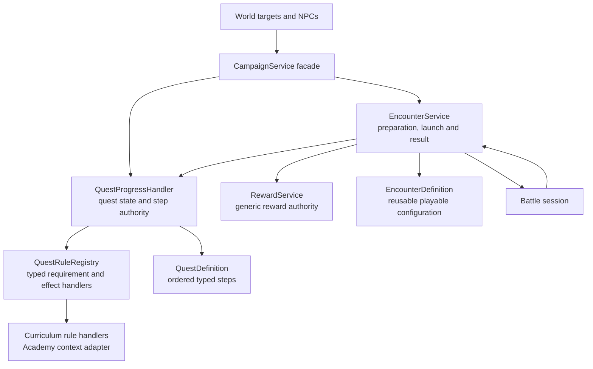

# Generic Quest and Encounter Rearchitecture Proposal

**Status:** Proposed
**Product source:** `docs/design/quest-system.md`

## Goal

Make generic quest steps the only authority connecting NPCs, world interaction,
encounters, and completion. Any quest source can reference the same reusable
battle encounter. Delete the old Class Hall and Course Flow paths instead of
adapting them.

## Target Ownership



### QuestProgressHandler — Planned

Owns discovery, acceptance, current step, completed steps, tracking, and quest
completion for every quest. It advances only when a typed event matches the
current authored step. It has no Academy, professor, course, or semester branch.

### EncounterService — Planned from existing battle-flow logic

Owns generic encounter preparation state, launch validation, battle context,
outcome recording, and the `EncounterCompleted` event. It does not know which
quest, NPC, map, or curriculum context caused the encounter to launch.

The first execution kind is Battle. Additional execution kinds are added only
when their gameplay exists; there is no arbitrary script encounter.

### QuestRuleRegistry — Planned extension boundary

Resolves explicit typed acceptance requirements and effects without adding
context checks to the quest core. Examples include owned item requirements,
resource costs, prerequisite quests, curriculum-capacity commitment, academic
credit, and world unlocks. Each kind has a typed handler and validation tests.

It is not an untyped key/value or arbitrary scripting system.

### RewardService — Implemented and retained

Remains the generic authority for fixed and selectable rewards. Quest and
encounter definitions reference reward offers rather than creating context-owned
reward systems.

### Existing AcademyProgressHandler — Implemented migration source, not target

It is dismantled along responsibility boundaries:

- quest indices and automatic course completion migrate to QuestProgressHandler;
- battle configuration and preparation migrate to EncounterService;
- reward resolution stays in RewardService;
- year, capacity, grade, and transcript data remain Academy record data reached
  only by curriculum-specific quest rule handlers.

No `AcademyProgressHandler` remains as a second quest or encounter authority.

## Generic Authored Model

```text
QuestDefinition
├── ID, title, description and visibility
├── AcceptanceRequirements[]
├── AcceptanceEffects[]
├── CompletionEffects[]
└── Steps[]
    ├── TalkToNpc(target NPC ID)
    ├── InteractWithWorldTarget(target world ID)
    ├── CompleteEncounter(encounter ID, required outcome)
    └── other explicitly implemented objective kinds

EncounterDefinition
├── ID and execution kind
├── gameplay configuration reference
├── preparation and loadout rules
└── reward offers
```

The Academy introduction is ordinary authored content applied to these systems:

```text
IntroductionToMagic Quest
├── requirement: prerequisite quest state
├── acceptance effect: commit curriculum capacity
├── step: interact with practice_grounds
├── step: complete encounter intro_summoning_practice
├── step: talk to general_magic
└── completion effect: record academic credit
```

A wilderness quest can reference `intro_summoning_practice` or another encounter
through the same `CompleteEncounter` step without importing Academy code.

## First Slice Runtime

1. The professor interaction asks QuestProgressHandler to accept the quest.
2. QuestRuleRegistry validates prerequisites and commits curriculum capacity
   through the typed curriculum handler.
3. The current step becomes `InteractWithWorldTarget(practice_grounds)`.
4. The Practice Grounds interaction validates the matching current step and asks
   EncounterService to prepare `intro_summoning_practice`.
5. Generic Encounter Preparation displays rules, loadout, and known rewards.
6. The battle session reports its outcome to EncounterService.
7. EncounterService records/grants encounter results and emits
   `EncounterCompleted`.
8. QuestProgressHandler matches that event and advances to
   `TalkToNpc(general_magic)`.
9. Generic Encounter Results returns to the originating walkable world; the
   professor displays `?`.
10. Dialogue completes the final step and the curriculum completion handler
    records academic credit.

## Generic Components Retained or Created

- Journal, tracked quest banner, generic NPC, and dialogue components.
- Generic world-interaction target component.
- Generic Encounter Preparation and Encounter Results screens, migrated from
  their current Academy-specific implementations.
- Battle configuration, deck validation, completion summary, and universal
  reward machinery, moved behind generic encounter boundaries.
- Academy record data and typed curriculum rule handlers.

## Removed Components and Paths

- `academy_course_flow.tscn` and `academy_course_flow.gd`.
- `academy_activity_graph` when its final Course Flow consumer is removed.
- The current `academy_class_hall` enrollment/launch screen and campus shortcut.
- `SCENE_ACADEMY_COURSE_FLOW` and course-flow return routing.
- Academy-specific preparation/results routes after generic replacements land.
- `GetAcademyCourseFlowState`, `CourseActivityIndex`, and automatic course
  completion based on an activity index.
- Tests and localization that exist only for removed screens and routes.

Deletion happens in the same initiative after replacements are wired. No
compatibility adapter or hidden fallback route remains.

## Migration Passes

1. **Generic contracts:** Add quest, typed step, encounter, typed event, and
   typed rule-handler contracts with validation tests.
2. **Content conversion:** Convert Introduction to Magic into one generic quest
   and its training battle into one generic encounter.
3. **World and launch wiring:** Add Practice Grounds and route its matching step
   through generic Encounter Preparation.
4. **Completion wiring:** Emit `EncounterCompleted`, advance the quest, return to
   campus, and complete through professor dialogue.
5. **Projection migration:** Drive Journal, HUD, NPC markers, and world target
   state from QuestProgressHandler.
6. **Generic UI migration:** Rename and rewire Academy preparation/results as
   generic encounter screens.
7. **Deletion:** Remove Course Flow, current Class Hall UI and shortcut, old
   Academy-specific routes/APIs, graph UI, indices, and superseded tests.
8. **End-to-end verification:** Prove offer → accept → Practice Grounds →
   encounter preparation → battle → campus → professor turn-in → unlock.

## Invariants

- One quest system owns progression for all contexts.
- One encounter system launches and resolves reusable playable encounters.
- Quest sources and encounters have no dependency on each other.
- Only a matching typed event advances a quest step.
- Context-specific rules use typed handlers; core services contain no context
  branches and execute no arbitrary scripts.
- Journal and HUD read quest state and never mutate progression directly.
- Encounter screens do not know which NPC, quest, or map launched them.
- No old Course Flow route remains reachable after migration.

## Migration Status

| Node | Status |
|---|---|
| CampaignService facade | Implemented; orchestration change planned |
| QuestProgressHandler | Planned |
| EncounterService | Planned from existing Academy/battle-flow logic |
| QuestRuleRegistry | Planned |
| RewardService | Implemented; retained |
| Typed quest and encounter definitions | Planned |
| Journal/HUD/NPC projections | Partial implementation; replacement planned |
| Practice Grounds interaction | Planned |
| Generic Encounter Preparation and Results | Planned from existing Academy screens |
| Academy record and curriculum rule handlers | Existing data; extraction planned |
| Course Flow | Replaced; deletion planned |
| Current Class Hall screen | Replaced; deletion planned |
