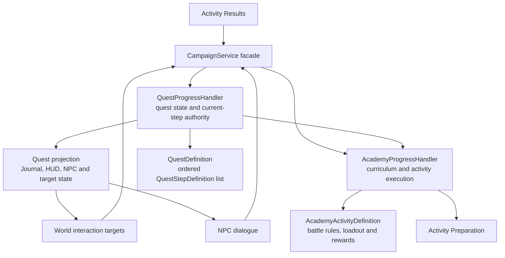

# Quest-Step Rearchitecture Proposal

**Status:** Proposed
**Product source:** `docs/design/quest-system.md`

## Goal

Make the active quest step the only authority that connects campus interaction,
NPC dialogue, Activity Preparation, battle completion, and return flow. Delete
the old Class Hall enrollment browser and Course Flow rather than adapting them.

## Target Ownership



### QuestProgressHandler — Planned

Owns accepted quest IDs, current step IDs, completed step IDs, tracking, and
quest completion. It advances a step only when a typed event matches that
step's authored target. It does not configure battles or award Academy rewards.

### AcademyProgressHandler — Implemented, then narrowed

Keeps curriculum eligibility and permanent commitment, Activity Preparation
state, deck validation, battle configuration, activity outcomes, and rewards.
It stops using `CourseActivityIndex` as the quest state machine and stops
automatically completing a course after the last activity.

### CampaignService — Implemented facade, extended orchestration

Remains the GDScript boundary. It coordinates quest acceptance with curriculum
commitment and translates completed Academy activities into typed quest events.
UI code never mutates quest indices directly.

## Authored Model

```text
QuestDefinition
├── Id, title, description and visibility
├── optional AcademicBinding
│   ├── course ID
│   ├── curriculum cost
│   └── prerequisites / choice group
└── Steps[]
    ├── TalkToNpc(target NPC ID)
    ├── InteractWithWorldTarget(target world ID)
    ├── CompleteAcademyActivity(course ID, activity ID, required outcome)
    └── TalkToNpc(target NPC ID, turn-in presentation)
```

Step kinds are explicit and implemented individually. There is no arbitrary
script step and no UI command that can mark an unknown step complete.

`AcademyActivityDefinition` remains separate because it describes playable
content, not quest sequencing. The same activity may later be referenced by
different authored quest contexts without duplicating battle configuration.

## First Slice

1. `TalkToNpc(general_magic)` is satisfied by accepting the offer; acceptance
   commits curriculum capacity.
2. Current step becomes `InteractWithWorldTarget(practice_grounds)`.
3. The campus Practice Grounds displays the tracked interaction and asks
   CampaignService to begin the matching step.
4. CampaignService validates the step and configures the referenced Academy
   activity before opening Activity Preparation.
5. Battle completion records activity outcome and advances the matching quest
   step.
6. Results returns to the walkable campus, not Course Flow.
7. Current step becomes `TalkToNpc(general_magic)` and the professor displays
   `?`.
8. Closing dialogue completes the quest and unlocks the foundation choice.

## Retained Components

- `academy_activity_preparation` and its loadout/deck validation UI.
- `academy_activity_results`, revised to read quest-aware completion context.
- Academy battle configuration, completion summary, and reward machinery.
- Journal, tracked quest banner, generic NPC, and dialogue components.
- Course metadata required for curriculum, transcript, prerequisites, and
  academic rewards.

## Removed Components and Paths

- `academy_course_flow.tscn` and `academy_course_flow.gd`.
- `academy_activity_graph` if it has no remaining non-Course-Flow consumer.
- The current `academy_class_hall` enrollment/launch screen and campus shortcut.
- `SCENE_ACADEMY_COURSE_FLOW` and course-flow return routing in BattleContext,
  Activity Preparation, and Activity Results.
- `GetAcademyCourseFlowState` and its GDScript wrapper after retained consumers
  receive narrower quest/activity projections.
- Tests and localization that exist only for the removed screens.

Deletion happens in the same initiative after replacements are wired. No
compatibility adapter or hidden fallback route is retained.

## Migration Passes

1. **Contract and validation:** Add typed quest/step definitions, current-step
   persistence, matching rules, and tests. Convert only Introduction to Magic.
2. **World wiring:** Add the Practice Grounds interaction and quest-authorized
   Activity Preparation launch.
3. **Completion wiring:** Advance from battle outcome to the return-to-professor
   step; route Results back to campus; complete through dialogue.
4. **Projection migration:** Drive Journal, HUD, professor markers, and world
   target state from the same current-step projection.
5. **Deletion:** Remove Course Flow, the current Class Hall screen and shortcut,
   old APIs/routes, graph UI, and superseded tests.
6. **End-to-end verification:** Prove offer → accept → Practice Grounds →
   preparation → battle → campus → professor turn-in → unlock.

## Invariants

- Exactly one current step per active linear quest in this first implementation.
- Only a matching typed event advances the current step.
- Journal and HUD read quest state; they do not own progression.
- Academy activity completion cannot silently complete its containing quest.
- No old Course Flow route remains reachable after migration.
- Activity Preparation never needs to know which UI or world object launched it.

## Migration Status

| Node | Status |
|---|---|
| CampaignService facade | Implemented; orchestration change planned |
| AcademyProgressHandler | Implemented; narrowing planned |
| QuestProgressHandler | Planned |
| Typed quest-step definitions | Planned |
| Journal/HUD/NPC projections | Implemented in partial course-index form; replacement planned |
| Practice Grounds interaction | Planned |
| Activity Preparation | Implemented; retained |
| Activity Results | Implemented; return-flow change planned |
| Course Flow | Replaced; deletion planned |
| Current Class Hall screen | Replaced; deletion planned |
