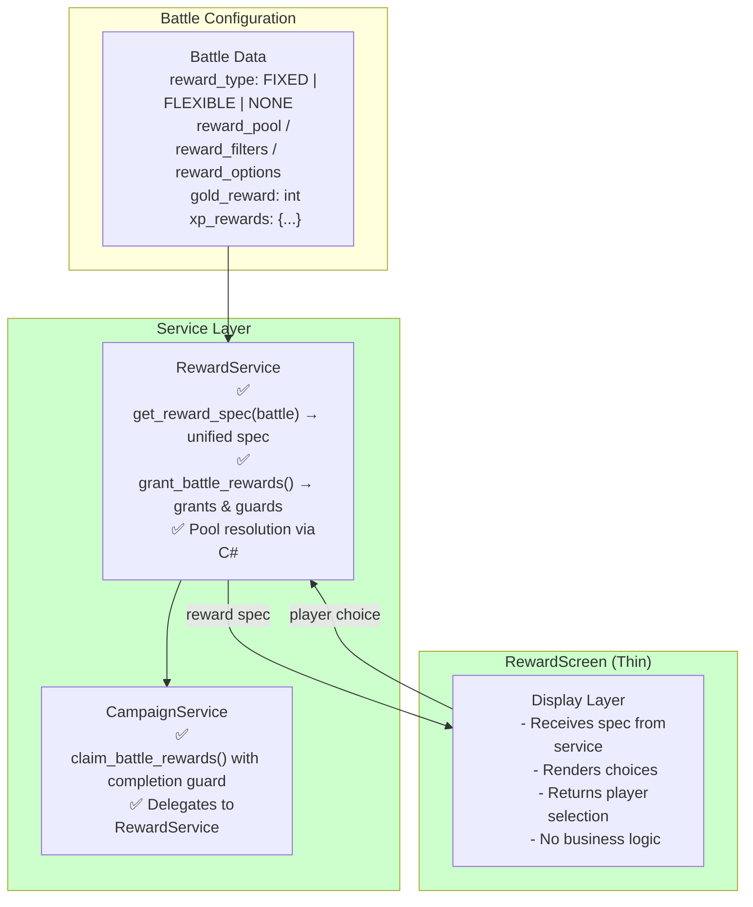
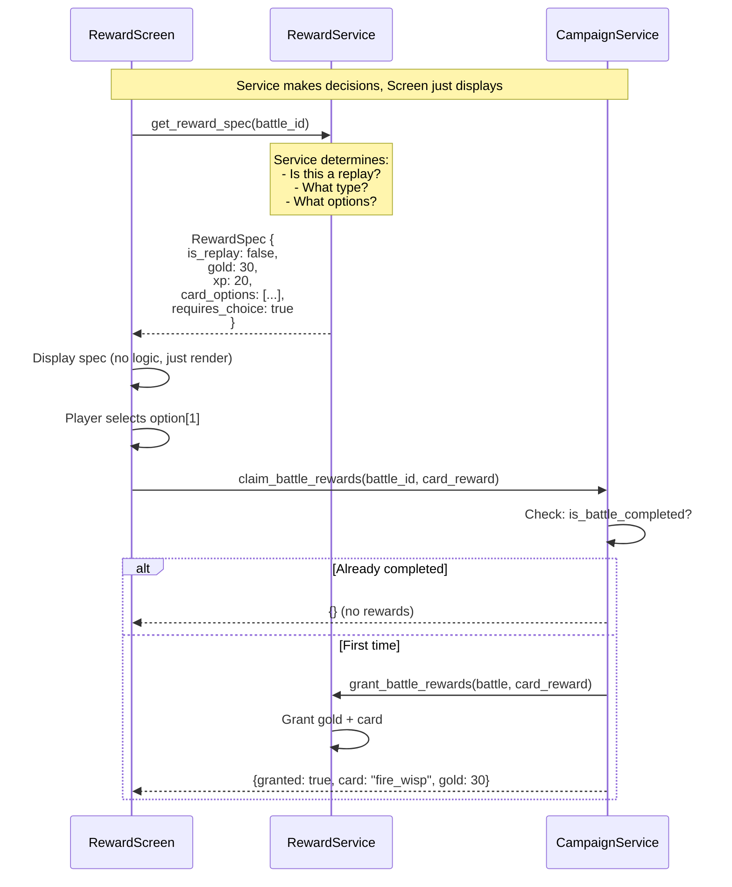

# Battle Reward System Architecture

## Overview

The battle reward system handles granting gold, XP, and cards to players after winning battles. It supports three reward types (FIXED, FLEXIBLE, NONE) and uses a type-safe pool system for dynamic card rewards.

---

## How Battles Configure Rewards

```gdscript
# Example from summoners_path_data.gd
{
    "id": BattleIDs.FIRST_TRIAL,
    "data": {
        "reward_type": RewardTypeIDs.FLEXIBLE,      # FIXED | FLEXIBLE | NONE
        "reward_options": [CardIDs.CHARGE, CardIDs.FIRE_WISP, CardIDs.PUFF],
        "player_selects": true,
        "gold_reward": 30,
        "card_xp_reward": 15,
        "summoner_xp_reward": 20,
    }
}
```

---

## Architecture: Service-Driven Design



---

## Request Flow



---

## FLEXIBLE Reward Configuration Options

Battles with `reward_type: FLEXIBLE` can configure card options in three ways:

### Option 1: Predefined Pool (Enum-Based)

```gdscript
{
    "reward_type": RewardTypeIDs.FLEXIBLE,
    "reward_pool": RewardConstants.PoolId.FIRE_COMMON_UNITS,
    "draw_count": 3,
    "exclude_owned": true,
    "player_selects": true,
}
```

### Option 2: Inline Filters

```gdscript
{
    "reward_type": RewardTypeIDs.FLEXIBLE,
    "reward_filters": {
        "element": RewardConstants.Element.FIRE,
        "rarity": RewardConstants.Rarity.COMMON,
        "card_type": RewardConstants.CardType.SUMMON,
    },
    "draw_count": 3,
}
```

### Option 3: Explicit Options

```gdscript
{
    "reward_type": RewardTypeIDs.FLEXIBLE,
    "reward_options": [CardIDs.CHARGE, CardIDs.FIRE_WISP, CardIDs.PUFF],
    "player_selects": true,
}
```

---

## Type-Safe Pool System (C#)

### Pool Types

| Type | Description | Example |
|------|-------------|---------|
| **Curated** | Explicit card lists | TutorialRewards, BossLoot |
| **Filter-Based** | Element + rarity + type filters | FireCommonUnits, AllSpells |
| **Composite** | Union of other pools | ElementalStarters |

### Key Files

- `RewardPoolId.cs` - Enum defining all pool IDs
- `RewardPoolCatalog.cs` - Pool definitions and card resolution
- `RewardConstants.gd` - GDScript mirror enums for type safety

### GDScript Interop

```gdscript
# From GDScript, use integer enum values
var drawn_ids: Array = _cs_service.DrawFromPoolEnum(
    RewardConstants.PoolId.FIRE_COMMON_UNITS,  # int
    3,      # count
    true,   # exclude_owned
    true    # unique_only
)
```

---

## RewardSpec Format

The `get_reward_spec()` method returns a unified structure:

```gdscript
{
    "is_replay": bool,           # True if battle already completed
    "reward_type": StringName,   # FIXED | FLEXIBLE | NONE
    "gold_reward": int,          # Gold amount
    "summoner_xp": int,          # Summoner XP reward
    "card_xp": int,              # Card XP reward
    "card_options": Array[Dictionary],  # Normalized card options
    "requires_choice": bool,     # True if player must select
    "chosen_index": int,         # Index from pending reward (-1 if not chosen)
}
```

### Normalized Card Option Format

All card options are normalized to:

```gdscript
{
    "catalog_id": String,    # Card ID
    "rarity": String,        # "common", "rare", etc.
    "count": int,            # Number of copies
    "display_name": String,  # Localized card name
}
```

---

## Guards and Safety

### Replay Prevention

`claim_battle_rewards()` checks if the battle is already completed before granting rewards:

```gdscript
func claim_battle_rewards(battle_id: String, card_reward: Dictionary) -> Dictionary:
    # Guard against replay
    if is_battle_completed(battle_id):
        print("CampaignService: Battle '%s' already completed, skipping rewards" % battle_id)
        return {}
    # ... grant rewards
```

### Validation

`CampaignService._validate_battle_rewards()` validates both `reward_cards` (FIXED) and `reward_options` (FLEXIBLE) at startup.

---

## Summary

| Aspect | Implementation |
|--------|----------------|
| **Who decides reward type?** | RewardService via `get_reward_spec()` |
| **Who checks if replay?** | CampaignService (guard in `claim_battle_rewards()`) |
| **Data format** | Unified via `_normalize_card_options()` |
| **RewardScreen responsibility** | Display only |
| **Pool resolution** | C# `RewardPoolCatalog` with type-safe enums |
