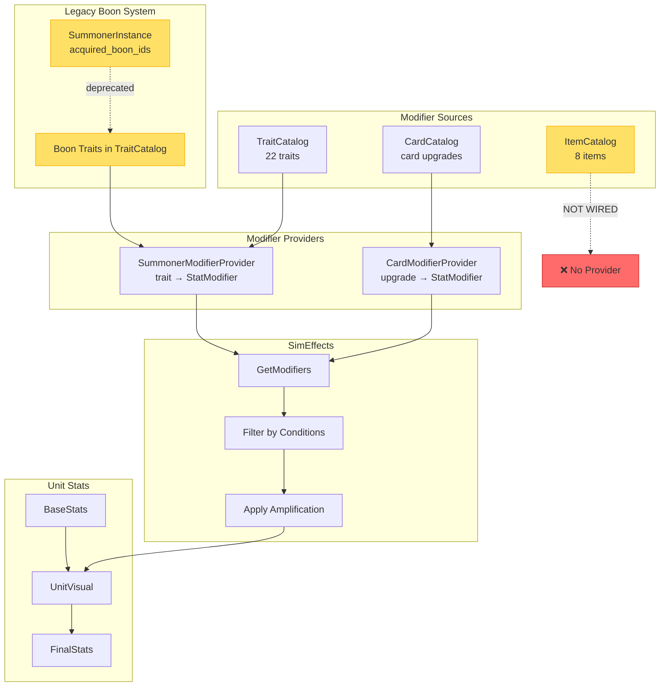
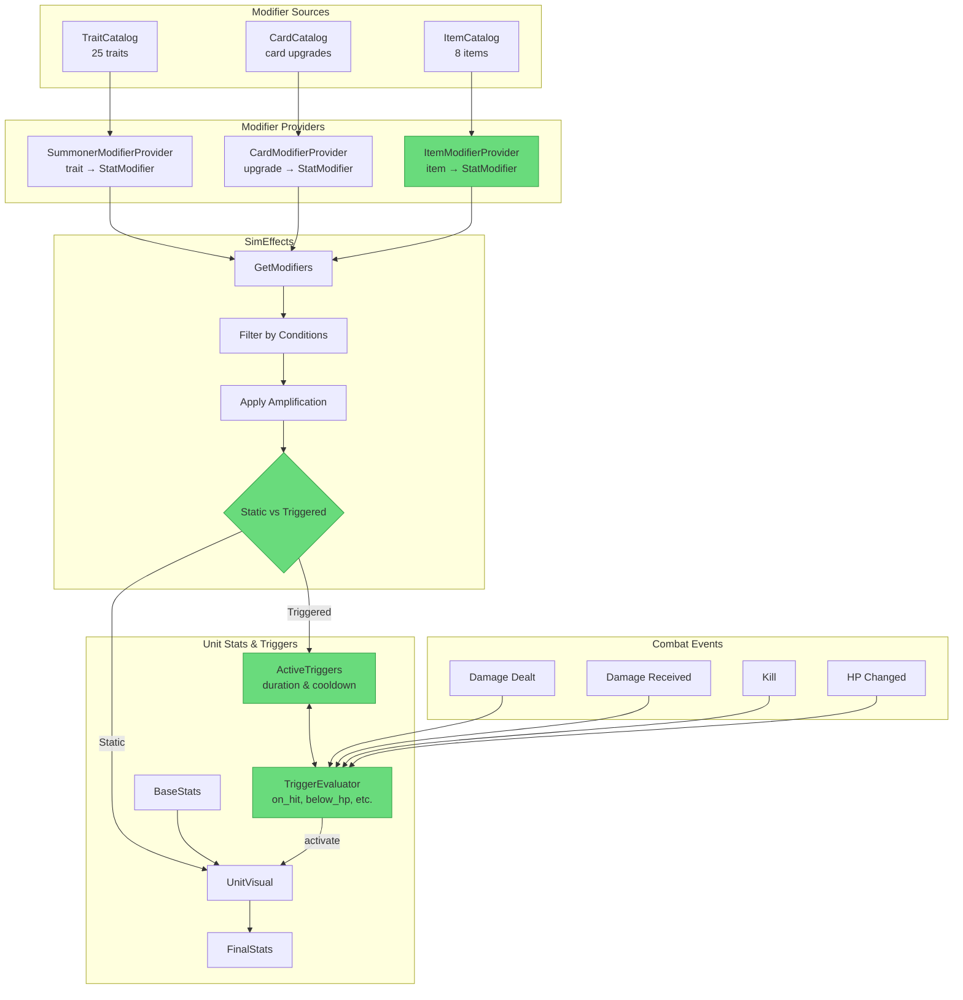
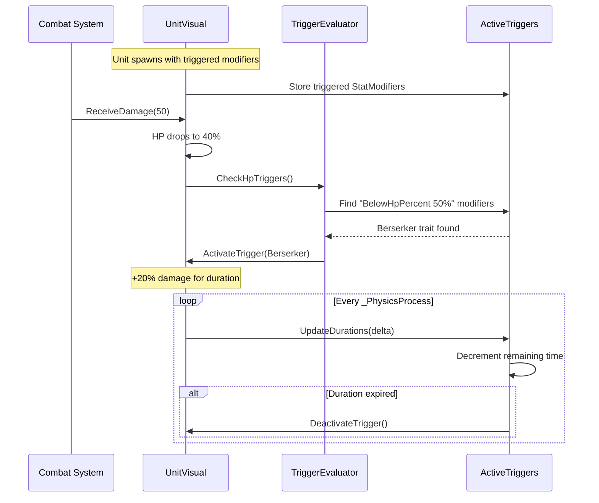

# Trait System Architecture

This document describes the architecture of the trait/modifier system, including the flow from modifier sources through providers to unit stats.

## Previous Architecture (Before Cleanup)

This was the state before the trait system cleanup:



**Issues:**
- ❌ Items existed but didn't affect unit stats (no ItemModifierProvider)
- ⚠️ Boons in SummonerInstance were deprecated but still present
- ❌ No support for triggered effects (on hit, on death, etc.)

---

## Current Architecture (After Cleanup)



**Improvements (green = new):**
- ✅ Items affect unit stats via ItemModifierProvider
- ✅ Triggered modifiers with duration/cooldown support
- ✅ Combat events activate conditional effects
- ✅ Boons completely removed (migrated to items in v5→v6, code deleted)

## Trigger Flow Detail



## Key Components

### Modifier Sources

| Source | Description | Example |
|--------|-------------|---------|
| TraitCatalog | Innate traits and boons | Fire Affinity (+10% fire damage) |
| CardCatalog | Card upgrade effects | Upgraded Fireball (+damage) |
| ItemCatalog | Equipment bonuses | Training Blade (+2% damage) |

### Modifier Providers

Providers convert source data to `StatModifier` objects that SimEffects can process:

- **SummonerModifierProvider**: Reads summoner's traits from TraitCatalog
- **CardModifierProvider**: Reads card upgrades from CardCatalog
- **ItemModifierProvider**: Reads equipped items from ItemService → ItemCatalog

### StatModifier Structure

```csharp
public class StatModifier
{
    public string Source { get; set; }
    public string? CardInstanceId { get; set; }
    public List<string> Tags { get; set; }
    public Dictionary<string, object> Conditions { get; set; }
    public Dictionary<string, float> StatAdds { get; set; }
    public Dictionary<string, float> StatMults { get; set; }
    public Dictionary<string, bool> Flags { get; set; }

    // Trigger fields (for conditional effects)
    public TriggerCondition Trigger { get; set; }
    public float TriggerThreshold { get; set; }
    public float TriggerDuration { get; set; }
    public float TriggerCooldown { get; set; }
}
```

### TriggerCondition Enum

```csharp
public enum TriggerCondition
{
    Always,           // Always active (default)
    OnHit,            // When dealing damage
    OnTakeHit,        // When taking damage
    OnKill,           // When killing an enemy
    OnDeath,          // When unit dies
    BelowHpPercent,   // When HP falls below threshold
    AboveHpPercent,   // When HP is above threshold
    Periodic          // Every N seconds
}
```

## File Locations

### Provider Classes
- `scripts/csharp/Systems/Modifiers/IModifierProvider.cs`
- `scripts/csharp/Systems/Modifiers/SummonerModifierProvider.cs`
- `scripts/csharp/Systems/Modifiers/CardModifierProvider.cs`
- `scripts/csharp/Systems/Modifiers/ItemModifierProvider.cs`

### Service
- `scripts/csharp/Battle/Simulation/Combat/SimEffects.cs`
- `scripts/csharp/Battle/Simulation/Stats/StatModifier.cs`
- `scripts/csharp/Battle/Simulation/Stats/TriggerCondition.cs`

### Data Catalogs
- `scripts/csharp/Infrastructure/Data/Traits/TraitCatalog.cs`
- `scripts/csharp/Infrastructure/Data/Items/ItemCatalog.cs`

## Migration Notes

### Boons → Items Migration

The boon system has been deprecated in favor of the item system:

- **Old**: `SummonerInstance.acquired_boon_ids` stored boon trait IDs
- **New**: `SummonerInstance.EquippedItems` stores equipped item instance IDs

Migration v5→v6 automatically converts boons to corresponding items via `ItemCatalog.GetItemIdForBoon()`.

See `docs/features/equipment-system.md` for item system details.

---

## Implementation Notes

### Battle Initialization

At battle start, `BattleScene.cs` registers providers:

```gdscript
func _register_summoner_provider() -> void:
    var modifier_service = get_node_or_null(CSharpAutoloads.MODIFIER_SERVICE)
    if modifier_service:
        # Register summoner trait provider
        modifier_service.register_summoner_provider(summoner_instance, summoner_id)

        # Register item modifier provider
        modifier_service.register_item_provider(summoner_id)
```

Both are unregistered in `_exit_tree()` to prevent memory leaks.

### Unit Spawn with Modifiers

When a unit spawns, it receives partitioned modifiers:

```csharp
// In card spawning logic
var (staticMods, triggeredMods) = SimEffects.Instance.GetModifiersPartitioned(context);
unit.InitializeWithPartitionedModifiers(staticMods, triggeredMods);
```

### Active Trigger Management

UnitVisual maintains a list of `ActiveTrigger` objects:

```csharp
private class ActiveTrigger
{
    public StatModifier Modifier;    // The source modifier
    public float RemainingDuration;  // Time left (0 = permanent while condition)
    public float CooldownRemaining;  // Time until can re-trigger
    public bool IsActive;            // Currently providing bonuses
}
```

Combat events call the appropriate check methods:
- `OnTakeDamage()` → `CheckOnTakeHitTriggers()` + `CheckHpTriggers()`
- `OnDealDamage()` → Checks OnHit triggers
- `OnKill()` → Checks OnKill triggers + handles heal_on_kill

### Stat Recalculation

When trigger states change, `RecalculateStatsWithTriggers()` recomputes all stats using the two-phase formula:

```csharp
// Collect bonuses from active triggers only
foreach (var trigger in _activeTriggers)
{
    if (!trigger.IsActive) continue;
    // Sum adds, multiply mults, merge flags
}

// Apply: (base + adds) * mults
MaxHp = (_baseMaxHp + hpAdd) * hpMult;
```

Note: Static modifiers are applied at spawn and stored in base stats. Triggered modifiers layer on top.

---

## Testing

Run modifier system tests:

```bash
# GdUnit4 tests (requires Godot editor)
godot --headless --script res://addons/gdUnit4/bin/GdUnitCmdTool.gd -- \
  --add tests/csharp/Systems/Modifiers \
  --add tests/csharp/Traits/TraitCatalogTest.cs
```

Test files:
- `tests/csharp/Battle/Simulation/Stats/StatModifierTest.cs`
- `tests/csharp/Battle/Simulation/Stats/TriggerConditionTest.cs`
- `tests/csharp/Battle/Simulation/Combat/SimEffectsTest.cs`
- `tests/csharp/Traits/TraitCatalogTest.cs` (includes triggered trait tests)
