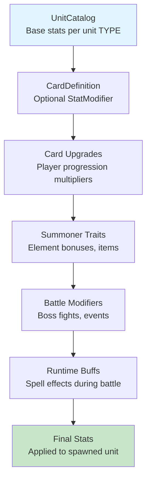

# Unit Stat Pipeline

This document describes how unit stats flow from definition to final application.

## Overview

Unit stats go through a 6-stage pipeline before being applied to a spawned unit. Each stage can modify the stats from the previous stage.

## The Pipeline



## Pipeline Stages

### 1. UnitCatalog (Base Stats)

Defines intrinsic stats for each unit TYPE. This is the single source of truth for "what is a Fire Wisp?"

**Location:** `scripts/csharp/Units/UnitCatalog.cs`

```csharp
UnitCatalog["fire_wisp"] = {
    MaxHp = 60,
    AttackDamage = 12,
    AttackRange = 3.0,
    AttackSpeed = 1.2,
    MoveSpeed = 3.5,
    AggroRadius = 20
}
```

### 2. Card Modifier (Optional)

Cards can apply a `StatModifier` to create variants. Only specified when the card intentionally differs from base stats.

**Example:** Fire Swarm spawns weaker Fire Wisps:
```csharp
UnitModifier = new StatModifier {
    StatMults = { ["max_hp"] = 0.75f, ["attack_damage"] = 0.75f }
}
// Result: HP = 60 * 0.75 = 45, ATK = 12 * 0.75 = 9
```

### 3. Card Upgrades

Player progression system. Leveling up a card applies multiplicative bonuses.

**Source:** `PlayerCardService.get_effective_stats()`

**Example:** Level 5 card with +20% HP upgrade:
```
HP = 45 * 1.2 = 54
```

### 4. Summoner Traits

Summoner-specific bonuses from traits and items.

**Source:** `ModifierService` via `SummonerModifierProvider`

**Example:** Fire Affinity trait gives +10% damage to fire units:
```
ATK = 9 * 1.1 = 9.9
```

### 5. Battle Modifiers

Context-specific modifiers for special battles.

**Source:** `ModifierService` or battle configuration overrides

**Example:** Boss fight with +50% enemy HP:
```
HP = 54 * 1.5 = 81
```

### 6. Runtime Buffs

Temporary effects applied during battle from spells, abilities, or environmental effects.

**Source:** `ModifierService` via runtime providers

**Example:** Buff spell giving +25% attack speed for 10 seconds.

## Separation of Concerns

| System | Responsibility | Example |
|--------|---------------|---------|
| **UnitCatalog** | What units ARE (base stats) | Fire Wisp: HP=60, ATK=12, Range=3.0 |
| **CardCatalog** | What cards DO (spawn + modify) | Fire Swarm: spawn 12 fire_wisps at 75% stats |
| **Scene files** | How units LOOK (structure/visuals) | Node hierarchy, collision shape, visual component |

## Key Principles

1. **Single Source of Truth**: Base stats defined once in UnitCatalog
2. **Explicit Modifications**: If a card differs from base, it has a modifier - no silent duplication
3. **Composable Pipeline**: Each stage applies cleanly on top of previous using the formula: `(base + adds) * mults`

## Stat Modification Formula

At each stage that applies modifiers:

```
final_stat = (current_stat + additive_bonuses) * multiplicative_bonuses
```

Additive bonuses are summed first, then all multiplicative bonuses are applied.

## Implementation

The pipeline is implemented in `UnitStatCalculator.Calculate()`:

```csharp
public static UnitStats Calculate(
    CardDefinition card,
    Dictionary<string, float>? upgradeMultipliers,
    List<StatModifier>? modifiers,
    Dictionary<string, float>? overrides)
{
    // 1. Base stats from UnitCatalog
    var stats = UnitCatalog.GetBaseStats(card.UnitType);

    // 2. Card variant modifier
    if (card.UnitModifier != null)
        stats = stats.WithModifiers([card.UnitModifier]);

    // 3. Card upgrades
    stats = stats.WithUpgradeMultipliers(upgradeMultipliers);

    // 4-6. Trait/battle/runtime modifiers
    stats = stats.WithModifiers(modifiers);

    // Final overrides (for special cases)
    stats = stats.WithOverrides(overrides);

    return stats;
}
```

## Related Files

- `scripts/csharp/Units/UnitCatalog.cs` - Base stats registry
- `scripts/csharp/Cards/CardCatalog.cs` - Card definitions with optional modifiers
- `scripts/csharp/Stats/UnitStatCalculator.cs` - Pipeline implementation
- `scripts/csharp/Stats/UnitStats.cs` - Stat container with modification methods
- `scripts/csharp/Systems/Modifiers/StatModifier.cs` - Modifier definition
- `scripts/csharp/Systems/Modifiers/ModifierService.cs` - Modifier collection and application
