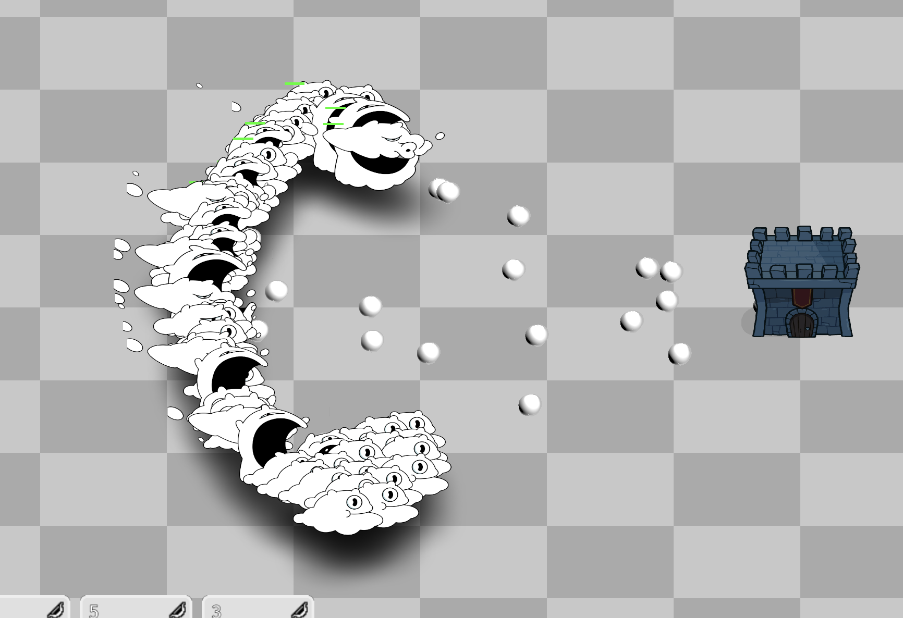

# Known Bugs

This document tracks known bugs and issues in Fateforged.

For resolved bugs, see [bugs-resolved.md](bugs-resolved.md).

**Note:** When resolving a bug, move it to `bugs-resolved.md` with the resolution date and details.

---

## Active Bugs

#### RID/Resource Leaks at Exit in Headless Mode
**Status:** Open
**Reported:** 2025-01-28
**Component:** Unit Testing / Godot Headless

**Description:**
When running tests via `--headless`, Godot reports resource leaks at exit.

**Current Behavior:**
After "All tests passed", Godot outputs:
- RID allocations leaked (GodotArea3D, GodotShape3D, textures, meshes, materials)
- "Leaked instance dependency" warnings
- ObjectDB instances leaked
- Resources still in use

**Impact:**
Cosmetic only - doesn't affect test results or game runtime.

**Root Cause:**
Godot's headless renderer doesn't fully clean up resources when autoloads create 3D objects (meshes, materials, etc.) that persist until exit.

**Proposed Solution:**
- May require explicit cleanup in autoload `_exit_tree()` methods
- May be unfixable Godot behavior in headless mode

**Related Files:**
- scripts/battle/vfx/vfx_manager.gd
- scripts/csharp/Battle/View/EntityManager.cs (HP bar lifecycle)
- scripts/csharp/Battle/Simulation/Combat/SimProjectile.cs

---

#### HP Bar Management Issues
**Status:** Open
**Reported:** 2026-01-04
**Component:** UI / HP Bar Manager

**Description:**
HP bars have multiple issues related to their lifecycle and positioning.

**Issues:**
1. **Swarm cleanup crash/bug:** When clicking "Clear Units" in debug mode, HP bars for swarm units don't clean up properly. May cause errors or orphaned UI elements.
2. **Positioning relative to units:** HP bars are not positioned correctly relative to their units. The offset or anchor point appears to be wrong.

**Expected Behavior:**
- HP bars should be removed cleanly when their units are removed
- HP bars should appear at a consistent, correct position above each unit's head

**Current Behavior:**
- Swarm unit HP bars misbehave on debug clear
- HP bar positions don't match unit visual positions

**Impact:**
Visual bugs and potential errors during development/testing.

**Related Files:**
- scripts/systems/hp_bar_manager.gd
- scripts/battle/ui/hp_bar.gd (if exists)

---

#### Puff Units Get Stuck in Idle When Blocked by Other Units
**Status:** Open
**Reported:** 2026-01-05
**Component:** Units / Pathfinding / Movement



**Description:**
Puff units get stuck in idle state when other characters are blocking their path. They don't attempt to move forward or find an alternate route to get into attack range. Affects units at both top and bottom of formations - possibly stuck in pathfinding mode.

**Expected Behavior:**
Units should navigate around obstacles or push forward to find a valid attack position.

**Current Behavior:**
- Units remain stuck in idle animation
- They don't attempt to path around blocking units
- Affects both top and bottom units in formation (not just back units)
- Units may be stuck in pathfinding state rather than truly idle
- Units have valid targets but can't reach them

**Impact:**
Reduces effective army size as blocked units don't contribute to combat.

**Possible Causes:**
- Pathfinding giving up too early when blocked
- No "push through" or flanking behavior when stuck
- Collision detection preventing movement entirely
- Target acquisition succeeding but movement failing

**Related Files:**
- scripts/csharp/Battle/View/UnitVisual.cs (visual shell / movement sync)
- scripts/csharp/Battle/Simulation/SimBehavior.cs (behavior logic, formerly in RangedUnit3D)
- Blocked detection / flanking logic

---

## Bug Report Template

```markdown
#### Bug Title
**Status:** Open/In Progress/Resolved
**Reported:** YYYY-MM-DD
**Component:** System/Feature

**Description:**
Brief description of the bug

**Expected Behavior:**
What should happen

**Current Behavior:**
What actually happens

**Impact:**
How this affects gameplay/experience

**Reproduction Steps:**
1. Step 1
2. Step 2
3. ...

**Proposed Solution:**
Potential fixes or approaches

**Related Files:**
- file1.gd
- file2.gd

**Notes:**
Additional context
```

---

#### Camera Scroll Wheel Boundary Issues
**Status:** Open
**Reported:** 2026-01-13
**Component:** Camera / Input

**Description:**
When scrolling with the scroll wheel to zoom the camera, the camera can go past the boundary limits.

**Expected Behavior:**
Camera should respect battlefield boundaries at all zoom levels.

**Current Behavior:**
Scroll wheel zoom allows the camera view to extend past the intended battlefield boundaries.

**Impact:**
Players can see outside the play area, breaking immersion.

**Related Files:**
- Camera controller scripts
- Battlefield boundary system

---

#### Camera Right-Click Drag Boundary Issues
**Status:** Open
**Reported:** 2026-01-13
**Component:** Camera / Input

**Description:**
When panning the camera with right-click and drag, the camera can go past the boundary limits and behaves erratically.

**Expected Behavior:**
Camera panning should respect battlefield boundaries smoothly.

**Current Behavior:**
Right-click drag panning allows the camera to go past boundaries and may exhibit buggy behavior.

**Impact:**
Players can see outside the play area and experience jarring camera movement.

**Related Files:**
- Camera controller scripts
- Battlefield boundary system

---

#### Wisps Attack Multiple Enemies Simultaneously
**Status:** Open
**Reported:** 2026-01-27
**Component:** Units / Combat / Targeting

**Description:**
Wisp units (Fire Wisp, Water Wisp, etc.) are attacking multiple enemies at once instead of targeting a single enemy.

**Expected Behavior:**
Wisps should target and attack one enemy at a time.

**Current Behavior:**
Wisps attack multiple enemies simultaneously, which may be unintended AOE behavior or a targeting issue.

**Impact:**
Affects combat balance - wisps are more effective than designed if they can hit multiple targets.

**Related Files:**
- scripts/csharp/Battle/View/UnitVisual.cs (visual shell)
- scripts/csharp/Battle/Simulation/Combat/ (targeting logic)
- Card definitions for wisps

---

#### Puff Units Switch Targets Unnecessarily
**Status:** Open
**Reported:** 2026-01-31
**Component:** Units / Targeting / Ranged AI

**Description:**
Puff units change targets even when they already have a valid target. Additionally, targeting prioritizes closer enemies that require movement over enemies already in cone range.

**Expected Behavior:**
1. Puffs should maintain their current target while it's still valid
2. Targeting should prioritize enemies already within cone attack range before selecting closer enemies that would require repositioning

**Current Behavior:**
- Puffs switch targets frequently even when current target is still valid
- Targeting selects the closest enemy overall, even if that enemy requires the Puff to move to get them in cone range
- This causes unnecessary movement and target-switching when a valid target is already in range

**Impact:**
Reduces Puff combat effectiveness - time spent switching targets and repositioning could be spent attacking.

**Proposed Solution:**
1. Add target stickiness - don't switch targets unless current target is dead, out of range, or significantly worse
2. Modify targeting priority: enemies in current cone range > enemies requiring movement
3. Only reposition to chase a closer target if no valid targets are currently in cone range

**Related Files:**
- scripts/csharp/Battle/Simulation/SimBehavior.cs (behavior logic, formerly in RangedUnit3D)
- scripts/csharp/Battle/Simulation/SimTargeting.cs (targeting logic, formerly in TargetingService)
- Cone attack range detection logic

---

#### CardIDs.DUCKLING References Non-Existent Card
**Status:** Open
**Reported:** 2026-02-01
**Component:** Data / Card Catalog

**Description:**
GDScript `CardIDs` contains a `DUCKLING` constant that references a card ID that doesn't exist in the card catalog. Duckling is only a `UnitId` (spawned by mama_duck card), not a playable card.

**Expected Behavior:**
All `CardIDs` constants should reference valid cards in the catalog.

**Current Behavior:**
On startup, the validation logs an error:
```
ERROR: CardCatalog: CardIDs constants reference non-existent cards:
ERROR:   - CardIDs.DUCKLING = 'duckling'
```

**Impact:**
Cosmetic startup error. No gameplay impact since duckling is correctly handled as a unit spawned by mama_duck.

**Proposed Solution:**
Remove `const DUCKLING: StringName = &"duckling"` from `scripts/infrastructure/data/card_ids.gd` since duckling is not a playable card.

**Related Files:**
- scripts/infrastructure/data/card_ids.gd (line 75)
- scripts/infrastructure/data/card_catalog.gd (validation logic)

---

#### Puff Pivot Point Off-Center When Turning
**Status:** Open
**Reported:** 2026-02-27
**Component:** Units / Visual / Sprites

**Description:**
When Puff turns around (flips facing direction), it visually snaps to a different position because the pivot point is at the center of the sprite image, not the visual center of the character. Puff is not centered within its sprite sheet, so flipping the sprite causes an apparent position jump.

**Expected Behavior:**
Puff should pivot around its visual center, appearing to turn in place without shifting sideways.

**Current Behavior:**
Puff appears to teleport slightly left or right when changing facing direction because the flip mirrors around the image center, not the character center.

**Proposed Solution:**
Adjust the sprite offset so Puff's visual center aligns with the pivot point, or re-center Puff within the sprite sheet.

**Related Files:**
- Puff unit scene / sprite configuration
- `scripts/csharp/Battle/View/UnitVisual.cs` (SetFacing method)

---

*Last Updated: 2026-02-27 - Added Puff pivot point off-center bug*
