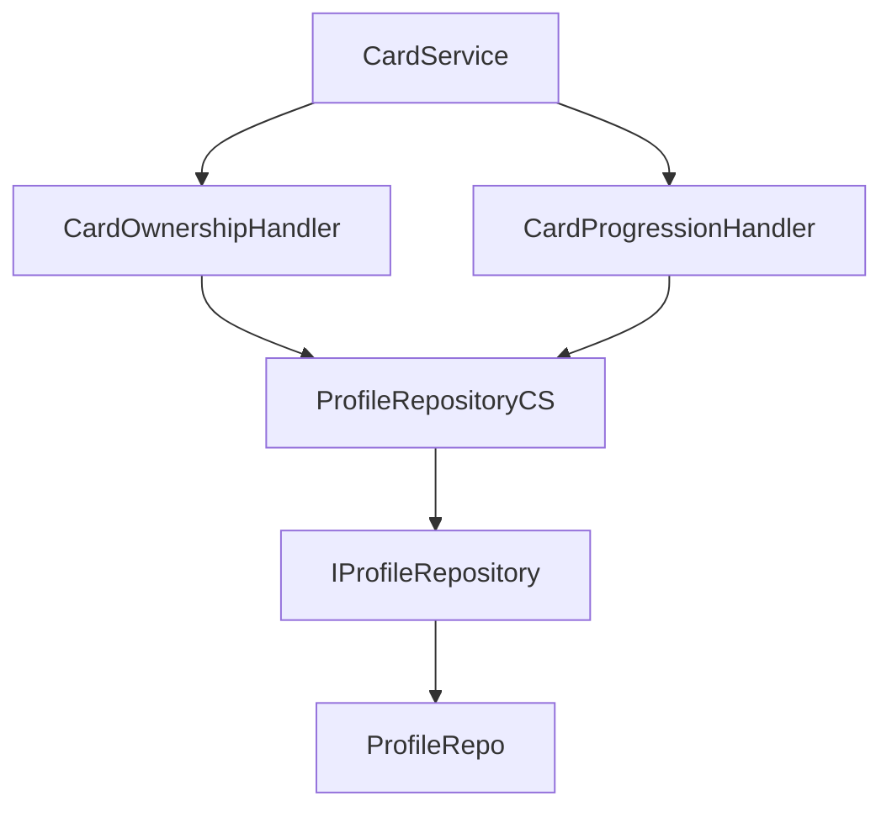
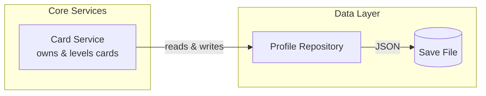

# Mermaid Diagram Guidelines

*How to create readable architecture diagrams that tell a clear story.*

---

## Core Principle

**Diagrams should be understood in under 2 minutes.** If it takes longer, the diagram is trying to do too much.

---

## 1. State the Diagram's Purpose

Before creating a diagram, define what story it tells:

> "Create a high-level service architecture diagram that a new developer could understand in under 2 minutes."

This frames **readability as the goal**, not completeness.

---

## 2. Use a Clear Mental Model

Humans parse architecture **left-to-right** and **top-to-bottom**.

Choose a flow pattern:
- `Inputs → Core Systems → Outputs`
- `Player → Game Systems → External Services`
- `Request → Processing → Response`

State this explicitly when creating diagrams.

---

## 3. Limit Scope Aggressively

**This is the most important guideline.**

Mermaid is not good at showing everything at once. Explicitly exclude:
- Implementation details
- Function names
- Low-level classes
- Helper utilities

> "Only show major services and how they communicate."

This alone improves diagrams by 50%.

---

## 4. Use Semantic Groupings

Use `subgraph` to create labeled chunks that match how humans think:

```mermaid
subgraph Core["Core Game Services"]
    Cards["Card Service"]
    Economy["Economy Service"]
end
```

Good group names:
- "Player Interface"
- "Core Game Services"
- "Combat Systems"
- "Data Layer"

Bad group names:
- "Services" (too vague)
- "CSharpAutoloads" (code identifier)

Avoid deep nesting — one level of subgraphs is usually enough.

---

## 5. Use Human-Readable Labels

Labels should be **noun + short verb**, not code identifiers.

| Bad | Good |
|-----|------|
| `TargetingService` | `Targeting Service` |
| `CardService` | `Card Service` |
| `ProfileRepositoryBridge` | `Profile Repository` |

Add brief descriptions when helpful:

```mermaid
Cards["Card Service<br/>owns & levels cards"]
```

---

## 6. Pick ONE Arrow Meaning

Unreadable diagrams mix different arrow types:
- Control flow
- Data flow
- Events
- Ownership
- Dependencies

**Pick one per diagram** and state it:

> "Arrows represent runtime communication during gameplay."

or

> "Arrows represent data flow from input to storage."

---

## 7. Annotate Arrows, Don't Add Boxes

Prefer short edge labels over adding more nodes:

```mermaid
Screens -->|plays card| Factory
Core -->|reads & writes| Repo
```

Keep annotations to **one short phrase** (2-4 words).

---

## Template

Use this prompt template when creating diagrams:

```
Create a [type] diagram for [system] that a new developer could understand in under 2 minutes.

Purpose:
- This diagram should tell a clear story, not document every system.
- Prioritize readability and mental clarity over completeness.

Layout:
- Lay the diagram out left-to-right.
- Show the flow from [Input] → [Core] → [Output].

Scope:
- Do NOT include implementation details, function names, or low-level classes.
- Only show major [components] and how they communicate at runtime.

Visual structure:
- Use subgraphs to group related systems into labeled, semantic chunks.
- Each subgraph should represent a concept a human would naturally name.

Labels:
- Use human-readable labels (noun + short verb).
- Avoid code identifiers.

Connections:
- All arrows represent [runtime communication / data flow / events].
- Prefer one-directional flow.
- Use short annotations on arrows instead of adding more boxes.
```

---

## Example: Good vs Bad

### Bad (too dense, code identifiers, mixed concerns)



### Good (clear story, human labels, focused)



---

## When to Create Multiple Diagrams

If you need to show:
1. High-level architecture AND
2. Detailed internal structure

Create **separate diagrams**, not one giant diagram.

- **Overview diagram**: Shows major systems and their relationships
- **Detail diagram**: Shows internals of ONE system

Never try to show everything in a single diagram.
